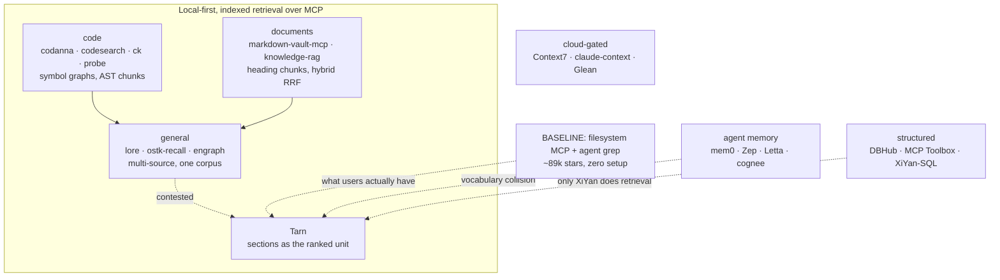

# Competitor Analysis: Local Context Serving for AI Agents

> Per-project profiles live in [the competitors bundle](index.md). This file covers
> cross-cutting analysis only.

## Scope & method

**Research date:** 2026-08-09. This is a full rewrite of the 2026-03-09 analysis, which
covered nine Obsidian-shaped projects. Tarn is pivoting from an Obsidian-only MCP server to
**general-purpose local context serving** — notes, source code, PDFs, project documentation,
SQL schemas, and mixed corpora — and the old competitive picture does not describe that market.

**Verification.** Every version, star count, licence, and last-activity date was pulled live
from the GitHub API on 2026-08-09, cross-checked against crates.io, npm, and PyPI. Where a
project publishes no releases, the figure is marked *unverified* rather than guessed.

**Two depths**, recorded in each profile's `depth` frontmatter field:

- **`deep-dive`** — the repository was cloned and its source read. 18 projects.
- **`profile`** — web research and repository metadata only. 37 projects.

**Five categories**, by what the project serves:

| Category | What it serves | Profiles |
|---|---|---|
| [general](general/index.md) | Mixed local corpora, memory, universal context | 15 |
| [code](code/index.md) | Source code | 12 |
| [documents](documents/index.md) | Documents, PDFs, RAG over files | 9 |
| [obsidian-pkm](obsidian-pkm/index.md) | Obsidian vaults specifically | 10 |
| [structured](structured/index.md) | Databases, schemas, semantic layers | 9 |

---

## Corrections to the 2026-03 analysis

The previous analysis made four claims that are now false. They are retracted explicitly
because three of them were load-bearing for Tarn's positioning.

### 1. "No competitor indexes at the section/heading level" — **retracted**

This was the headline differentiator, and it is wrong in two independent ways.

**Heading paths exist elsewhere.** [Codanna](code/codanna.md)'s document chunker carries
`heading_context: Vec<String>` — *"Heading hierarchy context (e.g., `["Chapter 1", "Section
1.2"]`)"* — which is the same primitive as Tarn's `heading_path`.

**Section addressing is now common.** Since March:

- [cyanheads v3](obsidian-pkm/obsidian-mcp-server-cyanheads.md) added `format: "section"` and
  `format: "document-map"`, with `Parent::Child` addressing and a fence-aware heading matcher.
- [Vault as MCP 0.10.0](obsidian-pkm/vault-as-mcp-ebullient.md) reads by heading name with
  **occurrence-index disambiguation** and returns an outline carrying those indices.
- [MCPVault](obsidian-pkm/mcpvault-bitbonsai.md) added `get_note_outline` → `read_note_lines`.
- [markdown-vault-mcp](documents/markdown-vault-mcp.md) recursively descends H1→H6 with a
  guaranteed chunk-size invariant.
- [codesearch](code/codesearch.md) — a *code* tool — chunks Markdown by heading section using
  the tree-sitter-md block grammar.
- [lore](general/lore.md) indexes `section` as a **BM25 field with a 2.0 boost**.

**The accurate, narrower claim:** most competitors *extract or chunk* by heading; Tarn *ranks*
sections as the retrieval unit and carries the full ancestor path. Those are real differences —
see [Where Tarn still leads](#where-tarn-still-leads) — but the absolute claim must go.

### 2. "Zero runtime dependencies / Rust single binary" is a differentiator — **retracted**

At least a dozen Rust MCP retrieval servers shipped in 2026: [codanna](code/codanna.md),
[codesearch](code/codesearch.md), [ck](code/ck.md), [probe](code/probe.md),
[lore](general/lore.md), [engraph](general/engraph.md), [ostk-recall](general/ostk-recall.md),
[pluck](general/pluck.md), [trusty-search](general/trusty-search.md),
[rememex](general/rememex.md), plus `ripvec`, `frigg`, `rag-rat-mcp`, `open-kioku`, `RustRAG`,
`cqs`. [codesearch](code/codesearch.md) states the position in its own README:

> *"many projects share the same baseline stack (Rust + tree-sitter + BM25 + embeddings +
> MCP)."*

Rust, BM25, a persistent index, and local-first operation are the **category baseline**, not an
edge.

### 3. "Unbounded caching — obsidian-mcp-server caches the entire vault in memory" — **retracted**

True of v2.0.7, false of v3.2.12. The vault cache is gone; the service is a stateless HTTP
client. This should no longer appear under patterns to avoid.

### 4. The roster omitted the category's adoption leader — **corrected**

[MarkusPfundstein/mcp-obsidian](obsidian-pkm/mcp-obsidian-pfundstein.md) has ~4,279 stars —
roughly 6.5× the next Obsidian MCP server — and was absent from the previous analysis. It is a
thin REST proxy with **no index and keyword-only search**, dormant on PyPI since April 2025.
Its absence made the earlier picture materially wrong in both directions: it understated how
low the adoption bar is, and it understated how beatable the incumbent is.

---

## Market map

Tarn sits at the intersection of three categories, all converging:

**The convergence is the story.** [Codanna](code/codanna.md) is a code tool that added a
document collection. [codesearch](code/codesearch.md) is a code tool that chunks Markdown by
heading. [lore](general/lore.md) is a document tool that has a tree-sitter feature flag.
Everyone is walking toward the middle from a different edge.

---

## Comparison table

Ordered by relevance to Tarn's pivot. "Chunk unit" is what gets indexed; "ranked unit" is what
a query actually returns — the two differ more often than expected.

| Project | Lang | Sources | Chunk unit | Ranked unit | Retrieval | Persistence | Local | Writes | Tools | Stars | Status |
|---|---|---|---|---|---|---|---|---|---|---|---|
| **Tarn** | Rust | markdown | **section + `heading_path`** | **section** | BM25 | own index | ✅ | planned | small | — | active |
| [lore](general/lore.md) | Rust | **90+ formats, 10 kinds** | heading chunk | chunk | BM25F (section ×2) | Tantivy | ✅ | ❌ | 6 | 17 | active |
| [engraph](general/engraph.md) | Rust | Obsidian | heading chunk | **file** | 5-lane RRF | SQLite+vec | ✅ | ✅ | 25 | 164 | dormant |
| [ostk-recall](general/ostk-recall.md) | Rust | 9 kinds | `##` section | chunk | dense+BM25 RRF | LanceDB+SQLite | ✅ | ledger | 2 | 6 | pre-alpha |
| [markdown-vault-mcp](documents/markdown-vault-mcp.md) | Python | markdown+attach | **adaptive H1→H6** | chunk | FTS5+vec RRF | SQLite+numpy | ✅ | ✅ | 33 | 27 | active |
| [knowledge-rag](documents/knowledge-rag.md) | Python | 20 formats | `##`/`###`; **else 1000ch** | chunk | BM25+vec+rerank | Chroma+inverted | ✅ | CRUD | 13 | 246 | active |
| [codanna](code/codanna.md) | Rust | code+docs | symbol; **`heading_context`** | symbol | symbol+semantic | Tantivy | ✅ | ❌ | fused | 722 | active |
| [codesearch](code/codesearch.md) | Rust | code+md | AST; **md=heading** | chunk | arroy+BM25 RRF | LMDB+Tantivy | ✅ | ❌ | 6 | 64 | active |
| [probe](code/probe.md) | Rust | code | AST block | block | **BM25, no index** | **none** | ✅ | ❌ | 3 | 679 | active |
| [ck](code/ck.md) | Rust | code | chunk (blake3) | chunk | BM25+vec RRF | on-disk | ✅ | ❌ | 6 | 1.7k | active |
| [serena](code/serena.md) | Python | code | — | — | **none (LSP)** | **none** | ✅ | ✅ | ~25 | **27.8k** | active |
| [cyanheads v3](obsidian-pkm/obsidian-mcp-server-cyanheads.md) | TS | Obsidian | — | note | text/JSONLogic/Omnisearch | none | ⚠️ needs app | ✅ | 14 | 652 | active |
| [MCPVault](obsidian-pkm/mcpvault-bitbonsai.md) | TS | markdown | — | note | **BM25, full scan** | **none** | ✅ | ✅ | 18 | 1.6k | active |
| [Vault as MCP](obsidian-pkm/vault-as-mcp-ebullient.md) | TS | Obsidian | — | note | **filter, unranked** | MetadataCache | ⚠️ needs app | ✅ | 12 | 34 | active |
| [mcp-obsidian](obsidian-pkm/mcp-obsidian-pfundstein.md) | Python | Obsidian | — | note | **keyword only** | **none** | ⚠️ needs app | ✅ | few | **4.3k** | dormant |
| [basic-memory](general/basic-memory.md) | Python | markdown | note+relations | note | hybrid+graph | SQLite | ✅ | ✅ | 15+ | 3.6k | active |
| [Context7](documents/context7.md) | TS | public docs | — | doc | — | cloud | ❌ | ❌ | **2** | **60k** | active |
| [DBHub](structured/dbhub.md) | TS | 5 DBs | — | schema object | **progressive disclosure** | live conn | ✅ | SQL | **2** | 3.3k | active |
| [XiYan-SQL](structured/xiyan-sql.md) | Python | 2 DBs | **table/column/value** | schema element | **embedding retrieval** | embeddings | ⚠️ | SQL | 1 | 241 | dormant |
| [xberg](general/xberg.md) | Rust | **101 formats** | `DocumentStructure` | — | — | — | ✅ | — | — | 8.9k | **dependency** |
| [filesystem MCP](general/mcp-reference-servers.md) | TS | files | — | file | **none** | **none** | ✅ | ✅ | few | **89k** | **baseline** |

---

## What is now commodity

Four properties that read as differentiators in March are table stakes now.

1. **Rust + BM25 + persistent index + MCP.** A dozen shipped implementations, said out loud by
   [codesearch](code/codesearch.md).
2. **Heading-aware chunking.** Even code-first tools do it — [codesearch](code/codesearch.md)
   uses a real Markdown grammar for it.
3. **Local-first, no API keys.** The default in this category. The cloud-gated exceptions
   ([claude-context](code/claude-context-zilliz.md), [Context7](documents/context7.md)) are
   notable *because* they are exceptions — though they also have the most stars, which is its
   own lesson.
4. **Hybrid retrieval with RRF.** [engraph](general/engraph.md),
   [ostk-recall](general/ostk-recall.md), [codesearch](code/codesearch.md), [ck](code/ck.md),
   [markdown-vault-mcp](documents/markdown-vault-mcp.md),
   [knowledge-rag](documents/knowledge-rag.md) all ship it.

---

## Unoccupied ground

Four openings, ordered by defensibility.

### 1. Heterogeneous corpora behind one ranked surface

Every code competitor is code-only. Every document competitor **degrades to fixed windows on
non-markdown**: [knowledge-rag](documents/knowledge-rag.md) uses 1000/200-character windows for
PDF, docx, xlsx, pptx and code; [markdown-vault-mcp](documents/markdown-vault-mcp.md) treats
non-markdown as second-class "attachments".

Only [lore](general/lore.md) attempts genuine breadth, and it does so with flat BM25F and no
code or SQL awareness. **Nobody unifies notes + code + PDFs + schemas behind one relevance
model.**

### 2. Structure-aware chunking for non-markdown

This is the *reason* for opening 1 — recovering structure from a PDF is hard, so everyone
punts. It is also now tractable: [xberg](general/xberg.md) produces a `DocumentStructure` with
**heading-driven section nesting across 101 formats**, in Rust, under MIT, with page spans for
paginated documents. The hard part is solved and available as a crate.

A Tarn that carries `heading_path` — or its per-format analogue (**section** for markdown,
**page span** for PDF, **symbol path** for code, **schema path** for SQL) — across *every*
format beats every document competitor on their weakest axis.

### 3. Ranking depth in the general-purpose slot

[engraph](general/engraph.md) has five adaptive lanes but is welded to Obsidian wikilinks.
[lore](general/lore.md) has breadth but flat BM25F. **Nobody has both.** And engraph — the most
sophisticated ranker here — still fuses at **file** granularity: its own `fusion.rs` says
*"Results are grouped by `file_path` (file-level deduplication)."* Section-granular fusion is
unoccupied.

### 4. Token economics as a coherent API

The good ideas exist, one per project, and no one has assembled them:

| Mechanism | Who has it |
|---|---|
| Metadata-first responses (`compact`) | [codesearch](code/codesearch.md) |
| Snippet + section-recovery read | [markdown-vault-mcp](documents/markdown-vault-mcp.md), [knowledge-rag](documents/knowledge-rag.md) |
| **Session deduplication** | [probe](code/probe.md) *only* |
| **`--max-tokens` budget** | [probe](code/probe.md) *only* |
| Density levels (`minify`) | [octocode](code/octocode.md) *only* |
| `min_score` + `filtered_by_score` | [knowledge-rag](documents/knowledge-rag.md) |
| Diversity cap per document | [markdown-vault-mcp](documents/markdown-vault-mcp.md) |
| Shallow/deep index escalation | [code-index-mcp](code/code-index-mcp.md) |
| Minified field names | [MCPVault](obsidian-pkm/mcpvault-bitbonsai.md) |

**Session dedup and token budgets appear in exactly one project each, and it is a code tool.**
No document-side competitor has either.

---

## Convergences to adopt

Decisions the field has already settled. Each is cheap now and expensive to retrofit.

### Daemon + thin stdio client

[Pharos](general/pharos-rag.md) and [ostk-recall](general/ostk-recall.md) reached this
independently, for the same reasons: an embedded index wants a single writer, and model/index
load cost cannot be paid per client process. [knowledge-rag](documents/knowledge-rag.md) ships
an `instance_lock` for the same reason. **Decide this before adding an HTTP transport.**

### Small, fused tool surfaces

| Tools | Project | Stars |
|---|---|---|
| 2 | [Context7](documents/context7.md) | 60k |
| 2 | [DBHub](structured/dbhub.md) | 3.3k |
| 2 | [ostk-recall](general/ostk-recall.md) | 6 |
| 3 | cognee | 30k |
| 6 | [lore](general/lore.md), [codesearch](code/codesearch.md), [ck](code/ck.md) | 17–1.7k |
| 25 | [engraph](general/engraph.md) | 164 |
| 33 | [markdown-vault-mcp](documents/markdown-vault-mcp.md) | 27 |

**Tool count does not predict adoption, and the two largest surfaces belong to the two
least-adopted projects.** [Codanna](code/codanna.md) goes further: its
`semantic_search_with_context` *fuses* five calls into one pre-correlated response, and it has
the highest crates.io adoption in the niche. Prefer fusing to adding.

### `[[sources]]` with a `kind` discriminator

[ostk-recall](general/ostk-recall.md)'s TOML is the reference schema: global `[corpus]` /
`[embedder]` blocks, then N source blocks each with an explicit `kind`, `paths`, a `project`
namespace tag, and per-source overrides — with **unknown keys erroring at load** and layered
`.gitignore` semantics via the `ignore` crate. [lore](general/lore.md)'s YAML is the same idea
with implicit discrimination (by which key is present); the explicit tag is clearer.

### Delegate format extraction

Do not hand-roll 90 parsers. [lore](general/lore.md) depends on
[xberg/kreuzberg](general/xberg.md) and exposes its features as Cargo features so the default
build stays lean. [Docling](documents/docling.md) is the Python fallback if that dependency
disappoints — at the cost of the single-binary property.

**But keep sectioning in Tarn.** Delegating *extraction* is clean; delegating *chunking* makes
chunk quality someone else's decision, and chunk boundaries are Tarn's product surface.

### Tools, not resources

The archived official `postgres` server exposed schema as **MCP resources**; the ecosystem
rejected it because client support is thin — recorded in
[Postgres MCP Pro](structured/postgres-mcp-pro.md)'s README. **If Tarn exposes sections as
resources rather than tools, reconsider.**

### Quantified claims

Three independent instances: [DBHub](structured/dbhub.md)'s token table (1.4k vs 19.0k, "13–14×
fewer"), [pluck](general/pluck.md)'s checked-in `benchmarks/baseline.json`, and
[knowledge-rag](documents/knowledge-rag.md)'s `evaluate_retrieval` tool returning MRR@5 and
Recall@5. **The projects winning attention compete on published numbers.** Tarn's central claim
is measurable and currently unmeasured.

---

## Ideas worth adopting

Ranked by value per unit of effort.

| # | Idea | Source | Why |
|---|---|---|---|
| 1 | **Session deduplication** | [probe](code/probe.md) | Agents issue overlapping queries; re-sending the same section is pure waste. Tarn's sections have stable identity. **Report the suppressed count** — silent filtering is indistinguishable from an empty corpus. |
| 2 | **`compact` / metadata-first default + `get_section`** | [codesearch](code/codesearch.md), [markdown-vault-mcp](documents/markdown-vault-mcp.md), [knowledge-rag](documents/knowledge-rag.md) | Decouples ranking cost from token cost. Three projects converged independently. |
| 3 | **BM25F field weighting** | [lore](general/lore.md), [pluck](general/pluck.md), [markdown-vault-mcp](documents/markdown-vault-mcp.md) | Tarn already stores heading path, path, and tags separately. Boosting them is a scorer change, not an index change. lore's ratios: title 3.0 / section 2.0 / body 1.0. |
| 4 | **Guidance / recovery hints on every response** | [codanna](code/codanna.md), [cyanheads](obsidian-pkm/obsidian-mcp-server-cyanheads.md), [code-index-mcp](code/code-index-mcp.md) | Templated, count-aware, config-as-data hints naming the next concrete call. Converts dead ends into the agent's next correct action. |
| 5 | **`max_tokens` as a search parameter** | [probe](code/probe.md) | Budget in the consumer's real unit. |
| 6 | **Chunk-size invariant with graceful fallback** | [markdown-vault-mcp](documents/markdown-vault-mcp.md), [ostk-recall](general/ostk-recall.md) | Descend H2→H6, then paragraph → line → word. Tarn's sections are unbounded today; one long section blows any budget. Tarn can retain the full `heading_path` on sub-splits, which competitors cannot. |
| 7 | **Section-granular RRF** | [engraph](general/engraph.md) (shape), nobody (granularity) | Adopt engraph's `weight / (k + rank)` accumulator but key it on **section id**, not `file_path`. This is the single ranking difference that would put Tarn ahead of both lore and engraph. |
| 8 | **`evaluate_retrieval` + published baseline** | [knowledge-rag](documents/knowledge-rag.md), [pluck](general/pluck.md), [DBHub](structured/dbhub.md) | Measure against [filesystem MCP + grep](general/mcp-reference-servers.md), the real baseline. |
| 9 | **Diversity cap + long-doc downweight** | [markdown-vault-mcp](documents/markdown-vault-mcp.md) | A few lines of post-processing; bounds worst-case context cost. |
| 10 | **`min_score` + `filtered_by_score`** | [knowledge-rag](documents/knowledge-rag.md) | Never filter silently. |
| 11 | **Chunk-level blake3 incremental reindex** | [ck](code/ck.md) | 80–90% cache hits on typical edits. Extends Tarn's note-level `RevisionToken` to section granularity. |
| 12 | **Per-tool MCP behavior annotations** | [basic-memory](general/basic-memory.md), [lore](general/lore.md), [Vault as MCP](obsidian-pkm/vault-as-mcp-ebullient.md) | Nearly free; improves client-side safety. |
| 13 | **Boolean query language** | [probe](code/probe.md), [lore](general/lore.md) | `AND`/`OR`/`+`/`-`/phrases plus `tag:`/`path:`/`heading:`. Cheap over an existing BM25 index, and it is *what makes skipping embeddings viable* — the agent does its own expansion. |
| 14 | **Read-ordered retrieval as a peer to search** | [lore](general/lore.md) | `lore_read_topic` — sections in document order for systematic coverage. Ranked search is the wrong tool for "cover this topic". |
| 15 | **Path ACLs** | [cyanheads](obsidian-pkm/obsidian-mcp-server-cyanheads.md), [Vault as MCP](obsidian-pkm/vault-as-mcp-ebullient.md) | Read/write prefix scopes with the active scope echoed back on denial, plus an interactive `acl test` check. |
| 16 | **Return candidates on ambiguity** | [codesearch](code/codesearch.md), [lore](general/lore.md), [Vault as MCP](obsidian-pkm/vault-as-mcp-ebullient.md) | Auto-resolve when unique, hand back the disambiguator when not. Never guess. |
| 17 | **Density levels (`minify`)** | [octocode](code/octocode.md) | Composes with #2: `compact` decides whether content returns, `minify` how much. |
| 18 | **Portable index artifact** | [kb-mcp-server](documents/kb-mcp-server-txtai.md) | Build once, ship a versioned bundle. Needs a format version and a tokenizer-consistency guard ([ck](code/ck.md)). |
| 19 | **Graph queries over existing link data** | [engraph](general/engraph.md), [grepai](code/grepai.md), [dbt-mcp](structured/dbt-mcp.md) | Tarn already parses and stores links. `trace_backlinks` / `trace_links` / `trace_graph` needs no new extraction. |
| 20 | **Presets and `init` auto-detection** | [lore](general/lore.md), [knowledge-rag](documents/knowledge-rag.md) | Directly mitigates the adoption risk in [zotero-mcp](documents/zotero-mcp.md). |

---

## Patterns to avoid

1. **Tool sprawl.** 25 and 33 tools belong to the two least-adopted projects here. The archived
   `obsidian-semantic-mcp` had collapsing 20+ tools into 5 as its entire thesis.
2. **File-granular fusion.** [engraph](general/engraph.md) runs five lanes and then dedupes by
   `file_path`, discarding the section precision its own chunker produced.
3. **Fixed-window chunking for non-markdown.** The category's shared blind spot, and the pivot's
   main opening.
4. **Mandatory model downloads.** [engraph](general/engraph.md) requires ~300 MB of GGUF with no
   BM25-only mode. [obsidian-tools](obsidian-pkm/obsidian-tools-glibalien.md) needs ~2 GB of
   PyTorch/ChromaDB and has 2 stars.
5. **Cloud/API-key gating.** [claude-context](code/claude-context-zilliz.md) requires Milvus
   credentials plus an OpenAI key.
6. **AGPL.** [basic-memory](general/basic-memory.md) and [khoj](general/khoj.md) both chose it;
   a permissive licence is a real differentiator for commercial adoption.
7. **Per-request full scans.** [MCPVault](obsidian-pkm/mcpvault-bitbonsai.md) has correct BM25
   and re-reads the whole vault on every query.
8. **Line-number addressing.** [MCPVault](obsidian-pkm/mcpvault-bitbonsai.md)'s
   `read_note_lines` offsets are invalidated by any concurrent edit. Heading identity is stable.
9. **Bundling LLM logic into the retrieval server.** Couples the server to providers; keep LLM
   calls in the agent layer. ([engraph](general/engraph.md)'s heuristic fallback for its
   orchestrator is the right mitigation when you do.)
10. **MCP resources for retrieval.** The ecosystem voted for tools.
11. **Platform-native shortcuts.** [rememex](general/rememex.md) bought fast OCR with UWP and
    permanently lost macOS and Linux.
12. **Growing into an application.** [Khoj](general/khoj.md) and [Onyx](general/onyx.md) are
    viable products that traded away the single-binary property.

---

## Strategic positioning

### The pincer

Tarn is squeezed from two directions by projects that are individually weak but jointly
awkward:

- **[engraph](general/engraph.md) holds Tarn-today's ground.** Rust, Obsidian, section
  chunking, five-lane adaptive RRF, 25 tools, REST API, writes, Homebrew and a Claude Code
  plugin marketplace entry. On Obsidian-vault retrieval it is ahead on ranking, surface,
  writes, and distribution. It is dormant since 2026-05-27, and it is structurally welded to
  wikilinks and markdown.
- **[lore](general/lore.md) holds Tarn-target's ground.** Rust, `rmcp`, Tantivy, structure-aware
  chunking, 90+ formats, 10 source types, a boosted `section` field, single binary, no
  services. It is at v0.1.0 with ~17 stars, `publish = false`, flat BM25F, and no code or SQL
  awareness.

**The pivot is the correct response** because engraph cannot follow it — three of its five
lanes and most of its tools presuppose an Obsidian vault. But the pivot lands Tarn against
lore, which has a head start on formats and a deficit on ranking and mindshare.

### Revised positioning table

| Dimension | Tarn | Closest competitor | Honest assessment |
|---|---|---|---|
| No Obsidian dependency | ✅ | [MCPVault](obsidian-pkm/mcpvault-bitbonsai.md), [lore](general/lore.md) | **Commodity** |
| Rust single binary | ✅ | [lore](general/lore.md), [codanna](code/codanna.md), a dozen more | **Commodity** |
| Persistent BM25 index | ✅ | [lore](general/lore.md) (Tantivy) | **Commodity** |
| Heading-aware chunking | ✅ | everyone, incl. [codesearch](code/codesearch.md) | **Commodity** |
| **`heading_path` as a ranked hierarchical field** | ✅ | [codanna](code/codanna.md) has the path but not the ranking | **Narrow edge** |
| **Sections as the ranked unit** | ✅ | [engraph](general/engraph.md) chunks by section, ranks by file | **Real edge** |
| **Section-granular fusion** | planned | nobody | **Unoccupied** |
| **Structure-aware chunking across all formats** | planned | nobody ([xberg](general/xberg.md) enables it) | **Unoccupied** |
| **One relevance model over notes + code + PDFs + SQL** | planned | nobody | **Unoccupied** |
| Optimistic concurrency (`RevisionToken`) | ✅ | nobody | Edge, low salience |
| Obsidian syntax parsing | ✅ | [engraph](general/engraph.md), [basic-memory](general/basic-memory.md) | Parity |
| Hybrid retrieval / RRF | ❌ | six projects | **Gap** |
| Write operations | ❌ | nearly all | **Gap** |
| Token economics | ❌ | [probe](code/probe.md), [codesearch](code/codesearch.md), [knowledge-rag](documents/knowledge-rag.md) | **Gap** |
| Published benchmarks | ❌ | [pluck](general/pluck.md), [DBHub](structured/dbhub.md), [knowledge-rag](documents/knowledge-rag.md) | **Gap** |
| Path ACLs, pagination, tool annotations | ❌ | [cyanheads](obsidian-pkm/obsidian-mcp-server-cyanheads.md), [ck](code/ck.md), [lore](general/lore.md) | **Gap** |
| Distribution | ❌ | [engraph](general/engraph.md), [lore](general/lore.md) (Homebrew, CC marketplace) | **Gap** |

### Where Tarn still leads

Precisely three things, and they should be the pitch:

1. **Sections are the ranked retrieval unit, carrying a full `heading_path`.** Competitors
   chunk by heading and then rank whole files or flat chunks. Tarn returns the right *section*,
   with its ancestry.
2. **The heterogeneous-corpus opening is genuinely empty.** One relevance model over notes,
   code, PDFs, and schemas — where every document tool degrades to fixed windows and every code
   tool is code-only.
3. **Per-document optimistic concurrency.** No competitor has it; every one of them is
   last-writer-wins.

### The uncomfortable data point

| Project | Scope | Stars |
|---|---|---|
| [zotero-mcp](documents/zotero-mcp.md) | one app's library | ~4,578 |
| [mcp-obsidian](obsidian-pkm/mcp-obsidian-pfundstein.md) | REST proxy, no index | ~4,279 |
| [serena](code/serena.md) | LSP wrapper, **no index at all** | ~27,771 |
| [markdown-vault-mcp](documents/markdown-vault-mcp.md) | adaptive chunking, hybrid RRF | ~27 |
| [lore](general/lore.md) | 90+ formats, Rust, Tantivy | ~17 |
| [ostk-recall](general/ostk-recall.md) | multi-corpus hybrid, daemon | ~6 |

**Retrieval sophistication does not predict adoption in this market — inverse correlation is
easier to find than positive.** What the adopted projects share is a one-sentence answer to
"what is this for" and a one-step install.

The mitigation is not to abandon the pivot but to **hide it at first contact**: ship named
presets (`tarn init --preset obsidian` / `rust-project` / `docs-site`) so a general-purpose
engine presents as a vertical tool at the moment a user tries it, and keep Obsidian as a
first-class, named use case rather than one config among many.

### The primary competitive action

**Section-granular fusion over a heterogeneous corpus, with token economics, measured against
filesystem MCP + grep.**

Every clause is load-bearing: *section-granular* is where engraph stops, *heterogeneous* is
where every specialist stops, *token economics* exists nowhere on the document side, and
*measured against the real baseline* is what turns the claim into evidence.

---

## Surveyed and excluded

Recorded so the next refresh does not re-research them.

| Project | Reason |
|---|---|
| `isaacphi/mcp-language-server` | Dead — last commit 2025-06-03; superseded by [Serena](code/serena.md) |
| `Tritlo/lsp-mcp` | Dead — last push 2025-07-21 |
| `chroma-core/chroma-mcp` | Stale ~11 months; raw vector-DB CRUD, no ingestion |
| `needle-ai/needle-mcp` | Abandoned 2025-07-27; cloud-only |
| `entanglr/zettelkasten-mcp` | Abandoned 2025-04-25 |
| `aaronsb/obsidian-semantic-mcp` | **Archived** — but its 20→5 tool-collapse thesis is cited above |
| `RooCodeInc/Roo-Code` | **Archived** 2026-05-15; work moved to Kilo Code |
| `Kurogoma4D/file-search-mcp` | Abandoned Rust toy — in-memory index rebuilt every run |
| `modelcontextprotocol/servers-archived` | Formally archived, incl. official postgres/sqlite |
| `mamertofabian/mcp-everything-search` | ~10 months stale; filename-only search |
| `repomix`, `gitingest` | Out of category — whole-repo dumps, no index or ranking |
| `vitali87/code-graph-rag` | **Governance risk** — GitHub account suspended, moved to Bitbucket |
| `ripvec` | crates.io still publishes but the GitHub repo 404s |
| `faxioman/code-sage` | Dormant, 9 stars — but architecturally close (Rust + USearch + Tantivy + Sled); `ARCHITECTURE.md` worth reading |
| `molaco/rust-code-mcp` | 29 stars, **no licence**; merkle-tree incremental updates are the one idea |
| `cased/kit` | A toolkit for building tools, not a server |
| `ast-grep/ast-grep-mcp` | Structural pattern matching, no index or ranking |
| Continue / Cline / Kilo Code | IDE agents with built-in indexing — **potential Tarn clients, not competitors** |
| `elastic/semantic-code-search-mcp-server` | 12 stars, but it is Elastic — **watch only** |
| Glean, Ragie, Morphik, RAGFlow | Enterprise/cloud RAG — different buyer and deployment model |

### Licence cautions found during review

Three projects claim a licence in their README with **no LICENSE file** detected by the GitHub
API — treat as all-rights-reserved for any code reuse:
[obsidian-mcp (Storks)](obsidian-pkm/obsidian-mcp-storks.md),
[obsidian-tools](obsidian-pkm/obsidian-tools-glibalien.md), and
[rememex](general/rememex.md). Three more report `NOASSERTION` (non-standard licence):
[Sourcebot](code/sourcebot.md), [Onyx](general/onyx.md), [SurfSense](general/surfsense.md).

### Renames during the review window

Four projects changed identity, which is why every profile records the former name:
Kreuzberg → [Xberg](general/xberg.md);
mcp-obsidian → [MCPVault](obsidian-pkm/mcpvault-bitbonsai.md);
obsidian-vault-mcp → [Vault as MCP](obsidian-pkm/vault-as-mcp-ebullient.md);
`googleapis/genai-toolbox` → [`googleapis/mcp-toolbox`](structured/mcp-toolbox-databases.md).
