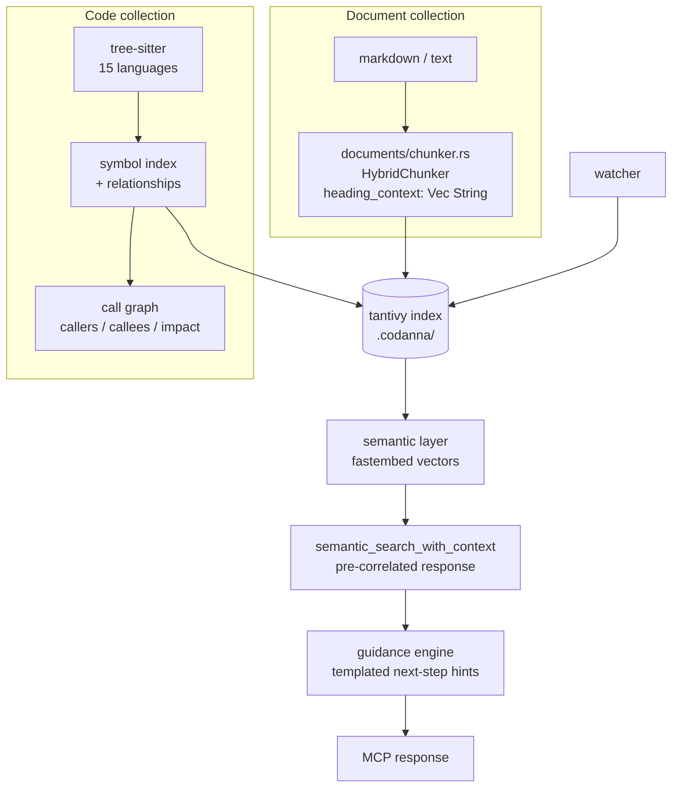

# Competitor Analysis: Codanna (bartolli)

> **The most-adopted Rust MCP indexer, and it has already made the code+documents pivot.**
> Two findings matter most: `semantic_search_with_context` fuses what would otherwise be five
> tool calls into one pre-correlated response, and its **document chunker carries a full
> `heading_context: Vec<String>` heading hierarchy** — the same primitive as Tarn's
> `heading_path`. The claim that no competitor keeps the heading breadcrumb is **false**, and
> the analysis must say so.

## Overview

| Field | Value |
|---|---|
| **Repository** | <https://github.com/bartolli/codanna> · docs at docs.codanna.sh |
| **Language** | **Rust** (edition 2024) |
| **Version** | crates.io `codanna` **0.13.2** (2026-08-04) |
| **Downloads** | ~12,917 — the highest in the Rust MCP-retrieval niche |
| **License** | Apache-2.0 |
| **Stars** | ~722 |
| **Last activity** | 2026-08-04 |
| **Status** | Active |
| **MCP crate** | `rmcp` **3.1.0** (server, client, stdio, child-process, streamable HTTP, worker) |
| **Index** | `tantivy` 0.26.1 |
| **Parsing** | `tree-sitter` 0.26.11 — 15 languages |
| **Embeddings** | `fastembed` (pinned `=5.6.0`) |
| **Transport** | stdio, HTTP, **HTTPS** — plus a one-shot CLI mode |

### Maturity Assessment

The broadest module layout of any Rust project surveyed: `parsing`, `indexing`, `symbol`,
`relationship`, `semantic`, `vector`, `storage`, `documents`, `guidance`, `plugins`,
`profiles`, `project_resolver`, `watcher`, `mcp`, `cli`, `display`, `io`, `config`, `types`.
Published performance numbers come with repro commands (76k–249k symbols/sec parsing; warm
lookups <10 ms — 0.3 ms exact, ~3 ms semantic).

The `fastembed` pin carries an explanatory comment (">=5.7 uses ort 2.0.0-rc.11 / ONNX
Runtime 1.23 whose…"), which is the kind of dependency hygiene that signals a maintained
project.

---

## Architecture



### Two collections, one server

Codanna indexes **code** (symbols, signatures, docstrings, call graphs, dependencies) and,
separately, **documents** (`codanna documents add-collection docs ./docs`). That is the
code-side mirror image of Tarn's pivot: a code tool reaching into documents, where Tarn is a
document tool reaching into code. They are converging on the same destination from opposite
sides.

---

## Document chunking — the correction

`src/documents/chunker.rs` defines:

```rust
pub struct RawChunk {
    /// Byte range in the source document (start, end).
    pub byte_range: (usize, usize),
    /// The text content of this chunk.
    pub content: String,
    /// Heading hierarchy context (e.g., ["Chapter 1", "Section 1.2"]).
    pub heading_context: Vec<String>,
}

pub trait Chunker: Send + Sync {
    fn chunk(&self, content: &str, config: &ChunkingConfig) -> Vec<RawChunk>;
}
```

Three things follow:

1. **`heading_context: Vec<String>` is a heading *path*, not a single heading string.** This
   is the same representation as Tarn's `heading_path`. The 2026-03 analysis claim that no
   competitor indexes at the section/heading level with a hierarchy is wrong, and so is the
   softer "everyone keeps only one heading" reading. Codanna keeps the breadcrumb.
2. **`Chunker` is a trait**, so chunking strategy is pluggable per collection. The shipped
   implementation is `HybridChunker` — paragraph-based with size constraints.
3. **Chunks carry `byte_range`**, so a chunk can be mapped back to an exact source span. Tarn
   should carry the same: it makes citation, re-read, and incremental invalidation precise.

What Tarn still has that codanna does not: `heading_context` is the *document* collection's
concern only, and the shipped chunker is paragraph-based with heading context attached rather
than heading-*delimited*. Sections are not the ranked unit — they are annotated chunks.

---

## Tools & Capabilities

Core tools (from `src/mcp/tools/`):

| Tool | Purpose |
|---|---|
| `find_symbol` | Exact symbol lookup with full context |
| `search_symbols` | Fuzzy symbol search |
| `get_calls` | Callees of a symbol |
| `find_callers` | Callers of a symbol |
| `analyze_impact` | Recursive blast radius |
| `semantic_search_docs` | Semantic search over the document collection |
| **`semantic_search_with_context`** | **The fused tool** |

### Tool fusion

`semantic_search_with_context` returns, per hit: symbol identity, signature, docstring,
callees **with exact call sites**, callers, and recursive impact — all pre-correlated in one
response. The project describes it as collapsing five MCP tools into one query, and each
result carries a `symbol_id` for unambiguous follow-up.

This is the opposite design philosophy to [engraph](../general/engraph.md)'s 25 primitives,
and it is the one winning adoption. The insight: an agent composing five tool calls burns
five round-trips *and* five chances to compose them wrongly. Pre-correlating the join
server-side is strictly cheaper and more reliable.

### The guidance system — the most transferable idea here

`src/guidance/` is a **configurable, template-based next-step hint engine**. Every tool
response can carry guidance selected by result count:

```rust
tools.insert("find_symbol", ToolGuidance {
    no_results: "Symbol not found. Use 'search_symbols' with fuzzy matching or
                 'semantic_search_docs' for broader search.",
    single_result: "Symbol found with full context. Explore 'get_calls' to see what it
                    calls, 'find_callers' to see usage, or 'analyze_impact' to understand
                    change implications.",
    multiple_results: "Found {result_count} symbols with that name. Review each to find
                       the one you're looking for.",
    ranges: vec![ /* e.g. min: 10 → "consider refining your search" */ ],
});
```

The design details worth copying:

- **Guidance is data, not code** — a `HashMap<String, ToolGuidance>` in config, user-editable.
- **It varies by result count** — zero, one, many, and arbitrary `RangeTemplate` bands
  (`min: 10, max: None` → "refine your search").
- **It names concrete next tools**, so the agent's next call is suggested rather than guessed.
- **`TemplateContext`** carries `tool`, `query`, `result_count`, `has_results`, and custom
  variables for substitution.

This generalizes the `recovery.hint` idea from
[cyanheads](../obsidian-pkm/obsidian-mcp-server-cyanheads.md) from *errors* to *every
response*, and makes it configurable rather than hard-coded. For Tarn: a zero-result section
search should say "no sections matched; try `list_topics` or widen the query", and a
50-result search should say "refine, or scope to a `heading_path` prefix."

### Dual surface: MCP server *and* one-shot CLI

The same tools are callable as `codanna mcp <tool> arg:val` without a running server. That
makes the capability usable from shell hooks, Agent Skills, and CI with zero MCP plumbing —
a distribution advantage Tarn could match cheaply, since its query layer is already separable
from its transport.

---

## Search Implementation

- **Symbol lookup** — exact and fuzzy over the tantivy index.
- **Semantic search** — `fastembed` local embeddings, over both collections.
- **Graph traversal** — callers, callees, dependencies, recursive impact analysis.
- **`--watch`** keeps the index hot.

Notably, codanna does **not** advertise BM25 ranking as a feature despite using tantivy. Its
retrieval story is symbol-exact plus semantic; lexical relevance ranking is not the pitch.
That is a real gap relative to Tarn and [lore](../general/lore.md), and it is the axis on
which a document-first tool competes with a code-first one.

---

## Token & Cost Optimization

Fusion *is* the token strategy: one pre-correlated response instead of five round-trips, each
of which would re-send overlapping context. `symbol_id` disambiguation avoids repeated
clarifying calls, and guidance reduces wasted exploratory queries.

There is no explicit density knob, session dedup, or budget parameter.

---

## Security Model

- **Local by default.** Remote OpenAI-compatible embeddings are strictly opt-in via
  `settings.toml`, with the key read from the environment.
- **HTTPS transport** is supported natively — unusual, and relevant for remote/team use.
- The ~150 MB embedding model download is a one-time supply-chain consideration.
- `.codanna/` holds the index; no ACL or read-only mode is documented.

---

## Strengths & Weaknesses

### Strengths

1. **Tool fusion** — `semantic_search_with_context` pre-correlates a five-call exploration
   into one response.
2. **The guidance engine** — templated, count-aware, config-driven next-step hints on every
   tool.
3. **`heading_context: Vec<String>`** — a real heading path on document chunks.
4. **`Chunker` as a trait** — pluggable chunking strategy per collection.
5. **`byte_range` on chunks** — exact source spans for citation and invalidation.
6. **Dual surface** — MCP server *and* one-shot CLI over the same tools.
7. **stdio + HTTP + HTTPS** transports.
8. **Published benchmarks with repro commands.**
9. **15 languages** via tree-sitter, with call graphs and impact analysis.
10. **Highest crates.io adoption** in this niche (~12.9k downloads).

### Weaknesses

1. **No BM25 story.** Uses tantivy but does not present lexical ranking as a capability;
   retrieval is symbol-exact plus semantic.
2. **Documents are the secondary collection** — heading context is attached to
   paragraph-based chunks rather than sections being the ranked unit.
3. **Embedding model required** for the semantic path (~150 MB download).
4. **Code-first data model.** Symbols, calls, and impact do not generalize to PDFs or SQL.
5. **No path ACLs or read-only mode.**
6. **No token-density knobs or session dedup.**
7. **`fastembed` pinned to an exact version** due to an ONNX Runtime incompatibility — a
   dependency risk carried in the open.

---

## Comparison with Tarn

| Dimension | Codanna | Tarn |
|---|---|---|
| Language | Rust | Rust |
| MCP crate | `rmcp` 3.1.0 | `rmcp` |
| Index | tantivy 0.26.1 | Own persistent BM25 |
| Primary unit | **Symbol** | **Section** |
| Secondary unit | Document chunk w/ `heading_context` | — |
| Heading path | **Yes** (`Vec<String>`) on doc chunks | **Yes** (`heading_path`) on sections |
| Byte ranges | **Yes** | Not exposed |
| Lexical ranking | Not a feature | **BM25 core** |
| Semantic | fastembed, required for semantic path | None |
| Graph | **Call graph + impact analysis** | Wikilink graph (parsed) |
| Chunking | Trait, `HybridChunker` (paragraph + size) | Heading-delimited sections |
| Tool design | **Fused** | Small set |
| Response guidance | **Templated, config-driven** | None |
| Transports | stdio, HTTP, HTTPS, one-shot CLI | stdio |
| Formats | Code (15 langs) + markdown/text | Markdown |

### Corrections this profile forces

- **"No competitor indexes at the section/heading level with a heading path" is false.**
  Codanna's `heading_context: Vec<String>` is the same primitive. Tarn's distinction is
  narrower: sections are Tarn's *ranked retrieval unit*, whereas codanna attaches heading
  context to paragraph-sized chunks in a secondary collection.
- **"Rust + tantivy + MCP is a differentiator" is false.** Codanna is Rust + tantivy + rmcp
  with 722 stars and 12.9k downloads, shipped and fast.

### What Tarn should take

- **A guidance engine.** This is the highest-value, lowest-cost item in the profile: templated
  hints keyed on tool and result count, stored as config data, naming the next concrete call.
  It generalizes cyanheads' error-only `recovery.hint` to every response and costs almost
  nothing to implement.
- **Tool fusion over tool proliferation.** When Tarn adds capabilities (backlinks, tags,
  neighbours), fuse them into the search response rather than adding tools. A section hit
  could carry its `heading_path`, sibling sections, and backlinks pre-correlated.
- **`byte_range` on sections.** Exact spans make citation precise and incremental
  invalidation cheaper.
- **A `Chunker` trait**, which the pivot needs anyway for per-format strategies — and which
  fits Tarn's existing `Buildable`/`Configurable` dispatch-enum pattern directly.
- **A one-shot CLI over the same query layer.** Tarn's `TarnCore` facade already separates
  query from transport; exposing it as `tarn query <tool> arg:val` is mostly plumbing and
  makes Tarn usable from hooks and CI.
- **Publish benchmarks with repro commands.**

### Where Tarn differs

Codanna is symbol-graph-first with documents bolted on; Tarn is section-first. For prose,
PDFs, and mixed knowledge the section is the better primitive, and Tarn's BM25 ranking is a
capability codanna does not present at all. The convergence risk is real, though: codanna is
already indexing markdown collections alongside code, and it is moving faster.
