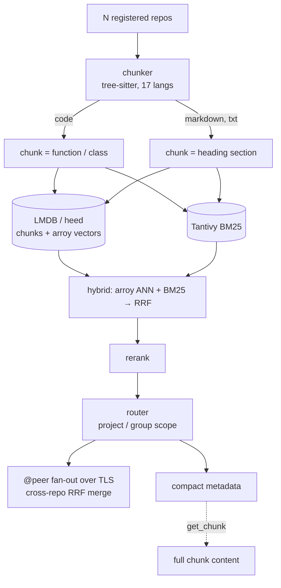

# Competitor Analysis: codesearch (flupkede)

> **Read this one for the commoditization thesis, stated by a competitor in its own README:**
> *"many projects share the same baseline stack (Rust + tree-sitter + BM25 + embeddings +
> MCP)."* codesearch's architecture is nearly identical to Tarn's target stack — Rust,
> Tantivy BM25, RRF fusion, **and it chunks Markdown by heading section**. Its two best ideas
> are `compact=true` metadata-first responses and cross-repo federated RRF.

## Overview

| Field | Value |
|---|---|
| **Repository** | <https://github.com/flupkede/codesearch> |
| **Language** | **Rust** |
| **Version** | **1.2.4** (2026-08-05) |
| **License** | Apache-2.0 |
| **Stars** | ~64 |
| **Last activity** | 2026-08-07 |
| **Status** | Active, young (created 2026-02-06) |
| **Surface** | **6 MCP tools** |
| **Transport** | stdio; HTTP in serve mode |
| **Store** | **LMDB via `heed` 0.20** (chunks + vectors) + **Tantivy** BM25 |
| **Vectors** | **`arroy` 0.5** ANN |
| **Parsing** | `tree-sitter` 0.26.8 — 17 languages **including Markdown** |

Positioning, verbatim: *"Fully local, fully offline, no GPU, no Docker."*

### Maturity Assessment

Young but disciplined. Twenty source modules (`chunker`, `search`, `fts`, `vectordb`,
`embed`, `rerank`, `symbols`, `federation`, `serve`, `watch`, `cache`, `bench`,
`db_discovery`…), a Dockerfile, CHANGELOG, AGENTS.md, CLAUDE.md, and design documents checked
in (`PLAN_TYPESCRIPT_SCIP.md`, `DIAGNOSE_FIND_IMPACT_ROUTING.md`).

---

## Architecture

### Markdown is a first-class chunking mode

`src/chunker/semantic.rs`:

> *"Markdown/txt are chunked by heading section rather than by definition"*
> `if language == Language::Markdown { … }`

and `src/chunker/grammar.rs` notes that Markdown uses the **tree-sitter-md *block* grammar
(sections, headings, …)** rather than an ad-hoc regex splitter.

So a *code* search tool already chunks prose by heading section, using a real grammar. This is
the clearest single piece of evidence that "heading-section chunking" is not a differentiator
— it is a checkbox that even code-first competitors tick. There is also a dedicated
`jupyter.rs` chunker that prefixes cells with `# [markdown]` / cell-type markers.

---

## Tools & Capabilities

Exactly **six** tools: `search`, `find`, `explore`, `get_chunk`, `find_impact`, `status`.

The routing behaviour is worth recording because Tarn will face the same problem if it ever
serves multiple corpora:

- In multi-repo mode, agents **must** specify `project` or `group` on tool calls.
- `status` always works without scope.
- **`get_chunk` auto-routes when the `chunk_id` is unique across repos; if ambiguous, it
  returns candidates and requires `project`.**

That last rule is the right pattern — resolve automatically when unambiguous, return the
candidate set when not, never guess. ([lore](../general/lore.md) does the same for document
paths.)

### The grep-guard

codesearch ships a guard that nudges agents away from raw grep when an index exists. The
implementation note is the interesting part:

> the grep-guard detects "codesearch is available **for this repo**" via a local
> `.codesearch.db` or `CODESEARCH_SERVER` — **not** by checking whether a `codesearch`
> process is running (that runs almost constantly as a multi-repo hub and would false-fire in
> every directory).

And its guidance to agents is admirably honest about when *not* to use it:

> *"Prefer codesearch for semantic, cross-file, or symbol-oriented lookup… Use plain
> grep/glob for a single known file, trivial one-line edits, or exact literal searches."*

Telling the agent when your tool is the wrong choice is a credibility move Tarn should copy —
Tarn's real baseline competitor is filesystem MCP plus the agent's own grep, and pretending
otherwise fools nobody.

---

## Search Implementation

**Hybrid, fused with RRF:**

| Lane | Implementation |
|---|---|
| Vector | `arroy` 0.5 ANN over LMDB-stored embeddings |
| Lexical | **Tantivy BM25** |
| Rerank | `src/rerank/` |
| Cross-repo | **Federated RRF merge** across repository groups and remote peers over TLS |

**Cross-repo RRF is the standout.** Register N repositories, assign them to groups, and a
query fans out and merges rankings across all of them — including remote `@peer` servers over
TLS. Its comparison table puts this first: *"Repository scope: multi-repo serve with cross-repo
RRF"* versus *"usually single repo at a time"*.

For Tarn's pivot the analogous capability is **multi-*corpus*** rather than multi-*repo*:
query notes + code + PDFs + SQL together and merge rankings. codesearch has already solved the
merge problem for the homogeneous case; the heterogeneous case (where score distributions
differ per corpus type) is harder and is unoccupied. Note that
[lore](../general/lore.md) independently solves the same problem with min-max normalization
per store batch.

Operationally: first index takes 2–5 minutes, incremental re-index 10–30 s, **branch switches
re-index automatically**.

---

## Token & Cost Optimization

This is the project's second differentiator and it is a single, well-chosen default:

- **`compact = true` by default** — `search` returns **metadata only, no code**. The agent
  calls `get_chunk` to pull actual content for the hits it cares about.

Their comparison table frames it as: *"Token cost per call: `compact=true` by default; chunks
fetched on demand"* versus *"frequently dumps full snippets."*

**This decouples ranking cost from token cost.** A query can consider 50 candidates and return
50 cheap metadata rows; the agent pays for content only on the two it wants. It is the same
two-phase shape as [markdown-vault-mcp](../documents/markdown-vault-mcp.md)'s snippet →
`read(section=)` and [knowledge-rag](../documents/knowledge-rag.md)'s `snippet_mode` →
`get_document`, arrived at independently by three projects — which is about as strong a signal
as this survey produces.

One more operational note that matters for remote deployments: *"In remote-serve mode,
returned paths are from the **server's** filesystem — read content via `get_chunk` rather than
opening paths locally."* Paths in results are not necessarily openable by the client.

---

## Security Model

- **Fully offline** — no GPU, no Docker, no external services, no API keys.
- **TLS between federated peers.**
- Unindexed directories (`.venv`, `node_modules`, `build/`) simply return nothing.
- No path ACLs or read-only mode documented; the tool is read-only in practice (no write
  tools).

---

## Strengths & Weaknesses

### Strengths

1. **`compact=true` by default** — metadata-first responses with on-demand `get_chunk`.
2. **Cross-repo federated RRF**, including remote peers over TLS.
3. **AST-aware chunking for 17 languages**, with **Markdown chunked by heading section using
   the tree-sitter-md block grammar**.
4. **Six tools.** Disciplined surface.
5. **Ambiguity → candidates**, not guesses, in `get_chunk` routing.
6. **Honest guidance about when to use grep instead.**
7. **Grep-guard detection done correctly** (per-repo marker, not process presence).
8. **Fully offline**: LMDB + arroy + Tantivy, no model server, no Docker.
9. **Fast incremental re-index** with automatic branch-switch handling.
10. **Explicit about the commoditization of its own stack.**

### Weaknesses

1. **~64 stars.** Little adoption despite good engineering.
2. **Code-first.** Markdown chunking exists, but there is no frontmatter, tag, wikilink, PDF,
   or SQL support.
3. **Heading sections are chunk boundaries, not a ranked hierarchy** — no heading-path field,
   no hierarchical scoping.
4. **Multi-repo mode forces the agent to specify scope** on most calls, adding a parameter the
   agent must get right.
5. **No writes.**
6. **Two storage engines** (LMDB + Tantivy) to keep consistent.
7. **Design documents checked into the repo root** (`DIAGNOSE_*`, `PLAN_*`) suggest churn in
   routing and language-support areas.

---

## Comparison with Tarn

| Dimension | codesearch | Tarn |
|---|---|---|
| Language | Rust | Rust |
| Lexical index | **Tantivy BM25** | Own persistent BM25 |
| Vector lane | arroy ANN over LMDB | None |
| Fusion | **RRF, incl. cross-repo** | Single lane |
| Markdown chunking | **Heading section (tree-sitter-md)** | Section with `heading_path` |
| Code chunking | AST — functions/classes, 17 langs | None |
| Heading path | No | **Yes** |
| Multi-corpus | **Multi-repo + federation over TLS** | Single vault |
| Response default | **Metadata only (`compact=true`)** | Section content |
| Two-phase fetch | **`get_chunk`** | Not yet |
| Tools | 6 | Small set |
| Writes | None | Planned |
| Obsidian syntax | None | Full parser |
| Adoption | ~64★ | Pre-release |

### What this profile establishes for the analysis

1. **The stack is commodity, and a competitor says so in its README.** Any positioning that
   leads with "Rust + BM25 + local + MCP" is describing the category baseline.
2. **Heading-section chunking is commodity too.** A code search tool does it with a real
   grammar. Tarn's remaining edge is the *heading path* and sections as the *ranked* unit —
   not "we chunk by heading."

### What Tarn should take

- **`compact` as the default response mode.** Return ranked section metadata —
  `heading_path`, path, score, a short snippet — and add a `get_section` call for full
  content. This is the single highest-leverage token change available, and three independent
  projects converged on it.
- **Return candidates on ambiguous identifiers**, auto-resolve when unique.
- **Honest tool guidance**, including when grep is the better choice. Tarn's honest baseline
  is filesystem MCP + grep; saying so builds more trust than it costs.
- **Score normalization before merging** if Tarn ever ranks across heterogeneous corpora —
  and note this is *harder* than codesearch's homogeneous case, which is precisely why it is
  unoccupied ground.
- **Automatic re-index on branch switch**, if Tarn indexes git-backed corpora.

### Where Tarn differs

`heading_path` as a ranked, hierarchical field rather than a chunk boundary; frontmatter,
tags, and wikilink parsing; and a document-first data model that extends naturally to PDFs and
prose. codesearch is deliberately narrow — "lightweight, multi-repo, MCP-native, fully
offline" — and explicitly does not want to be a knowledge tool. That self-limitation is Tarn's
opening on the same architecture.
