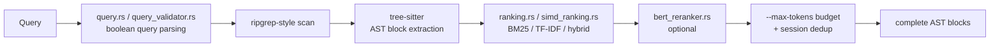

# Competitor Analysis: Probe (probelabs / buger)

> **The most important entry for Tarn's retrieval strategy.** Probe is the clearest
> articulation of the thesis Tarn implicitly bets on — that for *agent* consumers, lexical
> search with a good query language beats embedding search — and it argues the case
> explicitly. Its two most portable ideas, **session deduplication** and **`--max-tokens` as a
> first-class budget**, are cheap for Tarn to adopt and are absent from every document-side
> competitor.

## Overview

| Field | Value |
|---|---|
| **Repository** | <https://github.com/probelabs/probe> |
| **Author** | Leonid Bugaev (buger, of GoReplay) |
| **Language** | **Rust** core + Node distribution |
| **Version** | **v0.6.0-rc330** (2026-07-31); npm `@probelabs/probe`. crates.io `probe-code` is stale at 0.6.0 (2025-07-21) — **npm is the live channel** |
| **License** | Apache-2.0 |
| **Stars** | ~679 |
| **Last activity** | 2026-07-31 |
| **Status** | Active |
| **Index** | **None — stateless by design** |
| **Install** | `npx @probelabs/probe mcp` |

### Maturity Assessment

Mature engineering practice: `ARCHITECTURE.md`, `CONTRIBUTING.md`, `SECURITY.md`,
`CODE_OF_CONDUCT.md`, `Cross.toml` for cross-compilation, a Makefile, `benches/`, and a
documentation site. Source includes `path_safety.rs`, `file_guard.rs`, `query_validator.rs`,
and both `ranking.rs` and `simd_ranking.rs`.

The `-rc330` version suffix indicates a continuous-release pipeline rather than instability.

---

## The thesis

Probe's README states the argument directly, and it is worth quoting because it is the
central strategic question for Tarn's retrieval design:

> **The key insight: AI agents don't need embedding search**
>
> Embedding-based tools solve vocabulary mismatch — finding "authentication" when the code
> says `verify_credentials`. But when an AI agent is the consumer, **the LLM already handles
> this**:
>
> ```
> User: "find the authentication logic"
>   -> LLM generates: probe search "verify_credentials OR authenticate OR login OR auth_handler"
>   -> Probe returns complete AST blocks in milliseconds
> ```
>
> The LLM translates intent into precise boolean queries… Combined with session dedup, the
> agent can run 3-4 rapid searches and cover more ground than a single embedding query —
> faster, deterministic, and with zero setup cost.

The claim is not "embeddings are bad"; it is that **the vocabulary-mismatch problem embeddings
solve has already been solved upstream by the agent**, so paying for an embedding model, a
vector store, and an index-sync problem buys less than it appears to. What the agent needs
instead is *a query language expressive enough to encode its expansions* and *a retrieval unit
that returns complete, syntactically valid context*.

Its own comparison table:

| | grep/ripgrep | Embedding tools | Probe |
|---|---|---|---|
| Setup time | None | Minutes (indexing + embedding service) | None |
| Search method | Regex | Vector similarity | **Elasticsearch-style boolean queries + BM25** |
| Ranking | None (line order) | Cosine similarity | **BM25/TF-IDF/Hybrid with SIMD** |
| Token awareness | No | Partial | **Yes (`--max-tokens`, session dedup)** |

**Where this leaves Tarn.** Tarn's persistent BM25 index is a *middle* position: it accepts
Probe's argument about lexical retrieval but rejects its conclusion about statelessness,
trading index-maintenance cost for sub-millisecond warm queries and corpus-wide ranking
statistics. That is a defensible position, but Probe is the reason it needs to be argued
rather than assumed — "we index" is a cost, and the benefit must be stated.

---

## Architecture



**No index, no state on disk.** Files are scanned and ranked at query time. The consequences
are worth being precise about:

- **Never stale.** No sync problem, no reindex, no watcher, no branch-switch handling.
- **Deterministic.** The same query on the same tree returns the same result, always.
- **Zero setup.** `npx` and go.
- **Cost is per query, and scales with corpus size** — the exact trade Tarn's index inverts.

---

## Search Implementation

**Query language** (Elasticsearch-style), which is the substrate the whole thesis rests on:

- `AND`, `OR`
- `+required`, `-excluded`
- `"exact phrases"`
- Field filters: `ext:rs`, `lang:python`

**Ranking**: BM25, TF-IDF, or hybrid, with **SIMD acceleration** (`simd_ranking.rs`), plus
optional **BERT reranking** (`bert_reranker.rs`).

**Retrieval unit**: complete **AST blocks** via tree-sitter — a whole function or class, not a
line or a fixed window. Structurally valid context is what makes the results directly usable
by an agent without a follow-up "show me the rest of this function" call.

---

## Token & Cost Optimization

This is Probe's strongest contribution and the reason it earns a deep dive despite being
code-only.

### Session deduplication

Probe tracks which blocks an agent has already been shown **within a session** and filters
them from subsequent results. `src/main.rs` even handles the edge case explicitly — when a
result set comes back empty *because everything was filtered*, it says so:

> `"Filtered already-seen blocks (session deduplication):"`

That detail matters: silently returning nothing is indistinguishable from "no matches exist",
which would send the agent down the wrong path. Reporting the filter is the same principle as
[knowledge-rag](../documents/knowledge-rag.md)'s `filtered_by_score` counter.

**Why this is significant for Tarn.** An agent exploring a corpus issues several related
queries in sequence, and overlapping result sets mean the same section is re-sent repeatedly —
paid for every time. Deduplicating against a session's already-seen set is a pure win with no
relevance cost. No document-side competitor in this survey implements it, and Tarn's stable
section identity (`heading_path` + path) makes it straightforward: keep a per-session set of
returned section IDs and filter, reporting the count suppressed.

`config.rs` shows the cache scope is configurable across **file, workspace, project, session**
granularities.

### `--max-tokens`

A first-class token budget on the search call: `probe search "API" ./ --max-tokens 10000`.
Not a result count, not a character limit — a token budget the tool respects while packing
results. This is the correct unit for an LLM consumer, and it is a parameter Tarn should
expose on its search tool.

---

## Tools & Capabilities

Two modes:

- **Raw tools** — `search`, `query`, `extract`.
- **Built-in agent** — a ProbeAgent exposed as a single MCP surface, which natively integrates
  with Claude Code using its existing authentication ("no extra API keys needed"). Within the
  agent, `search()`, `query()`, `extract()`, `LLM()`, `map()`, `chunk()` and any other MCP
  tools are available.

There is also `lsp_integration/` and `path_resolver/` in the source tree.

The dual shape — a small primitive surface *or* one fused agent tool — is a distribution idea
worth noting: some clients want primitives, others want a single capable endpoint.

---

## Security Model

- **Stateless** — nothing persisted, so no index to leak or poison.
- **`path_safety.rs`, `file_guard.rs`** — explicit traversal and access guards.
- **`query_validator.rs`** — query input validation before execution.
- **`SECURITY.md`** with a disclosure policy.
- Agent mode piggybacks on the host harness's auth (Claude Code / Codex), so no additional
  credentials are stored.

---

## Strengths & Weaknesses

### Strengths

1. **Session deduplication** with explicit reporting when it empties a result set.
2. **`--max-tokens` as a first-class budget parameter.**
3. **A real boolean query language** (`AND`/`OR`/`+`/`-`/phrases/`ext:`/`lang:`) that lets an
   agent encode its own query expansion.
4. **Complete AST blocks** as the retrieval unit — syntactically valid, immediately usable.
5. **Zero setup, never stale, fully deterministic.**
6. **SIMD-accelerated ranking** with BM25/TF-IDF/hybrid options.
7. **A clearly argued retrieval thesis**, which is rarer and more useful than it sounds.
8. **Optional BERT reranking** without making it mandatory.
9. **Explicit path-safety and query-validation modules.**

### Weaknesses

1. **Per-query cost scales with corpus size.** No index means no warm-cache advantage and no
   corpus-wide statistics maintained across queries.
2. **Code-only.** No prose, PDF, frontmatter, or SQL support.
3. **No persistent ranking statistics** — IDF must be derived per run.
4. **Version channel confusion** — crates.io is stale at 0.6.0 (2025-07-21) while npm carries
   `0.6.0-rc330`; the Rust core is distributed primarily through Node.
5. **Node distribution** for a Rust tool adds a runtime dependency for the common install path.
6. **No writes.**
7. **The `-rc` versioning** makes "which version am I running" harder to reason about.

---

## Comparison with Tarn

| Dimension | Probe | Tarn |
|---|---|---|
| Index | **None (stateless)** | **Persistent BM25** |
| Staleness | Impossible | Requires sync (observer/watcher) |
| Query cost | O(corpus) per query | O(log n) warm |
| Ranking | BM25/TF-IDF/hybrid + SIMD | BM25 |
| Corpus statistics | Per-run | Persisted |
| Query language | **Boolean + field filters** | Basic |
| Retrieval unit | **Complete AST block** | **Section (`heading_path`)** |
| Token budget | **`--max-tokens`** | None |
| Session dedup | **Yes, with reporting** | None |
| Rerank | Optional BERT | None |
| Formats | Code | Markdown → general |
| Setup | Zero | Index build |
| Writes | None | Planned |

### What Tarn should take — in priority order

1. **Session deduplication.** The highest value-per-line item found anywhere in this survey.
   Tarn's sections have stable identity, so a per-session set of returned section IDs is
   enough. Report the suppressed count, as Probe does, so an empty page is never ambiguous.
2. **`max_tokens` as a search parameter.** Budget in the consumer's actual unit, and pack
   results to fit. Pairs naturally with the `compact`/metadata-first default that
   [codesearch](codesearch.md) and [knowledge-rag](../documents/knowledge-rag.md) converge on.
3. **A boolean query language.** `AND`/`OR`/`+required`/`-excluded`/`"phrases"` plus field
   filters is cheap over an existing BM25 index and raises the ceiling on agent-driven
   querying substantially — it is precisely what lets the agent do its own vocabulary
   expansion instead of paying for an embedding model. Tarn's natural field filters are
   `tag:`, `path:`, and `heading:`. ([lore](../general/lore.md) reaches the same conclusion by
   deliberately preserving query operators through sanitization.)
4. **Return structurally complete units.** Probe returns whole AST blocks; Tarn returns whole
   sections. Same principle — never hand back a fragment the agent must call again to
   complete.

### The argument Tarn must be able to make

Probe is the strongest case *against* indexing, and it is a serious one: no staleness, no sync
bug surface, no setup, deterministic. Tarn's index has to earn its keep on grounds Probe
cannot match:

- **Corpus-wide ranking statistics** (IDF over the whole corpus, section-length
  normalization) that a per-query scan approximates poorly.
- **Sub-millisecond warm queries** at corpus sizes where scanning is too slow — which is
  exactly where a general-purpose corpus (notes + code + PDFs) lands.
- **Structure that cannot be recovered by scanning**: `heading_path` hierarchies, link graphs,
  tag inventories.

Where Probe is straightforwardly right and Tarn should simply agree: **skip embeddings by
default.** The agent handles vocabulary mismatch; spend the effort on query language and token
economics instead.
