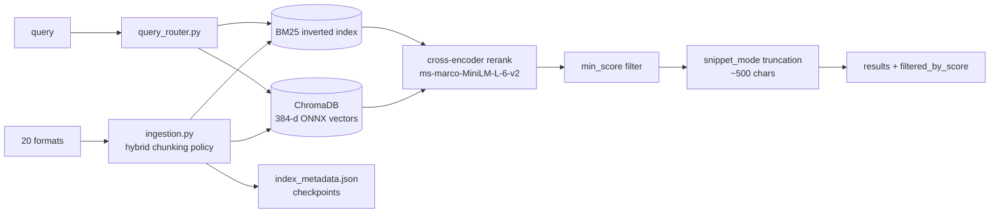

# Competitor Analysis: knowledge-rag (lyonzin)

> **The narrative leader in local-RAG MCP.** 246 stars in six months, a public benchmark
> baseline, a documented quality gate, and same-week adoption of new MCP spec revisions. This
> is the project Tarn will be compared against in "best local RAG MCP server" listicles, and
> it competes on *evidence* — published numbers — more than on architecture.

## Overview

| Field | Value |
|---|---|
| **Repository** | <https://github.com/lyonzin/knowledge-rag> |
| **Language** | Python ≥3.11 |
| **Version** | **4.8.1** (2026-08-07) — GitHub Releases, PyPI, and npm all in sync |
| **License** | MIT |
| **Stars** | ~246 (repo created 2026-02-05) |
| **Last activity** | 2026-08-09 |
| **Status** | Active — aggressive release cadence |
| **Surface** | **13 MCP tools** |
| **Transport** | stdio (default) |
| **Store** | ChromaDB (vectors) + custom BM25 inverted index + `index_metadata.json` |
| **Formats** | 20 — md, txt, PDF, docx, xlsx, pptx, ipynb, json, csv, xml, and ~9 code languages |

### Maturity Assessment

The most *marketed* project in this survey, and the marketing is backed by artifacts:
`bench/`, a checked-in `perf-baseline-v4.7.1.json`, `SECURITY.md`, `CODE_OF_CONDUCT.md`,
`CODEOWNERS`, `CONTRIBUTING.md`, `glama.json`, `presets/`, install scripts for POSIX and
PowerShell, a Dockerfile, and distribution on both PyPI and npm.

The README advertises a **"7-Pillar Quality Gate"** — 35+ CI checks including memory-leak
soak tests, performance-regression gates, and chaos injection.

---

## Technology Stack

| Layer | Choice |
|---|---|
| **Vector store** | ChromaDB |
| **Keyword** | **Custom inverted index** (replaced `rank-bm25`) |
| **Embeddings** | `BAAI/bge-small-en-v1.5`, 384-dim, **ONNX** |
| **Reranker** | `ms-marco-MiniLM-L-6-v2` cross-encoder |
| **Runtime** | Pure ONNX — no Docker, no Ollama, no API keys, no GPU |

Fully local: no external services and no keys required for the default configuration.

---

## Architecture

Supporting modules show operational seriousness: `instance_lock.py`, `ratelimit.py`,
`preflight.py`, `guarded.py`, `metrics.py`, `security.py`.

---

## Chunking — hybrid policy, and the exploitable weakness

`ingestion.py` applies a **format-dependent policy**:

- **Markdown** — split on headings, with two documented refinements:
  1. *"Strips code blocks before splitting (prevents `#` comments from being treated as
     headers)"* — code blocks are **masked** before the split pass.
  2. *"Split by `##` and `###` headers only (not `#` which catches code comments)"* — the
     regex is `re.split(r"(?=^#{2,3}\s+)", masked_text, flags=re.MULTILINE)`.
- **Everything else** — fixed windows: `chunk_size: 1000`, `chunk_overlap: 200` characters,
  bound-checked at config load (`chunk_size < 100` → reset to 1000; overlap ≥ size → reset to
  `size // 5`).
- **DOCX** — heading hierarchy is preserved by reading paragraph style names
  (`para.style.name`) and re-emitting them as markdown headings.

**This is the gap Tarn should aim at.** The project's own structure concedes it: markdown gets
structure-aware chunking, and PDF/docx/xlsx/pptx/code fall back to 1000-character windows with
200-character overlap. A page-boundary-aware PDF chunker or an AST-aware code chunker would
beat this on exactly the formats a general-purpose corpus is full of.

Two secondary observations: masking code fences before heading splits is the correct fix and
worth copying; and excluding `#` (H1) entirely from the split set is a blunt workaround — the
fence mask already solves the comment problem, so dropping H1 discards a real structural
signal.

---

## Search Implementation

Three-stage hybrid:

1. **BM25 over a custom inverted index.** The 4.x rewrite is the project's headline
   engineering claim: *"128× faster BM25 search — replaced `rank-bm25` full-corpus scan with a
   custom inverted-index implementation. Only documents containing query terms are scored,
   using `numpy.argpartition` for O(n) top-k selection."* Adjacent-chunk fetching became a
   single batched ChromaDB call instead of N round-trips, and an O(1) reverse lookup
   (`_source_to_docid`) removed linear scans.
2. **Dense retrieval** over ChromaDB with 384-dim `bge-small-en-v1.5` ONNX embeddings.
3. **Cross-encoder reranking** with `ms-marco-MiniLM-L-6-v2`.

There are dedicated tests for BM25 Unicode tokenization and tokenizer fragmentation
(`test_bm25_unicode_tokenizer.py`, `test_bm25_tokenizer_fragment.py`), which is more
tokenizer rigor than most competitors show.

**Note what the 128× claim actually says.** It is a comparison against a naive full-corpus
scan in `rank-bm25` — i.e. the speedup comes from *having a real inverted index at all*, which
is table stakes for Tantivy and for Tarn's own index. It is not evidence of an advantage over
a properly-indexed competitor. Worth stating plainly in the analysis, because the number is
prominent and easy to mis-read as a relevance or latency edge.

---

## Token & Cost Optimization

Two well-designed knobs, both defaulted sensibly:

- **`snippet_mode`** (default **`true`**) — truncates content to ~500 characters **at natural
  break points**, claimed **~72% token reduction**. Crucially it adds a `content_length` field
  carrying the original size, and points the agent to `get_document()` for the full text. That
  is the snippet → full-read loop again, with an explicit size signal so the agent can decide
  whether the fetch is worth it.
- **`min_score`** — filters results below a normalized 0.0–1.0 relevance threshold,
  recommended at 0.2–0.4 "to cut noise". The response includes a **`filtered_by_score` count**
  so the agent knows results were suppressed rather than absent.

The `filtered_by_score` counter is the detail worth copying: silent filtering is
indistinguishable from an empty corpus, and telling the agent *how many* were dropped lets it
retry with a lower threshold instead of concluding nothing exists.

---

## Evaluation — the differentiator

`evaluate_retrieval` is exposed **as an MCP tool**, returning **MRR@5** and **Recall@5** plus
per-query results.

No other project in this survey ships retrieval evaluation as a first-class, callable
capability. Combined with `bench/` and the checked-in `perf-baseline-v4.7.1.json`, it means
the project can make quality claims with reproducible backing — and can detect regressions in
CI rather than by feel.

This is the strategic point for Tarn: **the projects winning attention in this category
compete on published numbers.** [DBHub](../structured/dbhub.md) publishes a token-cost table;
[pluck](../general/pluck.md) gates every claim on a checked-in benchmark file; knowledge-rag
ships MRR/Recall as a tool. Architecture arguments do not travel; numbers do.

---

## Tools & Capabilities

13 tools, all instrumented with `@rate_limited` and `@instrument` decorators (zero overhead
when disabled):

| Tool | Purpose |
|---|---|
| `search_knowledge` | Hybrid search with `min_score`, `snippet_mode` |
| `get_document` | Full content retrieval after a snippet |
| `add_document` | Ingest |
| `add_from_url` | Ingest from a URL |
| `reindex_documents` | Rebuild |
| `get_reindex_status` | Progress |
| `list_documents` | Inventory |
| `list_categories` | Grouping |
| `get_index_stats` | Index health |
| `search_similar` | Similarity by document |
| `evaluate_retrieval` | **MRR@5 / Recall@5** |
| (+ document CRUD: update, remove) | |

A restrained, coherent surface — roughly a third of
[markdown-vault-mcp](markdown-vault-mcp.md)'s 33.

---

## Security Model

- **Fully local** — ONNX runtime, no API keys, no external calls.
- **`security.py`, `ratelimit.py`, `guarded.py`, `instance_lock.py`, `preflight.py`** — rate
  limiting per tool, a single-instance lock, and startup preflight validation.
- **`SECURITY.md`** with a disclosure policy.
- **Config bound-checking** with warnings rather than crashes on invalid values.

The single-instance lock is the same conclusion [ostk-recall](../general/ostk-recall.md) and
[Pharos](../general/pharos-rag.md) reached: an embedded store cannot tolerate concurrent writers.

---

## Strengths & Weaknesses

### Strengths

1. **Retrieval evaluation as an MCP tool** (MRR@5 / Recall@5) — unique in this survey.
2. **Checked-in performance baseline** and a benchmark suite gating CI.
3. **`snippet_mode` with `content_length`** and **`min_score` with `filtered_by_score`** —
   token knobs that stay honest about what they hid.
4. **Custom inverted-index BM25** with `numpy.argpartition` top-k.
5. **Code-fence masking before heading splits.**
6. **DOCX heading hierarchy preserved** via paragraph style names.
7. **Fully local ONNX stack** — no Docker, Ollama, GPU, or keys.
8. **Restrained 13-tool surface**, uniformly instrumented.
9. **Distribution on PyPI *and* npm**, plus install scripts for POSIX and Windows.
10. **Operational hardening** — rate limiting, instance lock, preflight, metrics.

### Weaknesses

1. **Fixed 1000/200-character windows for every non-markdown format** — PDF, docx, xlsx,
   pptx, and code all lose their structure. This is the central weakness.
2. **H1 excluded from heading splits**, discarding a real signal after the fence mask already
   solved the underlying problem.
3. **The 128× claim is against a naive baseline**, not against an indexed competitor.
4. **Python + ChromaDB + ONNX** — heavier install and slower cold start than a single binary.
5. **Two independent persistence stores** (ChromaDB + inverted index) plus a metadata
   checkpoint file to keep consistent.
6. **No section-level addressing** — `get_document` returns whole documents; there is no
   "fetch the section this snippet came from".
7. **No path ACLs or read-only mode** documented.
8. **Quality-gate claims are self-reported** — the pillars and check counts are asserted in
   the README, not independently verifiable.

---

## Comparison with Tarn

| Dimension | knowledge-rag | Tarn |
|---|---|---|
| Language / runtime | Python + ChromaDB + ONNX | Single Rust binary |
| Keyword | Custom inverted index BM25 | Own persistent BM25 |
| Dense lane | bge-small-en-v1.5 (384-d ONNX) | None |
| Rerank | ms-marco-MiniLM cross-encoder | None |
| Formats | **20** | Markdown |
| Markdown chunking | `##`/`###` split, fences masked | Sections with `heading_path` |
| Non-markdown chunking | **1000/200 fixed windows** | Planned structure-aware |
| Retrieval unit | Chunk | Section |
| Section addressing | None | `heading_path` |
| Token knobs | **`snippet_mode`, `min_score`, `filtered_by_score`** | Section-scoped |
| Evaluation | **`evaluate_retrieval` (MRR@5, Recall@5)** | None |
| Benchmarks | **Published, CI-gated** | None |
| Tools | 13 | Small set |
| Writes | Document CRUD | Planned |
| Concurrency | Instance lock | `RevisionToken` |

### What Tarn should take

- **Ship `evaluate_retrieval` as a tool and a benchmark baseline in the repo.** This is the
  highest-leverage item on this page. Tarn's core claim — that section-level retrieval beats
  document-level retrieval on tokens-per-correct-answer — is measurable, and unmeasured claims
  lose to measured ones regardless of who is right.
- **`min_score` + `filtered_by_score`.** Never filter silently; report the count so the agent
  can lower the threshold instead of concluding the corpus is empty.
- **`snippet_mode` + `content_length`.** Truncate at natural break points and always return
  the original size so the agent can decide whether to fetch more.
- **Mask code fences before any structural split.** Tarn parses markdown properly, but this is
  worth an explicit test: a `# comment` inside a fenced block must never become a section
  boundary. ([cyanheads](../obsidian-pkm/obsidian-mcp-server-cyanheads.md) precomputes the
  same mask.)
- **Preserve heading hierarchy when extracting from DOCX** via style names — directly relevant
  to the general-purpose pivot, and `heading_path` is exactly the right target representation.
- **Bound-check config with warnings**, not crashes.

### Where Tarn wins

The pivot's whole thesis is visible in this project's chunking table: structure-aware for
markdown, 1000-character windows for everything else. A general-purpose Tarn that carries
`heading_path` (or its per-format analogue — page/section for PDF, symbol path for code)
across *every* format beats this on its weakest axis. But Tarn cannot make that argument
credibly without the measurement apparatus knowledge-rag already ships.
