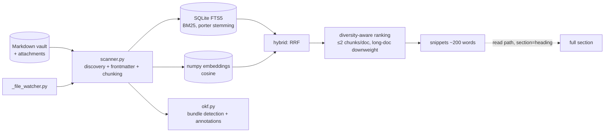

# Competitor Analysis: markdown-vault-mcp (pvliesdonk)

> **The closest philosophical match to Tarn in any language.** Adaptive heading-level
> chunking, BM25 as the primary lane, a persistent index, snippet-then-`read(section=)`
> retrieval, and an explicit "generic markdown collection, not just Obsidian" positioning —
> the same pivot Tarn is making. It is also, unexpectedly, **OKF-aware**, which makes it
> directly relevant to how this documentation bundle itself is structured.

## Overview

| Field | Value |
|---|---|
| **Repository** | <https://github.com/pvliesdonk/markdown-vault-mcp> |
| **Author** | Peter van Liesdonk |
| **Language** | Python ≥3.11 (through 3.14) |
| **Version** | PyPI **3.1.0** (2026-07-08); repo at `3.2.0-rc.6` |
| **License** | MIT |
| **Stars** | ~27 |
| **Last activity** | 2026-08-07 (very active) |
| **Status** | Active — classifiers declare "Development Status :: 5 - Production/Stable" |
| **Surface** | **33 LLM-visible tools** + 6 app-only tools |
| **Store** | SQLite FTS5 + numpy embeddings file + JSON change-tracking state |
| **Framework** | FastMCP (`fastmcp-pvl-core`) |

### Maturity Assessment

Production-grade for its size: Dockerfile, `compose.yml`, codecov config, CHANGELOG,
CLAUDE.md, a `REVIEW.md`, a published documentation site, a GitHub webhook integration, and a
`FORKING.md`. The project is generated from a copier template (`fastmcp-pvl-core`) with
explicit `PROJECT-DEPS-START/END` markers preserving domain dependencies across template
updates — an unusual and disciplined way to run a Python service.

Adoption is the weak point: ~27 stars for work of this quality.

---

## Technology Stack

| Layer | Choice |
|---|---|
| **MCP framework** | FastMCP ≥3.0 via `fastmcp-pvl-core` |
| **Keyword index** | SQLite **FTS5** with BM25 and porter stemming |
| **Vector index** | numpy embeddings file, cosine similarity |
| **Embeddings** | FastEmbed (local, default), Ollama, or OpenAI |
| **Frontmatter** | `python-frontmatter` |
| **CLI** | Typer |
| **Extras** | `mcp`, embeddings backends, `[all]` in the Docker image |

Persistence is deliberately three separate artifacts: the FTS5 index file
(`MARKDOWN_VAULT_MCP_INDEX_PATH`, **in-memory unless set**), the numpy embeddings file
(`..._EMBEDDINGS_PATH`, required to enable semantic search at all), and JSON change-tracking
state for incremental reindexing.

---

## Architecture

---

## Chunking — the closest analogue to Tarn's section model

`scanner.py` defines a `Chunker` protocol with multiple strategies. The adaptive heading
chunker is the interesting one, and its docstring is unusually precise about behaviour:

- **Legacy mode** (both `max_chunk_words` and `max_chunk_chars` unset): split on **H1/H2
  only**. A document containing only H3+ headings returns a single `heading=None` chunk.
- **Adaptive mode** (a budget is set): after the initial H1/H2 split, **each chunk exceeding
  the budget is recursively re-split at the next heading level** — H3, then H4, … up to H6 —
  until it fits or no deeper headings exist inside.
- If H1/H2 yielded nothing, the chunker **descends H3→H6 to find the shallowest heading level
  actually present**, so a document with only H3s is split at H3 rather than collapsed.
- When heading refinement cannot progress further — a leaf section, a heading-less preamble,
  a short document — `_budget_split` falls back to **paragraph, then line, then word
  boundaries**, so the invariant `not _over_budget(chunk.content)` holds for *every* chunk.

Default budget is `MAX_CHUNK_WORDS = 400`. Chunks carry `heading` and `heading_level`.

This is a genuinely better-specified chunker than most: it guarantees a hard size bound while
degrading through progressively coarser structural signals. Tarn's sections are currently
unbounded, and this is the reference design for fixing that.

The limitation relative to Tarn: chunks carry a **single `heading` plus `heading_level`**, not
a full ancestor path. Same gap as [lore](../general/lore.md) and
[engraph](../general/engraph.md) — everyone chunks by heading, nobody keeps the breadcrumb.

---

## Search Implementation

| Mode | Mechanism |
|---|---|
| `keyword` | SQLite FTS5, BM25, porter stemming |
| `semantic` | Cosine similarity over the numpy embedding store |
| `hybrid` | **Reciprocal Rank Fusion** of the two |

**Per-column BM25 weights** are configurable via `MARKDOWN_VAULT_MCP_FTS_WEIGHTS` as
`column:weight` pairs over the columns **`path`, `title`, `folder`, `heading`, `content`,
`summary`**. So `heading` is a separately weightable BM25 column — the same BM25F insight as
lore's boosted `section` field, but exposed as user configuration rather than a compile-time
constant.

**Diversity-aware ranking** is applied after fusion:

- a single document is capped at **2 chunks** per result list (configurable),
- chunks of long documents are **downweighted**,
- results are returned as **sentence-scale snippets** (~200 words by default).

The README states the purpose plainly: *"This bounds LLM context cost per query, with
full-section recovery via `read(path, section=heading)`."*

Incremental reindexing converges the vector index precisely — "exactly the changed documents
are re-embedded and orphaned vectors dropped, never the whole corpus."

---

## Token & Cost Optimization

The strongest coherent story in the documents category, and structurally similar to what Tarn
should build:

1. **Snippets by default** — `search` returns ~200-word query-relevant snippets in `content`;
   `snippet_words=0` restores full-chunk behaviour.
2. **`read(path, section=heading)`** — the recovery path. See a snippet, fetch exactly that
   section.
3. **Diversity cap** — ≤2 chunks per document, so one verbose note cannot monopolize a page.
4. **Long-document downweighting.**
5. **`MAX_NOTE_READ_BYTES`** (default 262144) caps full-document reads, and the docs
   explicitly route users to partial reads instead; **partial reads bypass the cap**.
6. **Adaptive chunk budget** guaranteeing no oversized chunk exists to return.

The snippet → section-read loop is exactly the two-phase retrieval pattern the code-side
competitors arrived at independently (`codesearch`'s metadata-then-`get_chunk`), and it is
the single most transferable idea here.

---

## OKF support — directly relevant to this bundle

`src/markdown_vault_mcp/okf.py` implements **Open Knowledge Format** awareness:

- **Detection probe** — reads `okf_version` from the bundle-root `index.md`. Pure disk I/O
  with zero index coupling, so it works before the index is built and picks up a mid-session
  declaration on the next call.
- **Read annotations** — derives per-note `type`, lifecycle `status`, staleness, and trust
  tier, and makes those dimensions **filterable in search**.
- **`okf_validate`** — a conformance audit tool.
- **Migration transforms** — `okf_convert_links`, `okf_generate_index`, `okf_seed_log`.
- **`MARKDOWN_VAULT_MCP_OKF_MODE`** — `auto` / `on` / `off`.

Two design decisions worth recording:

**The trust model is read-only by construction.** The docstring is explicit: *"the vault-side
declaration only ever enables read semantics and advisory guidance — never write behavior."*
A file in the corpus declaring `okf_version` can change how results are annotated and
filtered, but can never change what the server writes. That is the correct boundary for any
in-corpus declaration — the corpus is untrusted input.

**The field vocabulary is kept as data, not code** — module constants rather than logic
spread through the codebase, justified by the spec being pre-1.0 with one breaking rename
already behind it, so a future revision is a table edit.

Since this doc set is itself an OKF bundle, this is also a practical note: a conformant
`docs/` bundle is directly consumable by an existing MCP server.

---

## Tools & Capabilities

**33 LLM-visible tools** plus **6 app-only tools** (`vault_context`, `vault_list`,
`vault_read`, `vault_search`, `vault_graph_neighborhood`, `vault_graph_hubs`) marked
`visibility="app"` and used only by an MCP Apps SPA — never exposed to the model.

Notable mechanics:

- **Tool visibility is composed from multiple gates.** Write tools (`write`, `edit`,
  `delete`, `rename`, `move_folder`, `fetch`, `git_sync`, `create_upload_link`) appear only
  when `MARKDOWN_VAULT_MCP_READ_ONLY=false`; `git_sync` additionally requires managed-git
  mode. The two disable passes compose via tool tags (`{"write", "git-managed"}`).
- **Read-only is the default** — writes are opt-in.
- **MCP resources** expose vault metadata as structured JSON, including a
  `similar://vault/{path}` template returning the top-10 semantically similar notes.
- **Prompts** ship too, e.g. `propose-links`, which scans a scope, proposes links between
  semantically close but unconnected notes, and writes them on confirmation.
- Git history, manual git sync, one-time transfer links, and a GitHub webhook.

**33 tools is the largest LLM-visible surface in this survey** — larger than
[engraph](../general/engraph.md)'s 25. Against a field converging on 2–6 tools, that is the
project's clearest design liability, and the app-only visibility mechanism shows the author
already has the machinery to trim it.

---

## Security Model

- **Read-only by default**; writes require an explicit env opt-in.
- **Tool-tag-based visibility gating** so unavailable capabilities are not merely erroring but
  invisible.
- **OKF declarations cannot influence write behaviour** — in-corpus data is treated as
  untrusted for anything but read annotations.
- **`MAX_NOTE_READ_BYTES`** bounds response size.
- Embeddings can run fully local via FastEmbed; Ollama/OpenAI are opt-in.

Exposure: an HTTP/webhook surface and one-time upload links widen the attack surface beyond
a pure stdio server, and the index defaults to **in-memory** unless a path is configured,
which is a silent performance cliff rather than a security issue.

---

## Strengths & Weaknesses

### Strengths

1. **The best-specified chunker in the survey** — adaptive heading descent with a guaranteed
   size invariant and paragraph/line/word fallbacks.
2. **Snippet-then-`read(section=)`** two-phase retrieval.
3. **Per-column BM25 weights** exposed as configuration, including a `heading` column.
4. **Diversity-aware ranking** with a per-document cap and long-document downweighting.
5. **Precise incremental reindexing** — only changed documents re-embedded, orphans dropped.
6. **Genuinely generic** — "an Obsidian vault, a docs folder, a Zettelkasten, a PARA vault".
7. **OKF-aware**, with a correct read-only trust boundary.
8. **Read-only by default** with composed visibility gates.
9. **Production hygiene** — Docker, compose, codecov, docs site, copier-template discipline.

### Weaknesses

1. **33 LLM-visible tools.** The largest surface here; tool-selection accuracy will suffer.
2. **Python.** Startup cost, venv/dependency management, and a `[all]` Docker image to make
   embeddings work.
3. **Single `heading` per chunk**, not an ancestor path.
4. **Index is in-memory unless a path is configured** — an easy misconfiguration that silently
   discards the index every restart.
5. **Semantic search requires a separate embeddings file path** to be enabled at all; two
   independently-configured persistence artifacts is fragile.
6. **~27 stars.** Excellent work, almost no distribution.
7. **Version confusion** — PyPI at 3.1.0 while the repo carries `3.2.0-rc.6`.
8. **Attachments are second-class** — non-markdown files are supported as "attachments"
   rather than being chunked and ranked as first-class content.

---

## Comparison with Tarn

| Dimension | markdown-vault-mcp | Tarn |
|---|---|---|
| Language / runtime | Python ≥3.11 | Single Rust binary |
| Keyword index | SQLite FTS5 BM25 + porter stemming | Own persistent BM25 |
| Vector lane | numpy + FastEmbed/Ollama/OpenAI | None |
| Fusion | **RRF (keyword + semantic)** | Single lane |
| Field weighting | **Per-column BM25 weights incl. `heading`** | Uniform |
| Chunking | **Adaptive heading descent + budget invariant** | Section, unbounded |
| Heading model | `heading` + `heading_level` | **`heading_path` array** |
| Two-phase retrieval | **snippet → `read(path, section=)`** | Section returned directly |
| Diversity | **≤2 chunks/doc + long-doc downweight** | None |
| Incremental reindex | Precise, orphan-dropping | Observer-driven |
| Tools | 33 (+6 app-only) | Small set |
| Writes | Yes, opt-in behind read-only default | Planned |
| Concurrency control | None | `RevisionToken` |
| Non-markdown | Attachments only | Planned first-class |
| OKF | **Detection, annotation, validation, migration** | N/A |

### What Tarn should take

- **The adaptive chunker's size invariant.** Tarn's sections are unbounded today; a single
  long section will exceed any response budget. Adopt the descent (H2 → H3 → … → H6) with
  paragraph/line/word fallback and an explicit post-condition that no chunk exceeds budget.
  Tarn has an advantage here: because it keeps `heading_path`, a sub-split section can retain
  its full ancestor path rather than losing context.
- **Snippet-first responses with a section-recovery call.** Return ~200-word query-relevant
  snippets by default and let the agent fetch the full section by `heading_path`. This is the
  same two-phase pattern the code-side tools converged on.
- **Diversity capping.** A per-document chunk cap plus long-document downweighting is a few
  lines of post-processing and directly bounds worst-case context cost.
- **Per-field BM25 weights as configuration**, not constants — `path`, `title`, `folder`,
  `heading`, `content` is a good column set, and Tarn's `heading_path` is a natural extra.
- **Read-only by default**, with writes behind an explicit opt-in and composed visibility
  gates so unavailable tools are hidden rather than failing.
- **The OKF read-only trust boundary**, if Tarn ever honours in-corpus declarations:
  corpus-declared metadata may shape reads, never writes.

### Where Tarn wins

Runtime (single binary vs Python + optional embedding stacks), `heading_path` vs a single
heading string, revision tokens, and a materially smaller tool surface. The gaps are real
though: this project has hybrid fusion, field weighting, diversity ranking, snippet
economics, and writes — all of which Tarn lacks — and it has already proven the "generic
markdown, not just Obsidian" thesis works.
