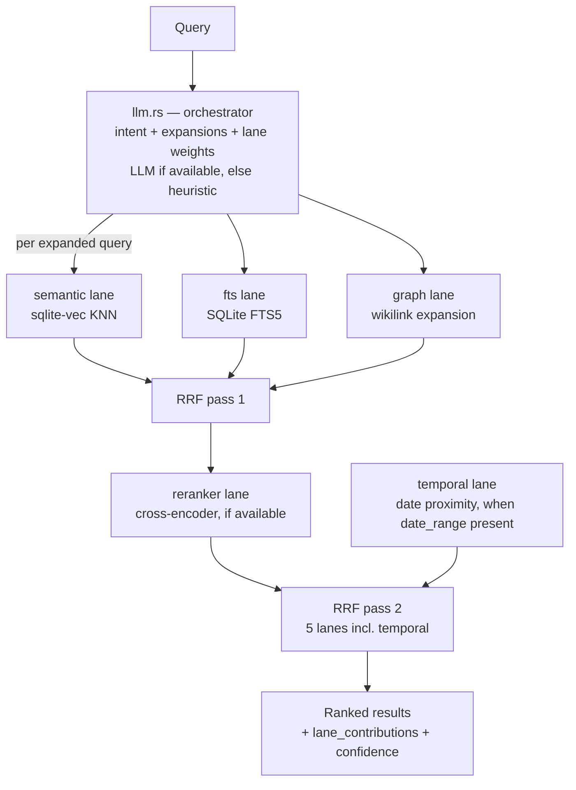

# Competitor Analysis: engraph (devwhodevs)

> **This is the project Tarn competes with today.** Same language, same corpus, same
> protocol, same section-chunking idea — and further along on ranking, tool surface, and
> distribution. It is filed under `general/` rather than `obsidian-pkm/` because it is a
> standalone Rust MCP server rather than a plugin, and because it is the strongest single
> argument for Tarn's pivot: engraph is architecturally welded to markdown vaults and
> wikilinks, so the general-purpose ground is somewhere it structurally cannot follow.

## Overview

| Field | Value |
|---|---|
| **Repository** | <https://github.com/devwhodevs/engraph> |
| **Author** | devwhodevs |
| **Language** | **Rust** (edition 2024) |
| **Version** | 1.7.2 (2026-05-27) |
| **License** | MIT |
| **Stars** | ~164 |
| **Last activity** | 2026-05-27 |
| **Status** | **Dormant** — ~2.5 months quiet at time of review |
| **Surface** | **25 MCP tools** + **26 REST endpoints** |
| **Transport** | stdio (`rmcp` 1.5, `transport-io`); HTTP via axum with API keys, rate limiting, CORS |
| **Store** | SQLite (`rusqlite`, bundled) + FTS5 + `sqlite-vec` |
| **Embeddings** | `llama-cpp-2` — local GGUF, Metal-accelerated on macOS |
| **Codebase size** | ~25,700 lines Rust |

### Maturity Assessment

Mature and broad. Thirty source modules, a CHANGELOG, CONTRIBUTING, CLAUDE.md, `skills/`,
`examples/`, an OpenAPI spec (`openapi.rs`), migration tooling, onboarding flow, health
checks, and a file watcher. Distribution includes a Homebrew tap, prebuilt binaries, and a
**Claude Code plugin marketplace entry** (`claude plugin marketplace add devwhodevs/engraph`)
— the only project in this survey using that channel.

The concern is momentum: no commits since 2026-05-27 while the surrounding field moves
weekly.

---

## Technology Stack

| Layer | Choice |
|---|---|
| **Store** | `rusqlite` 0.32 (bundled SQLite) with FTS5 |
| **Vectors** | `sqlite-vec` 0.1.8-alpha + `zerocopy` |
| **Embeddings** | `llama-cpp-2` 0.1 (local GGUF, ~300 MB required, ~1.3 GB optional) |
| **Tokenizers** | `tokenizers` 0.22 (fancy-regex), `shimmytok` 0.7 |
| **MCP** | `rmcp` 1.5 (`transport-io`) |
| **HTTP** | `axum` 0.8 + `tower-http` (CORS) |
| **Watch** | `notify` 7 + `notify-debouncer-full` |
| **Parallelism** | `rayon` |
| **Fuzzy** | `strsim` |
| **Discovery** | `ignore` |
| **Time** | `time` (for the temporal lane) |

Everything is local: no API keys, no external services, inference via llama.cpp.

---

## Architecture

Single crate, thirty modules. The retrieval path is the interesting part.



### The orchestrator

`search_with_intelligence` runs a five-step pipeline:

1. **Orchestrate** — classify query intent and generate expansions, using a local LLM when
   present and falling back to `llm::heuristic_orchestrate` otherwise. **Orchestration
   results are cached in SQLite** (`get_llm_cache` / `set_llm_cache`), keyed by query, so the
   LLM cost is paid once per distinct query.
2. **Three-lane retrieval per expanded query** — semantic, FTS, graph.
3. **RRF pass 1** over those three lanes.
4. **Reranker as a fourth lane** over the pass-1 candidates (`rerank_candidates: 30`).
5. **RRF pass 2** with up to five lanes, adding **temporal** when the query carries a date
   range.

Crucially, `LaneWeights::from_intent(&orchestration.intent)` means **lane weights are chosen
per query by intent** — a "what happened last week" query activates and weights the temporal
lane; a lookup query weights FTS. This is adaptive fusion, not fixed-weight fusion.

### RRF implementation

```rust
rrf_score = sum( weight_i / (k + rank_i) )   // k typically 60
```

Every fused result carries `lane_contributions: Vec<LaneContribution>` — lane name, rank,
raw score, weighted contribution, and a human-readable `detail` such as `"1-hop from
BRE-2579"` — plus a `confidence` normalized to 0–100%. This powers an `--explain` output.
**Explainable ranking is rare and genuinely valuable**, both for users debugging recall and
for agents deciding whether to trust a hit.

### Chunking — and its ceiling

`chunker.rs` splits on headings with level-based split priorities (`#` = 100, `##` = 90,
`###` = 80, … `######` = 50), so it is heading-aware in the same spirit as Tarn.

But two limits matter:

- **A chunk carries `heading: Option<String>`** — the *first* heading line, extracted by
  `extract_heading`. It is a single string, not an ancestor path. There is no breadcrumb, no
  hierarchical scoping, no parent context.
- **RRF fuses at file granularity.** `fusion.rs` states it directly: *"Results are grouped by
  `file_path` (file-level deduplication). The best snippet/heading per file is kept from the
  highest-ranked lane."*

So engraph **chunks by section but ranks by file**. The section is a snippet-selection
device, not the retrieval unit. That is precisely the gap Tarn's section-level index targets,
and it survives all five lanes.

---

## Tools & Capabilities

**25 MCP tools**, broken down in the README as 8 read, 10 write, 2 identity, 1 index,
1 diagnostic, 3 migrate — plus **26 REST endpoints** with API-key auth, rate limiting, and
CORS, described by a generated OpenAPI spec.

Observed tool/operation names include `read`, `read_section`, `chunks`, `context`, `create`,
`edit`, `append`, `prepend`, `edit_frontmatter`, `add_tag`, `remove`, `move_note`,
`add_alias`, `remove_alias`, `archive`, `delete`, `health`, `identity`, `reindex_file`,
`migrate_preview`, `migrate_apply`, `migrate_undo`, plus note archetypes (`daily`,
`meeting`, `decision`, `person`, `project`).

Distinctive capabilities:

- **`read_section`** — section-level reads, and section-level *edits*.
- **`context`** — assembles a context bundle rather than a raw hit list.
- **PARA migration** with preview / apply / **undo**. An agent-driven vault reorganization
  that can be rolled back is a genuinely bold feature.
- **`identity`** — person/entity resolution with aliases.
- **`placement.rs`** — semantic folder placement for new notes.
- **`health`** — vault diagnostics.
- **File watcher** keeps the index live.

Twenty-five tools is the largest surface in this survey, and it is the outlier: cognee ships
3, ostk-recall 2, DBHub 2, lore 6. Tool-selection accuracy degrades as surfaces grow, so this
is a design liability as much as a feature list.

---

## Search Implementation

| Lane | Mechanism |
|---|---|
| **semantic** | `sqlite-vec` KNN over local GGUF embeddings |
| **fts** | SQLite FTS5 keyword |
| **graph** | Wikilink expansion from seed hits (1-hop and beyond) |
| **rerank** | Cross-encoder over pass-1 candidates |
| **temporal** | Date-proximity scoring, activated when a date range is present |

Fusion is two-pass RRF with intent-derived weights, query expansion feeding every lane, and
LLM orchestration cached in SQLite.

**The graph lane is the headline.** The project's demo surfaces a person's note that never
contains the query term "auth", reached because it is `[[wikilinked]]` from the auth
document. Link structure as a retrieval lane — not merely as metadata — is the most
distinctive retrieval idea in the Obsidian-shaped part of this field.

**And it is exactly what does not generalize.** The graph lane requires wikilinks. PARA
migration requires the PARA convention. Frontmatter tools require Obsidian frontmatter.
Applied to a PDF corpus, a source tree, or a SQL schema, three of engraph's five lanes and
most of its tool surface have no meaning.

---

## Token & Cost Optimization

Not a stated design goal, and the weakest axis relative to the code-side competitors.

Present: `context` bundles instead of raw dumps; `top_n` and `rerank_candidates: 30` caps;
snippet-based results rather than whole files; LLM orchestration caching (a *cost* saving,
not a token-per-response saving).

Absent: no response-density knob, no session deduplication, no per-call token budget, no
metadata-only projection, no published token benchmarks.

---

## Security Model

- **Fully local** — no API keys, no external calls; inference is llama.cpp on-device.
- **HTTP surface is authenticated** — API keys, rate limiting, CORS. That is more than most
  HTTP-exposing competitors ([Vault as MCP](../obsidian-pkm/vault-as-mcp-ebullient.md) has
  none).
- **`ignore` crate** for discovery, so gitignore semantics apply.
- **Migration undo** limits the blast radius of agent-driven reorganization.

Gaps: no path ACLs or read-only mode; 10 write tools plus `delete` and `archive` with no
revision tokens or conflict detection; the required ~300 MB GGUF model download is a supply
chain consideration.

---

## Strengths & Weaknesses

### Strengths

1. **Five-lane adaptive RRF** with per-query, intent-derived lane weights — the most
   sophisticated retrieval pipeline in this survey that actually ships.
2. **Explainable ranking** — `lane_contributions` with per-lane rank, raw score, weighted
   contribution, and human-readable detail, plus a normalized confidence.
3. **Graph expansion as a retrieval lane**, surfacing structurally-related notes that share
   no vocabulary with the query.
4. **Temporal lane** activated by query intent.
5. **Orchestration caching in SQLite** — LLM query analysis costs once per distinct query.
6. **Section-level reads and edits.**
7. **Reversible bulk restructuring** (PARA migrate preview/apply/undo).
8. **Distribution**: Homebrew, prebuilt binaries, Claude Code plugin marketplace, REST API
   with OpenAPI.
9. **Fully local inference** — no keys, Metal-accelerated.

### Weaknesses

1. **Ranks at file granularity.** Sections are chunked and used for snippets, but RRF dedupes
   by `file_path`. The five lanes resolve to "which file", not "which section".
2. **`heading` is one string, not a path.** No ancestor context, no hierarchical scoping.
3. **Dormant** since 2026-05-27.
4. **25 tools + 26 REST endpoints.** The largest surface here by a wide margin, against a
   field converging on 2–6.
5. **Mandatory ~300 MB model download** — no zero-dependency BM25-only mode.
6. **Structurally Obsidian-bound** — the graph lane, PARA migration, identity/alias tooling,
   and frontmatter tools all assume the vault convention.
7. **No concurrency control** despite 10+ write tools.
8. **No path ACLs.**
9. **No token-economy features** and no published benchmarks.
10. **`sqlite-vec` is on an alpha release** (0.1.8-alpha.1) in a 1.7.2 product.

---

## Comparison with Tarn

| Dimension | engraph | Tarn |
|---|---|---|
| Language | Rust | Rust |
| MCP crate | `rmcp` 1.5 | `rmcp` |
| Corpus | Obsidian/markdown vault | Obsidian vault → general-purpose |
| Store | SQLite + FTS5 + sqlite-vec | Own persistent BM25 index |
| Retrieval lanes | **5** (semantic, FTS, graph, rerank, temporal) | BM25 |
| Fusion | **Two-pass RRF, intent-weighted** | Single ranking |
| **Ranking granularity** | **File** | **Section** |
| Heading representation | `Option<String>`, first heading | **`heading_path` array** |
| Explainability | **Per-lane contributions + confidence** | None |
| Section reads/edits | Yes | Reads yes, writes planned |
| Concurrency control | None | `RevisionToken` |
| Tool count | 25 (+26 REST) | Small |
| Model requirement | ~300 MB GGUF mandatory | None |
| Writes | 10 tools + migrate/undo | Planned |
| Distribution | Homebrew + CC plugin marketplace | Pre-release |
| Status | Dormant | Active |

### The honest read

On Obsidian-vault retrieval, **engraph is ahead of Tarn on ranking, tool surface, write
capability, and distribution.** Competing head-on there means catching up on four axes
against a 25k-line codebase. That is the case for the pivot, stated as plainly as it can be.

But its lead is built on assumptions that do not travel. Three of five lanes (graph,
temporal-via-frontmatter-dates, and the LLM orchestrator's vault-shaped intents) and most of
25 tools presuppose an Obsidian vault. A general-purpose Tarn is not competing with engraph
at all — it is competing with [lore](lore.md), which has breadth but flat BM25F.

### What Tarn should take

- **RRF fusion at section granularity.** engraph's `rrf_fuse` is a clean, small
  implementation (weight / (k + rank), k=60, per-lane accumulators). Tarn should adopt the
  shape but key accumulators on **section id**, not `file_path` — that single difference is
  Tarn's ranking edge over both engraph and lore.
- **Lane contributions in the response.** Explainable ranking is cheap once you fuse, and it
  is exactly the kind of self-describing output agents can act on.
- **Intent-derived lane weights**, with a heuristic fallback so the LLM is optional. The
  `heuristic_orchestrate` fallback pattern is the right way to make LLM assistance
  non-mandatory.
- **Cache query orchestration** keyed by query text.
- **Temporal as a lane**, not a filter — activated by intent rather than requiring the user
  to pass a date range.
- **Reversible bulk operations** (preview / apply / undo) when writes land.
- **The Claude Code plugin marketplace** as a distribution channel.

### What Tarn should not take

The 25-tool surface, the mandatory model download, and the file-level fusion granularity.
