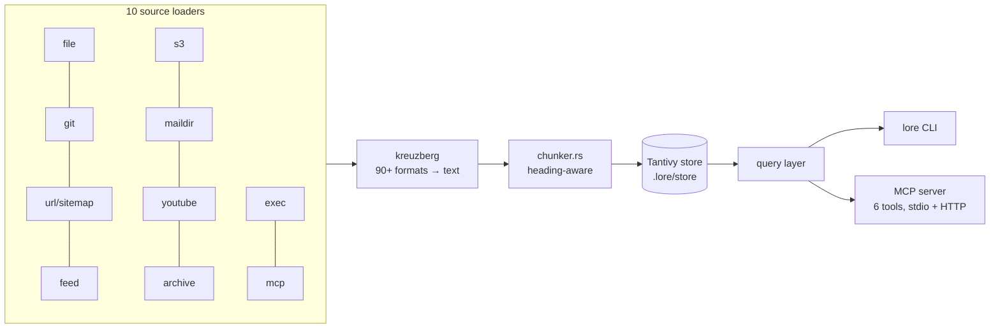

# Competitor Analysis: lore (timorunge)

> **The single most important entry in this bundle.** lore is Tarn's target architecture,
> already shipped: Rust, `rmcp`, Tantivy BM25, heading-aware chunking, a section field with
> BM25 boost, per-source processing profiles, 90+ formats, single binary, no external
> services. It occupies the position Tarn is pivoting toward — and it holds that position
> with 17 stars, v0.1.0, and no ranking sophistication beyond field-boosted BM25.

## Overview

| Field | Value |
|---|---|
| **Repository** | <https://github.com/timorunge/lore> |
| **Author** | Timo Runge |
| **Language** | **Rust** (edition 2024, rust-version 1.93) |
| **Version** | 0.1.0 (2026-05-05) — releases lag commits |
| **License** | MIT |
| **Stars** | ~17 |
| **Last activity** | 2026-07-27 |
| **Status** | Active |
| **Surface** | 6 MCP tools, all read-only |
| **Transport** | stdio and streamable HTTP |
| **Index** | Tantivy 0.26 (zstd compression) |
| **Extraction** | `kreuzberg` 4.9 (now [xberg](xberg.md)) |
| **MCP crate** | `rmcp` 1.7 — **the same crate Tarn uses** |
| **Tagline** | *"`man` pages for your projects — for humans and agents alike."* |

### Maturity Assessment

Small in adoption, serious in engineering. The workspace is `.` + `cli` + `xtask`, with
`benches/`, `fuzz/`, `deny.toml`, an `.actrc`, a Makefile, `skills/`, `smithery.yaml`, and
twelve documents under `docs/` (configuration.md alone is 51 KB). Clippy is configured at
`pedantic` across the workspace. This is not a weekend project; it is an under-marketed one.

Distribution: install script, Homebrew tap (`timorunge/tap/lore-cli`), prebuilt Linux/macOS
binaries.

---

## Technology Stack

| Layer | Choice |
|---|---|
| **Index** | `tantivy` 0.26, `zstd-compression` |
| **Extraction** | `kreuzberg` 4.9, default-features off, features opted in |
| **MCP** | `rmcp` 1.7 (client, child-process and streamable-HTTP transports) |
| **Async** | `tokio` (full) |
| **Hashing** | `blake3` |
| **Config** | `serde_yaml_ng`, `schemars` for schema generation |
| **Discovery** | `ignore`, `globset`, `notify` (watch), `fd-lock` |
| **Network** | `reqwest`, `texting_robots` (robots.txt), `httpdate` |
| **Formats** | `quick-xml`, `mail-parser`, `mime_guess`, `zip`, `tar`, `flate2`, `zstd`, `bzip2`, `xz2` |
| **Optional LLM** | `aws-sdk-bedrockruntime` + `aws-config` |

### Compile-time feature flags as the extensibility axis

```toml
default    = []                                    # nothing — the lean build
ingest     = [kreuzberg, reqwest, notify, ignore, globset, fd-lock, archives...]
mcp        = [rmcp]
llm        = [aws-sdk-bedrockruntime, aws-config, reqwest]
s3         = [aws-sdk-s3, aws-config, ingest]
ocr        = [kreuzberg/ocr, ingest]
iwork      = [kreuzberg/iwork, ingest]
tree-sitter= [kreuzberg/tree-sitter, ingest]
```

This is the cleanest answer in the survey to "how do I support 90 formats without a 300 MB
binary": push format support down into one extraction crate, then expose *its* features as
*your* features. OCR, Apple iWork, and tree-sitter code parsing are all one flag each, and
they all resolve to `kreuzberg/<feature>`.

---

## Architecture



### Source loaders

`src/ingest/loaders/` — `file`, `git`, `sitemap`, `feed`, `s3`, `maildir`, `youtube`,
`archive`, `exec`, and **`mcp`**. That last one is worth pausing on: lore can ingest from
*upstream MCP servers*, making it a retrieval layer over other agents' tools.

`exec` ingests the stdout of a shell command, which turns any CLI into a source.

### Chunking

`src/ingest/chunker.rs` delegates to `kreuzberg::chunking` with `ChunkerType` /
`ChunkingConfig`, but adds its own pre-pass:

```rust
const PRESPLIT_THRESHOLD: usize = 512 * 1024; // 512 KB
```

Documents above 512 KB are **pre-split at top-level headings** before being handed to
kreuzberg, explicitly to avoid kreuzberg's O(n²) heading-map cost on huge inputs. Chunk
attributes are carried in an `Arc<str>`-based struct so each chunk clones by refcount bump
rather than string copy — `source_id`, `source`, `origin`, `kind`, `format`, `title`,
`author`, `lang`, `created_at`, `tags`, `topic`.

Small correctness details that signal care: it strips a UTF-8 BOM before trimming
(Project Gutenberg text files start with one and `str::trim()` will not remove it), and
`resolve_headings` lowercases heading lists for case-insensitive matching.

---

## Tools & Capabilities

Six tools, **all read-only**, all carrying full MCP annotations
(`read_only_hint`, `destructive_hint = false`, `idempotent_hint`):

| Tool | Purpose |
|---|---|
| `lore_info` | Knowledge-base overview — document/chunk counts, topics, languages, source types |
| `lore_list_topics` | All topics, alphabetical; topic names are filters for search and read |
| `lore_search` | Full-text BM25 with English stemming |
| `lore_read_topic` | Chunks for a topic **in document order** — "prefer over search for systematic topic coverage" |
| `lore_list_docs` | Source documents with metadata; filter by topic/title/author/language |
| `lore_read_doc` | A document's chunks in order; accepts partial paths, returns candidates when ambiguous |

Two design choices stand out in the tool descriptions themselves:

**Search is not the only retrieval mode.** `lore_read_topic` exists because ranked search is
the wrong tool for "cover this topic systematically" — it explicitly tells the agent to
prefer ordered reads for coverage and search for lookup. Most competitors offer only ranking.

**Ambiguity returns candidates.** `lore_read_doc` accepts `"readme.md"`, `"docs/api"`, or a
full path, resolving exact → case-insensitive → substring, and returns the candidate list
when more than one matches instead of guessing.

---

## Search Implementation

Tantivy BM25 with **per-field boosts** — effectively BM25F:

| Field | Boost | Purpose |
|---|---|---|
| `title` | **3.0** | Document title |
| `section` | **2.0** | **Section heading** |
| `tags` | 2.0 | Document and chunk tags |
| `llm_summary` | 1.5 | LLM-generated summary (optional `llm` feature) |
| `llm_tags` | 1.5 | LLM-generated keywords |
| `body` | 1.0 | Chunk content |

**`section` is an indexed, boosted field.** This is the finding that most directly affects
Tarn's positioning: lore does not merely chunk by heading, it treats the heading as a
weighted retrieval signal. Tarn's `heading_path` is richer (a full path, not a single
heading), but lore has already shipped the ranking half of the idea.

Other search machinery:

- **English stemming tokenizer** registered for the BM25 fields — "install" matches
  "installed", "installer".
- **Query sanitization** before Tantivy's `QueryParser`, deliberately *preserving* phrase
  quotes, wildcards (`*`, `?`), boost (`^`), and fuzzy operators, because those are safe once
  the parser is locked to the search fields. So agents get a real query language.
- **Federated multi-store search** (`src/store/multi.rs`) — query several knowledge bases at
  once, with **min-max normalization of BM25 scores within each store batch** before merging,
  so no single corpus dominates on raw score scale. Source-ordered results deliberately skip
  normalization to preserve raw scores.
- **Honest pagination semantics**, documented in the tool description: `total` reflects
  index-level matches, while source filters and `max_per_source` reduce the page in memory,
  so a page may be shorter than `limit`.

No embeddings, no rerank, no hybrid fusion. BM25 is the whole retrieval story, and the
project argues for that explicitly (below).

---

## Token & Cost Optimization

Modest and mostly implicit. Chunks are the retrieval unit, so responses are bounded by
`max_chunk_chars`; `min_chunk_chars` suppresses fragments; `max_per_source` enforces source
diversity within a page; `metadata`-oriented tools (`list_docs`, `list_topics`, `info`) let an
agent orient without pulling content.

There is no response-density knob, no session-level deduplication, and no explicit token
budget parameter. This is a gap relative to the code-side competitors.

---

## Security Model

- **No external services, no API keys** in the default and `ingest` builds. LLM enrichment
  and S3 are opt-in features.
- **`fd-lock`** guards concurrent access to the store.
- **`texting_robots`** — respects robots.txt when crawling URL/sitemap sources, which is more
  care than most ingestion tools take.
- **Header interpolation is restricted to `LORE_*` environment variables**
  (`Authorization: "Bearer ${LORE_API_TOKEN}"`), so a config file cannot exfiltrate arbitrary
  environment secrets.
- **`ignore` crate** for discovery, so `.gitignore` semantics apply by default.
- A dedicated `docs/security.md` exists.

The `exec` source loader is the sharp edge: it runs shell commands defined in config. That is
powerful and appropriate for a local tool, but it means a lore config file is executable
content and should be treated as such.

---

## Configuration — the multi-source model

```yaml
name: My Knowledge Base
description: Optional description (shown in lore info and MCP server instructions)
base_dir: ..

sources:
  - path: ./docs
    glob: "**/*.md"
    topic: Architecture

  - url: https://example.com/guide.html
    topic: Guides
    headers:
      Authorization: "Bearer ${LORE_API_TOKEN}"

  - git: https://github.com/user/repo
    ref: main
    glob: "**/*.md"
```

Each source entry is discriminated by which key is present (`path` / `url` / `git` / …)
rather than an explicit `kind` field, and carries its own glob, topic label, and processing
overrides. `description` feeds the **MCP server instructions**, so the corpus describes
itself to the agent.

---

## Strengths & Weaknesses

### Strengths

1. **The multi-format problem is solved by delegation.** One dependency (`kreuzberg`) covers
   90+ formats; feature flags keep the binary honest.
2. **Ten source types**, including git, sitemaps, feeds, maildir, S3, archives, shell
   commands, and upstream MCP servers.
3. **Section headings are a boosted BM25 field**, not just a chunk boundary.
4. **Federated multi-corpus search** with per-store score normalization.
5. **Read-ordered retrieval as a peer to ranked search** (`lore_read_topic`), which is the
   right answer for coverage tasks and almost nobody else offers it.
6. **Six read-only tools with full MCP annotations** — a deliberately small, safe surface.
7. **Zero-config onboarding** — `lore init` scans a directory, detects doc folders and
   READMEs, and writes a pre-filled config.
8. **Genuine engineering hygiene**: pedantic clippy, fuzz targets, benches, `cargo-deny`,
   51 KB of configuration documentation.

### Weaknesses

1. **v0.1.0 and ~17 stars.** No mindshare. `publish = false` in Cargo.toml — it is not even
   on crates.io, so the only install paths are Homebrew and the install script.
2. **BM25 only.** No embeddings, no hybrid fusion, no reranking, no temporal signal. Against
   `engraph`'s five-lane RRF or `knowledge-rag`'s BM25 + vectors + cross-encoder, it will
   lose head-to-head relevance comparisons on prose.
3. **No writes.** Read-only by design.
4. **No code awareness.** `tree-sitter` exists only as a kreuzberg feature flag for
   extraction; there is no symbol index, no call graph, no code-specific ranking.
5. **No SQL/structured source type.**
6. **No token-economy features** — no density knob, no session dedup, no budget parameter.
7. **Chunking is delegated**, so chunk-boundary quality is kreuzberg's decision, not lore's
   (mitigated by the 512 KB heading pre-split, but that is a performance fix, not a quality
   one).
8. **`exec` sources make config executable** — a real supply-chain consideration for shared
   configs.

---

## Comparison with Tarn

| Dimension | lore | Tarn |
|---|---|---|
| Language / runtime | Rust, single binary | Rust, single binary |
| MCP crate | `rmcp` 1.7 | `rmcp` |
| Index | Tantivy 0.26, on disk | Own persistent BM25 index |
| Ranking | BM25F — title 3.0, **section 2.0**, tags 2.0, body 1.0 | BM25 over sections |
| Chunk unit | Heading-aware chunks (via kreuzberg) | **Section with `heading_path`** |
| Heading representation | Single `section` string field | Full `heading_path` array |
| Formats | **90+ via kreuzberg** | Markdown only |
| Source types | **10** (file, git, url, sitemap, feed, s3, maildir, youtube, archive, exec, mcp) | Local vault |
| Multi-corpus | **Federated, score-normalized** | Single vault |
| Query language | Phrases, wildcards, fuzzy, boost | Basic |
| Tools | 6, read-only, annotated | Read tools |
| Writes | None | Planned |
| Concurrency control | `fd-lock` on the store | `RevisionToken` per note |
| Obsidian syntax | None — no wikilinks, no inline tags | Full parser |
| Link graph | None | Parsed, indexed |
| Adoption | ~17★, v0.1.0 | Pre-release |

### What this means for Tarn's positioning

**The "Rust + BM25 + local + MCP + structure-aware chunking" position is occupied.** Any
pitch built on those four properties describes lore as accurately as it describes Tarn.
Positioning has to move to where lore is thin:

1. **Ranking depth.** lore is flat BM25F with no hybrid lane, no rerank, no recency, no graph
   expansion. `engraph` proves multi-lane RRF is achievable in Rust on a markdown corpus.
   Doing that *over a heterogeneous corpus* is unoccupied ground.
2. **`heading_path` as a path, not a string.** lore indexes one `section` value. A full
   ancestor path enables hierarchical boosting, breadcrumb-scoped filtering, and
   subtree-scoped retrieval that a single field cannot express.
3. **Writes with revision tokens.** lore is read-only; Tarn's optimistic concurrency has no
   counterpart here.
4. **Token economics.** Neither project has session dedup, density knobs, or budget
   parameters — but the code-side competitors do, and whoever ships them first in the
   general-purpose slot takes that ground.

### What Tarn should take, concretely

- **Delegate format extraction.** Do not hand-roll PDF/DOCX/XLSX parsers. [xberg](xberg.md)
  (the crate lore knows as `kreuzberg`) is Rust, MIT, and far better resourced than a
  bespoke extractor set would be. Mirror lore's feature-flag pattern so the default build
  stays lean.
- **Boost the heading field.** Tarn already stores `heading_path`; giving it a BM25 boost is
  a small change with a direct relevance payoff. lore's ratios (title 3.0 / section 2.0 /
  body 1.0) are a reasonable starting point.
- **A read-ordered retrieval tool.** `lore_read_topic` — "give me this topic's sections in
  document order" — is the correct primitive for systematic coverage and Tarn's section index
  can serve it trivially.
- **Return candidates on ambiguity**, rather than guessing or erroring bare.
- **Per-store score normalization** if Tarn ever indexes more than one corpus.
- **Preserve query-language operators** through sanitization instead of stripping them.
- **`description` → MCP server instructions**, so the corpus introduces itself to the agent.

### Watch item

lore's releases lag its commits (v0.1.0 tagged 2026-05-05, active through 2026-07-27), and
`publish = false` suggests the author is not yet courting adoption. The gap between its
engineering quality and its 17 stars is the opportunity — and the risk, if it starts
marketing.
