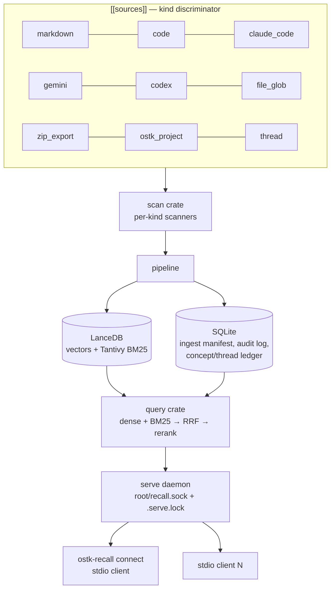

# Competitor Analysis: ostk-recall (os-tack)

> **Read this one for its configuration schema and its process model, not its adoption.**
> At ~6 stars and self-described pre-alpha, ostk-recall is not a market threat. But it is the
> most direct answer in the survey to the two structural questions Tarn's pivot raises:
> *how do you describe many heterogeneous sources in one config?* and *what owns the index
> when several MCP clients point at it?*

## Overview

| Field | Value |
|---|---|
| **Repository** | <https://github.com/os-tack/ostk-recall> |
| **Author** | Scott Meyer |
| **Language** | **Rust** (edition 2024, rust-version 1.85) |
| **Version** | 0.9.3 |
| **License** | MIT OR Apache-2.0 |
| **Stars** | ~6 |
| **Last activity** | 2026-08-08 (very active) |
| **Status** | Active, **self-described pre-alpha** |
| **Surface** | **2 MCP tools** — `recall`, `remember` |
| **Transport** | stdio, plus a shared local-socket daemon |
| **Store** | LanceDB (Arrow + Tantivy BM25) + SQLite (rusqlite) |
| **Embeddings** | `model2vec-rs` static embeddings; `fastembed-rs` optional reranker |

### Maturity Assessment

Ten workspace crates (`core`, `embed`, `store`, `scan`, `pipeline`, `query`, `attention`,
`attention-mcp`, `mcp`, `cli`), `unsafe_code = "forbid"`, clippy at both `pedantic` and
`nursery`, a release profile tuned for binary size (`panic = "abort"` explicitly noted as
dropping ~25 MB of unwind tables, thin LTO, `codegen-units = 1`, symbol stripping), four
runnable end-to-end examples, and a `config.example.toml` written as a graduated tutorial.

The maintainer daily-drives it. It is genuinely pre-alpha in surface stability, not in care.

---

## Architecture



### The daemon + thin-client model

This is the part most worth stealing. From the config reference:

> The `serve` daemon also binds `<root>/recall.sock` for scan-trigger pokes from the watcher,
> and holds a singleton `<root>/.serve.lock` — only one `serve` per root; a second exits
> cleanly (run many **CLIENTS** via `ostk-recall connect`, not many daemons).

One process owns the index and the embedding model; MCP clients are thin stdio adapters that
connect over a Unix socket. This solves two problems Tarn will hit the moment two agents
point at one vault:

1. **Index locking.** LanceDB (like any embedded store) wants a single writer. Spawning one
   server per MCP client fights over that lock.
2. **Model load time.** A ~500 MB embedding model loaded per client process is untenable;
   loaded once in a daemon it is free thereafter.

[Pharos](pharos-rag.md) reached the same conclusion independently. Two of the
closest architectural analogues to a general-purpose Tarn both ended up at daemon + thin
client, which is strong evidence it is the right default rather than a preference.

---

## Configuration — the `[[sources]]` schema

This is the reference implementation of the multi-source config shape Tarn's pivot needs.

```toml
[corpus]
root = "~/.local/share/ostk-recall"

[embedder]
model = "minishlab/potion-retrieval-32M"

[[sources]]
kind = "claude_code"
project = "claude-code-history"
paths = ["~/.claude/projects"]

[[sources]]
kind = "markdown"
project = "notes"
paths = ["~/notes", "~/Documents/research"]

[[sources]]
kind = "code"
project = "experiments"
paths = ["~/experiments"]
extensions = ["rs", "py", "ts"]
```

Design properties worth copying verbatim:

- **An explicit `kind` discriminator** selects the scanner. Nine kinds ship: `markdown`,
  `code`, `claude_code`, `gemini`, `codex`, `file_glob`, `zip_export`, `ostk_project`,
  `thread`. Compare [lore](lore.md), which discriminates implicitly by *which key is present*
  (`path` / `url` / `git`) — the explicit tag is clearer for a corpus that will grow more
  kinds.
- **`project` is a free-text namespace tag** on each block, and it doubles as the allowlist
  key for the file watcher (`[watch].projects`).
- **Per-source options** live in the block (`extensions`, glob patterns) while global
  concerns (`[corpus]`, `[embedder]`, reranker) stay at the top level.
- **Unknown keys are a load-time error**, and `~` / `$VAR` are shell-expanded in every path.
  Strict validation on a config that users hand-write is the right trade.
- **Ignore semantics are layered**: per-source patterns merge on top of standard
  `.gitignore` / `.ignore` / `.ostk-recall-ignore`, using the `ignore` crate (same engine as
  ripgrep), so "anything you'd write in a .gitignore works."
- **The example config is a graduated tutorial** — it walks minimal → transcripts →
  knowledge → relational → live, with every option documented inline at its default.

---

## Chunking

`crates/scan/src/markdown.rs` splits on **`##` headings at column 0**. Pre-heading text
becomes segment 0; each subsequent `##` section becomes one chunk. Sections whose estimated
token count exceeds `MAX_SECTION_TOKENS` (2000) are sub-split, and `file_glob.rs` sub-splits
oversize markdown sections at paragraph boundaries (blank-line gaps). Empty and
whitespace-only sections are dropped.

Compared to Tarn this is coarse — H2-only, no `heading_path`, no nesting — but the
**oversize-section sub-split with a token budget and paragraph-boundary fallback** is a
practical detail Tarn needs for the same reason: a single section can exceed any sane
response budget, and splitting at paragraph gaps degrades better than splitting mid-sentence.

---

## Search Implementation

Hybrid, fused with RRF:

| Lane | Mechanism |
|---|---|
| dense | `model2vec-rs` static embeddings (potion-retrieval-32M, 512-dim, or potion-base-8M, 256-dim) |
| BM25 | Tantivy, via LanceDB's full-text index |
| rerank | Optional `fastembed-rs` cross-encoder over the top-N |

`crates/query/src/candidate.rs` keeps `bm25_score`, `bm25_rank`, and `rrf_score` **as
separate optional fields on the candidate**, with a `has_bm25_evidence()` predicate. Lane
provenance is preserved through fusion rather than collapsed into one number — the same
instinct behind [engraph](engraph.md)'s `lane_contributions`.

There are **two retrieval contexts** (`crates/query/src/context.rs`):

- **`Explicit`** — the caller passes `recall(text)`; full BM25 + dense.
- **Ambient** — candidate generation without a caller query; **the BM25 lane is off by
  invariant**, because there is no query text to match against.

Encoding "which lanes are even meaningful in this mode" as an invariant in the type system,
rather than as a runtime branch, is a nice piece of design.

**Static embeddings are the notable model choice.** `model2vec` distills a sentence
transformer into a static lookup table — no neural forward pass at query time, so embedding
is fast and CPU-cheap, at some recall cost versus a real encoder. For a local-first tool that
is a defensible trade, and it is far lighter than [engraph](engraph.md)'s mandatory ~300 MB
GGUF.

---

## Tools & Capabilities

**Two tools: `recall` and `remember`.** Everything else is a parameter — `recall` dispatches
on an `action` argument. The `attention-mcp` crate additionally exposes an ambient "memory
lens" as an MCP *resource* tracking the current attention vector.

This is the far end of the small-surface convergence: cognee ships 3, DBHub 2, lore 6,
[engraph](engraph.md) 25. Note also that `recall` / `remember` are becoming the category's
conventional verbs — cognee independently landed on `remember` / `recall` / `forget`.

### The concept ledger and attention runtime

Typed nodes and attributed directed edges in SQLite. Each edge records its origin
(`authored` / `observed` / `promoted`) and **derives conductance from confidence and recency
rather than storing a weight**. Diffusion walks the latent (vector-similarity) half of the
graph, and an off-diagonal bridge walked during consolidation is promoted into a weak reified
edge that must then earn conductance through use or decay.

On top sits a "live attention runtime": a turn observer, an auto-weaver linking new chunks to
thread anchors, and an idle curator fading inactive threads.

**This is over-engineered for Tarn's scope** and depends on an LLM in the loop. It is
recorded here because the *derive-don't-store* principle is transferable: computing edge
strength from confidence + recency at query time avoids a write amplification problem that
stored weights create.

---

## Token & Cost Optimization

Not a headline. Present: chunk-level retrieval with a 2000-token section budget, top-N
capping before rerank, and a two-tool surface that keeps the tool-listing overhead minimal.
Absent: density knobs, session dedup, explicit budget parameters.

---

## Security Model

- **Fully local** — "nothing is sent off-box."
- **`unsafe_code = "forbid"`** workspace-wide.
- **Audit log in SQLite** alongside the ingest manifest.
- **Singleton daemon lock** prevents concurrent writers corrupting the store.
- **Layered ignore files** keep secrets excluded by the same rules as version control.

The obvious exposure is the corpus itself: indexing `~/.claude/projects`, `~/.gemini/tmp`,
and `~/.codex/sessions` means agent session logs — which routinely contain pasted secrets and
private code — land in a searchable index. The project does not appear to redact.

---

## Strengths & Weaknesses

### Strengths

1. **The `[[sources]] kind` config schema** — the clearest multi-source model in the survey.
2. **Daemon + thin stdio clients**, with an explicit singleton lock and a documented rationale.
3. **Two-tool surface** with actions as parameters.
4. **Lane provenance preserved** through fusion (`bm25_rank`, `has_bm25_evidence`).
5. **Retrieval-context invariants** encoded in types (BM25 off in ambient mode).
6. **Agent session logs as a first-class source kind** — an emerging category with no winner.
7. **Static embeddings** (model2vec) — hybrid retrieval without a heavyweight model.
8. **Oversize-section sub-splitting** with a token budget and paragraph-boundary fallback.
9. **Strict config validation** with unknown-key errors and shell expansion.
10. **Binary-size-conscious release profile** with the reasoning written down.

### Weaknesses

1. **Pre-alpha, ~6 stars.** No adoption, unstable surface.
2. **H2-only chunking** — no heading path, no nesting, coarser than Tarn's model.
3. **Missing incremental cursors for JSONL session logs**, per the project's own notes — so
   transcript re-scans redo work.
4. **No HTTP/SSE transport** yet.
5. **The concept ledger and attention runtime are large, speculative surface area** for a
   pre-alpha retrieval tool, and they need an LLM.
6. **Embedding model switch requires `init --force` + full re-scan** — no migration path.
7. **No redaction** on session-log ingest.
8. **Ten crates** is heavy scaffolding for the retrieval core it currently delivers.

---

## Comparison with Tarn

| Dimension | ostk-recall | Tarn |
|---|---|---|
| Language | Rust | Rust |
| Store | LanceDB (Arrow + Tantivy) + SQLite | Own persistent BM25 index |
| Retrieval | Dense + BM25 → RRF → optional rerank | BM25 |
| Embeddings | model2vec static (light) | None |
| Chunk unit | `##`-delimited section, 2000-token cap | Section with `heading_path` |
| Heading model | Implicit (split boundary) | **`heading_path` array** |
| Multi-source | **9 `kind`s, one corpus** | Single vault |
| Config | **`[[sources]]` + `kind` discriminator, strict validation** | Vault path |
| Process model | **Daemon + thin clients, socket, singleton lock** | Per-client process |
| Tools | 2 | Small set |
| Writes | `remember` (ledger, not files) | Planned (files) |
| Concurrency control | Store-level lock | `RevisionToken` per note |
| Obsidian syntax | None | Full parser |
| Adoption | ~6★ pre-alpha | Pre-release |

### What Tarn should take

- **The `[[sources]]` + explicit `kind` config schema.** This is the single highest-value
  artifact in the repo. Tarn's pivot needs exactly this shape: global `[corpus]` /
  `[index]` blocks, then N source blocks each with a `kind` selecting an extractor,
  per-source globs and extensions, and a free-text `project`/`corpus` tag for namespacing and
  filtering. Adopt the strictness too — unknown keys should error at load, not be ignored.
- **Daemon + thin client.** Decide this *before* adding an HTTP transport, because it is
  expensive to retrofit. The singleton-lock-with-clean-exit behaviour is the right UX: a
  second `serve` should exit cleanly telling the user to `connect`, not fail obscurely.
- **Layered ignore-file semantics** using the `ignore` crate, so per-source patterns merge on
  top of `.gitignore`.
- **Oversize-section sub-splitting** at paragraph boundaries with a token budget. Tarn's
  sections are unbounded today; a single long section will blow any response budget.
- **Lane provenance on candidates** — keep per-lane rank and score rather than collapsing to
  a fused number, so results can explain themselves.
- **Retrieval-mode invariants in types**, so impossible lane combinations cannot be
  constructed.
- **Agent session logs as a source kind.** Cheap to add, genuinely useful, and an emerging
  category (`callimachus`, `sessiongrep`, and this project) with no established winner.

### Where Tarn wins

Chunking model (`heading_path` vs H2-only), per-document concurrency control (`RevisionToken`
vs a store-wide lock), Obsidian syntax parsing, and — for now — scope discipline. ostk-recall
has built an attention runtime and a concept ledger before shipping incremental transcript
cursors; that ordering is a warning as much as an inspiration.
