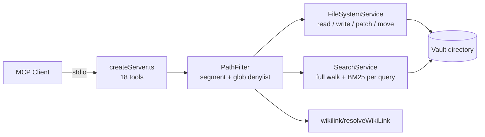

# Competitor Analysis: MCPVault (formerly bitbonsai/mcp-obsidian)

> **Rewritten 2026-08-09.** The project was renamed from **mcp-obsidian** to **MCPVault**
> (`@bitbonsai/mcpvault`, repo `bitbonsai/mcpvault`, site mcpvault.org) and moved 0.10.0 →
> 0.14.1. Tool count grew from 14 to 18; the notable additions are the
> `get_note_outline` → `read_note_lines` navigation pair and wikilink resolution.
> This file replaces the earlier `mcp-obsidian-bitbonsai.md`.

## Overview

| Field | Value |
|---|---|
| **Repository** | <https://github.com/bitbonsai/mcpvault> |
| **Package** | `@bitbonsai/mcpvault` |
| **Homepage** | <https://mcpvault.org> |
| **Author** | bitbonsai (Mauricio Wolff) |
| **Language** | TypeScript |
| **Version** | 0.14.1 |
| **License** | MIT |
| **Stars** | ~1,599 — the most-starred *standalone* Obsidian MCP server |
| **Last activity** | 2026-08-08 |
| **Status** | Active |
| **Surface** | 18 tools |
| **Transport** | stdio |
| **Vault access** | Direct filesystem — **no Obsidian, no plugins required** |
| **Codebase size** | ~2,800 lines TypeScript (excluding tests) |

### Maturity Assessment

Well-maintained and genuinely popular. Four runtime dependencies
(`@modelcontextprotocol/sdk`, `gray-matter`, `yaml`, `trash`) and a real test suite
co-located with each module (`search.test.ts`, `pathfilter.test.ts`, `integration.test.ts`).
The project has sponsor/Ko-fi/Liberapay funding links and markets itself as a "universal AI
bridge" compatible with Claude, ChatGPT Desktop, Cursor, Windsurf, Gemini CLI, Codex, and
IntelliJ.

---

## Technology Stack

| Layer | Technology |
|---|---|
| **Runtime** | Node.js ≥ 18 |
| **Language** | TypeScript |
| **MCP SDK** | `@modelcontextprotocol/sdk` ^1.30.0 |
| **Frontmatter** | `gray-matter` ^4.0.3 + `yaml` ^2.9.0 |
| **Deletion** | `trash` ^10.1.1 (OS trash, not `unlink`) |
| **Distribution** | npm, `npx @bitbonsai/mcpvault /path/to/vault` |

Notably still true: **no vector database, no embeddings, no ML runtime, no index files.**
The entire server is filesystem reads plus scoring in TypeScript.

---

## Architecture

A stateless filesystem server. Each call resolves a vault-relative path through
`PathFilter`, reads from disk, and returns. There is **no persistent index** — `search_notes`
walks the vault and scores on every query.



The module split is clean: `search.ts`, `filesystem.ts`, `frontmatter.ts`, `pathfilter.ts`,
`uri.ts`, and a `wikilink/` package, each with a sibling test file.

---

## Tools & Capabilities

Eighteen tools:

| # | Tool | Notes |
|---|---|---|
| 1 | `read_note` | Full note read |
| 2 | `write_note` | Create/overwrite |
| 3 | `patch_note` | `append` / `prepend` / `overwrite` operations |
| 4 | `list_directory` | Directory listing |
| 5 | `delete_note` | `trashMode`: `none` / `local` (`.trash/` in vault) / `system` (OS trash) |
| 6 | `search_notes` | BM25-ranked, see below |
| 7 | `move_note` | Move/rename a note |
| 8 | `move_file` | Move/rename any allowed file |
| 9 | `read_multiple_notes` | **Batch read** — reduces round-trips |
| 10 | `update_frontmatter` | Structured frontmatter edit |
| 11 | `get_notes_info` | Metadata without content |
| 12 | `get_frontmatter` | Frontmatter only |
| 13 | `manage_tags` | `add` / `remove` / `list` |
| 14 | `get_vault_stats` | Vault-wide counts |
| 15 | `list_all_tags` | Tag inventory |
| 16 | `wiki_link` | Resolve `[[wikilink]]` targets to paths |
| 17 | **`get_note_outline`** | **New** — heading structure only (level, text, line number) |
| 18 | **`read_note_lines`** | **New** — read an explicit 1-indexed line range |

### The outline → ranged-read pair (the significant addition)

`get_note_outline` returns headings with **level, text, and line number**, and its own
description tells the agent the intended loop: *"Use this first to navigate large notes
efficiently, then call `read_note_lines` to read only the section you need."*

The heading parser is CommonMark-correct in a way most competitors' are not: it allows up to
three leading spaces, tolerates a bare `#` with no text, strips optional closing `#`
sequences, and tracks frontmatter delimiters so `---` is never mistaken for content.

The limitation is that addressing is **by line number, not by heading identity**. The agent
must do the arithmetic to turn "the section under `## Goals`" into a line range, and any
concurrent edit invalidates the offsets. Compare cyanheads' `Parent::Child` section locator,
which is stable under edits, or Tarn's `heading_path`, which is stable *and* indexed.

---

## Search Implementation

Genuine Okapi **BM25** with the standard constants, computed fresh on every query:

```text
k1 = 1.2, b = 0.75
idf   = ln(1 + (N - df + 0.5) / (df + 0.5))
score = idf * (tf * (k1 + 1)) / (tf + k1 * (1 - b + b * docLength / avgdl))
```

Corpus statistics (`totalDocLength`, `docCount`, `termDocFreq`) are accumulated during the
walk, so average document length and IDF are computed per request over the whole vault.

Query handling: whitespace-split into terms, and when there is more than one term the **full
query string is appended as an extra scoring term**, giving a cheap phrase bonus without a
positional index.

Filtering happens before I/O where possible — `pathPrefix` (subtree), `excludePaths`, and
the `PathFilter` denylist all prune candidates before files are read. Options include
`searchContent`, `searchFrontmatter`, `caseSensitive`, and `limit` (capped at 20).

**The structural weakness is unchanged and is the whole story:** every search reads every
markdown file in the vault. There is no index, no cache, no incremental update. Ranking
quality is real; ranking cost is O(vault) per query.

---

## Token & Cost Optimization

Still the most deliberate token-cost design in the Obsidian/PKM category.

- **Minified response fields** — search results serialize as `{p, t, ex}` rather than
  `{path, title, excerpt}`. The field names are documented in `types.ts` with inline
  comments. Claimed 40–60% response-size reduction.
- **`prettyPrint: false` by default** — JSON is emitted without indentation unless the caller
  opts in. Whitespace is tokens.
- **`get_note_outline` + `read_note_lines`** — structure first, then a bounded slice, so a
  large note never has to be pulled whole.
- **`read_multiple_notes`** — batch reads amortize round-trips.
- **`get_notes_info` / `get_frontmatter`** — metadata-only projections.
- **`limit` capped at 20** — a hard ceiling on result-set size regardless of what the agent
  asks for.

---

## Security Model

Path containment, no ACLs.

- **`PathFilter`** denies restricted names at *any* depth by comparing lowercased path
  segments against a set (`.obsidian`, `.git`, `node_modules`, `.ds_store`, `thumbs.db`),
  plus an anchored glob denylist. The source carries a comment explaining the fix: the glob
  patterns alone only matched root-level `node_modules`, so nested copies were being
  traversed and polluting the tag index, and nested `.git`/`.obsidian` leaked contents
  (issue #128).
- **Extension allowlist** — `.md`, `.markdown`, `.txt`, `.base` (Obsidian Bases YAML), etc.
- **Symlink-aware traversal prevention** with `realpath` resolution and ELOOP handling.
- **Trash instead of unlink** — `delete_note` defaults to `trashMode: 'none'` and can route
  through a vault-local `.trash/` or the OS trash, so deletion is recoverable.

No read/write scoping, no role separation, no per-agent permissions — every client that can
reach the server gets the full vault minus the denylist.

---

## Strengths & Weaknesses

### Strengths

1. **No Obsidian dependency.** Runs headless against any directory of markdown. This, plus
   `npx`, is why it out-stars the plugin-bound competitors.
2. **Real BM25**, correctly implemented, with a sensible phrase bonus.
3. **Token cost treated as a design constraint**, not an afterthought — minified fields,
   unindented JSON, metadata projections, batch reads, capped limits.
4. **Outline-then-slice navigation** avoids whole-note reads.
5. **Defense-in-depth path filtering** with a documented history of hardening.
6. **Recoverable deletes** via OS/vault trash.
7. **Small dependency surface** and per-module tests.

### Weaknesses

1. **Full vault scan on every search.** No index, no cache, no incremental update. This is
   the single defining constraint — ranking is good, but cost grows linearly with vault size
   on every single query.
2. **Line-number addressing is fragile.** `read_note_lines` offsets are invalidated by any
   concurrent edit, and the agent must map headings to ranges itself.
3. **Sections are not a retrieval unit.** `get_note_outline` exposes structure for
   *navigation*, but search still ranks whole notes — so a hit tells you which file, not
   which section.
4. **No concurrency control.** Writes are last-writer-wins; no revision tokens or conflict
   detection.
5. **No path ACLs.** Denylist only; no read-only mode or write scoping.
6. **18 tools with overlapping semantics** — `move_note`/`move_file`,
   `get_notes_info`/`get_frontmatter`, `manage_tags`/`list_all_tags`.
7. **Minified field names are undocumented at the protocol level.** `{p, t, ex}` saves tokens
   but the model must infer or be told what they mean; the schema descriptions carry the
   burden.

---

## Comparison with Tarn

| Dimension | MCPVault | Tarn |
|---|---|---|
| Obsidian required | No | No |
| Language / runtime | TypeScript on Node ≥18 | Single Rust binary |
| Index | **None** — full scan per query | Persistent section-level BM25 |
| Ranking | BM25 (k1=1.2, b=0.75), recomputed each query | BM25 over a persisted index |
| Retrieval unit | Whole note | Section (`heading_path`) |
| Section support | Navigation only (`outline` → line range) | Indexed, ranked, addressable |
| Section addressing | Line numbers (edit-fragile) | `heading_path` (stable) |
| Token optimization | **Minified fields, unindented JSON, batch reads, caps** | Section-scoped retrieval |
| Concurrency control | None | `RevisionToken` |
| Path safety | Segment denylist + extension allowlist + realpath | `VaultPath` validated type |
| Write operations | 8 tools, trash-backed deletes | Planned |
| Wikilink handling | Resolution tool | Parsed into the index for graph queries |
| Adoption | ~1,599★ | Pre-release |

### What Tarn should take

- **The full token-economics bundle.** MCPVault is the only project in this category that
  treats response size as a first-class constraint, and it does so with four independent
  cheap mechanisms rather than one. `prettyPrint: false` by default is nearly free.
- **`trashMode` for deletes.** Recoverable deletion with an explicit mode parameter is
  strictly better than `unlink`, and Tarn will need it when writes land.
- **Segment-wise path denial.** Comparing every path *segment* against a restricted set,
  rather than relying on anchored globs, is the fix their issue #128 documents. Worth
  checking `VaultPath` handles nested `.git`/`node_modules` the same way.

### Where Tarn wins, precisely

MCPVault is the clearest demonstration of why a persistent index matters: it already has
correct BM25 and thoughtful token economics, and is still bounded by re-reading the entire
vault per query. Tarn's persisted, incrementally-updated, section-level index attacks exactly
that. The second gap is the retrieval unit — MCPVault's outline tool proves the *demand* for
section navigation, but because search ranks whole notes, the agent must locate the relevant
section itself after the hit. Tarn returns the section directly.
