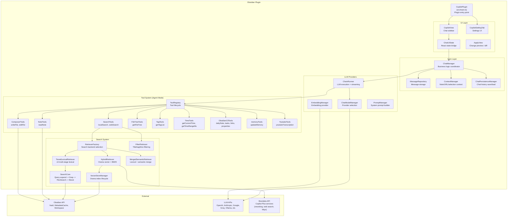

# Obsidian Copilot (logancyang)

## Overview

| Field | Value |
|-------|-------|
| **Repository** | [github.com/logancyang/obsidian-copilot](https://github.com/logancyang/obsidian-copilot) |
| **Type** | Obsidian plugin (not standalone MCP server) |
| **Language** | TypeScript |
| **Version** | 3.3.3 (manifest and release, 2026-05-21) |
| **License** | AGPL-3.0 |
| **Stars** | ~7,534 |
| **Last activity** | 2026-08-09 |
| **Status** | Active |
| **Codebase Size** | ~95K lines TypeScript |
| **Author** | Logan Yang |

**Maturity:** Highly mature and by far the most popular project in this category. Active development with frequent releases, comprehensive test suite, extensive CLAUDE.md with architectural documentation, and a premium tier ("Copilot Plus"). The 3.x version indicates multiple major rewrites.

> **Version delta since the 2026-03 review:** 3.2.5 → 3.3.3. Minor release; the tiered
> lexical retriever described below is unchanged in architecture. Star count and release
> cadence confirm it remains the category's adoption leader.

## Technology Stack

### Runtime & Frameworks

- **Runtime:** Obsidian desktop app (Electron) and mobile (Capacitor)
- **UI:** React 18 + Radix UI primitives + Tailwind CSS (with `tw-` prefix to avoid collisions)
- **State management:** Jotai (atomic state) + custom subscription pattern
- **AI orchestration:** LangChain JS (`@langchain/core`, `@langchain/openai`, `@langchain/anthropic`, etc.)
- **Editor:** Lexical rich-text editor for chat input, CodeMirror extension for autocomplete

### Key Dependencies

| Dependency | Purpose |
|------------|---------|
| `@langchain/*` (openai, anthropic, google-genai, groq, mistralai, xai, deepseek, cohere, ollama, community) | LLM provider integrations |
| `@orama/orama` | Vector/hybrid search database (semantic search) |
| `minisearch` | BM25+ full-text search engine (v3 lexical search) |
| `fuzzysort` | Fuzzy string matching |
| `chrono-node` + `luxon` | Natural language date parsing and timezone handling |
| `turndown` | HTML-to-markdown conversion |
| `diff` | File diff computation for change preview |
| `zod` | Tool schema validation |
| `crypto-js` | API key encryption |
| `koa` + `koa-proxies` | Local proxy server (for CORS) |
| `react-markdown` + `react-syntax-highlighter` | Chat message rendering |
| `trie-search` | Trie-based prefix search |

### Build Tooling

- **Bundler:** esbuild (with custom config `esbuild.config.mjs`)
- **Type checking:** TypeScript strict mode
- **CSS:** Tailwind CSS compiled from `src/styles/tailwind.css` to `styles.css`
- **Testing:** Jest + Testing Library
- **Linting:** ESLint + Prettier + husky pre-commit hooks

## Architecture

Obsidian Copilot is a full-featured AI chat plugin that runs entirely inside Obsidian's plugin sandbox. It provides a chat sidebar, agent-mode tools, semantic search, and inline autocomplete.

### Plugin Integration Model

Obsidian Copilot extends the `Plugin` class and registers:

- **Views:** A chat sidebar (`CopilotView`) and a file-change diff preview (`ApplyView`)
- **Commands:** Registered via Obsidian command palette for quick actions
- **Settings tab:** Full settings UI for provider config, tool toggles, search settings
- **Editor extensions:** CodeMirror companion extension for inline autocomplete

The plugin uses Obsidian's `app.vault` for all file I/O and `app.metadataCache` for tag/link graph queries. On desktop, it additionally uses Obsidian's CLI binary for advanced operations (daily notes, tasks, links, properties, templates, bases).

### Message Architecture

Messages are stored in a `MessageRepository` with dual representations:
- `displayText` for UI rendering
- `processedText` for LLM consumption (with context injected)

Project-based chat isolation maintains separate `MessageRepository` instances per project ID. Chat history persists to markdown files.

## Tools & Capabilities

### Search Tools

| Tool | Description |
|------|-------------|
| `localSearch` | Smart vault search: dispatches to lexical, semantic, or Miyo backend based on settings. Accepts query, salient terms, and optional time range. |
| `lexicalSearch` | Forces BM25+ keyword search via TieredLexicalRetriever |
| `semanticSearch` | Forces Orama-based hybrid vector + BM25 search |
| `webSearch` | Internet search via Brevilabs API or self-hosted backend |
| `indexVault` | Triggers semantic search index rebuild |

### File & Note Tools

| Tool | Description |
|------|-------------|
| `readNote` | Read note content in 200-line chunks with pagination. Resolves wikilinks, disambiguates paths, extracts linked note metadata. |
| `writeFile` | Create or overwrite files with diff preview UI. Supports markdown and JSON Canvas format. |
| `editFile` | Targeted find-and-replace with fuzzy matching (handles smart quotes, NFKC normalization, trailing whitespace). Single-match enforcement. |
| `getFileTree` | Returns vault file/folder tree as nested JSON. Falls back to folder-only view for large vaults (>500KB). |
| `getTagList` | Lists vault tags with occurrence counts (frontmatter + inline). Size-limited to 500KB. |

### Time Tools (Always Enabled)

| Tool | Description |
|------|-------------|
| `getCurrentTime` | Current time with optional timezone offset |
| `getTimeRangeMs` | Natural language to epoch range (e.g., "last week", "Q1 2024") via chrono-node |
| `getTimeInfoByEpoch` | Epoch timestamp to human-readable conversion |
| `convertTimeBetweenTimezones` | Timezone conversion between UTC offsets |

### Obsidian CLI Tools (Desktop Only)

| Tool | Description |
|------|-------------|
| `obsidianDailyNote` | Create, read, or get path of today's daily note |
| `obsidianRandomRead` | Read a random note |
| `obsidianProperties` | Read/list frontmatter properties |
| `obsidianTasks` | List/filter tasks across vault (todo, done, by file, by status) |
| `obsidianLinks` | Query link graph: backlinks, outgoing links, orphans, unresolved |
| `obsidianTemplates` | List or read template content with variable resolution |
| `obsidianBases` | Query Obsidian Bases (database .base files): list, views, query, create |

### Other Tools

| Tool | Description |
|------|-------------|
| `updateMemory` | Save user preferences/facts to a persistent memory file via LLM |
| `youtubeTranscription` | Extract YouTube video transcripts (Copilot Plus only) |

### LLM Providers

The plugin supports a wide range of providers through LangChain adapters:

OpenAI, Azure OpenAI, Anthropic, Google Gemini, Groq, Mistral, xAI (Grok), DeepSeek, Cohere, Ollama (local), LM Studio (local), OpenRouter, AWS Bedrock, GitHub Copilot, SiliconFlow, and generic OpenAI-compatible endpoints.

## Search Implementation

### Retriever Selection Priority

The `RetrieverFactory` selects the search backend in this order:

1. **Miyo** (cloud semantic) -- if Copilot Plus with Miyo enabled
2. **Self-hosted backend** -- if self-host mode configured
3. **MergedSemanticRetriever** -- if semantic search V3 enabled (Orama + lexical merge)
4. **TieredLexicalRetriever** -- default

### v3 TieredLexicalRetriever Pipeline (Default)

The primary search path is a multi-stage lexical retrieval pipeline:

1. **Query Expansion** (`QueryExpander`): Uses the active LLM to generate alternative query phrasings and extract salient terms. Results are cached. Falls back to original terms if LLM unavailable.

2. **Grep Scan** (`GrepScanner`): Two-pass substring search over vault files:
   - Pass 1: path/filename matches (no I/O, fast)
   - Pass 2: content matches via `app.vault.cachedRead`
   - Returns up to 200 candidate file paths

3. **Full-Text Search** (`FullTextEngine`): Builds an ephemeral MiniSearch index over candidate chunks:
   - **Scoring:** BM25+ with field weights: title(5x), tags(4x), heading(2.5x), path(1.5x), body(1x)
   - **Tokenization:** Custom multilingual tokenizer (handles CJK, Latin, mixed scripts)
   - **Chunking:** Files split into chunks; index destroyed after each query (always-fresh results)

4. **Scoring Boosts:**
   - `FolderBoostCalculator`: Boosts notes in frequently-accessed folders
   - `GraphBoostCalculator`: Boosts notes connected in the link graph (max 1.15x multiplier, capped at 20 candidates)
   - `ScoreNormalizer`: Min-max normalization clipped to [0.02, 0.98]

5. **Diverse Top-K Selection:** Note-diverse selection to avoid returning multiple chunks from the same note

6. **FilterRetriever** (parallel): Separate retriever handles exact title matches, tag matches, and time-range filtering. Results are merged with search results at the orchestration layer.

### Hybrid/Semantic Search (Optional)

When semantic search is enabled, the `HybridRetriever` uses Orama:
- **Vector search** with embedding similarity
- **Hybrid mode** when salient terms present: configurable text/vector weight (default 0.5/0.5)
- **Reranking** via Brevilabs API when max Orama score < threshold
- Results combined with explicit note chunks (files referenced in wikilinks)
- Time-range search combines daily note lookups with mtime-filtered Orama queries

### Deduplication

Search results are deduplicated by file path (case-insensitive), keeping the highest-scoring chunk per note.

## Token & Cost Optimization

### Response Format

- Tool results use structured JSON (not raw text), enabling UI-side formatting
- `ToolResultFormatter` converts JSON tool results to compact display summaries
- Search results return metadata (title, path, score, mtime) plus content snippets
- ReadNote chunks are 200 lines with pagination (explicit `hasMore`/`nextChunkIndex` signaling)
- Large file trees (>500KB) automatically drop file names and show only folder structure with extension counts
- Tag lists are size-capped at 500KB with progressive trimming

### Context Management

- `ContextManager` processes note/URL/selection context separately from messages
- Context is reprocessed on message edit to avoid stale information
- `MessageRepository` stores separate `displayText` and `processedText` per message
- Chain memory synchronization prevents context drift

### Search Efficiency

- Ephemeral indexes (built per query, destroyed after) avoid stale data but cost CPU
- GrepScanner uses `cachedRead` (Obsidian's file cache) to avoid disk I/O
- Query expansion uses LLM with timeout + caching to avoid redundant calls
- `RETURN_ALL_LIMIT = 100` caps maximum results for expanded queries
- Default `maxSourceChunks` setting limits results for normal queries

### LLM Token Savings

- Token counting patched to use `length/4` estimation instead of fetching tiktoken CDN
- Tool schemas use Zod with detailed descriptions (token cost in system prompt, but reduces back-and-forth)
- Time tools avoid LLM date parsing by using chrono-node deterministically

## Security Model

### API Key Management

- API keys stored in Obsidian settings (plugin data.json)
- Optional encryption using Electron's `safeStorage` on desktop or Web Crypto (AES-GCM) on mobile
- Keys encrypted/decrypted on settings load/save with prefixes (`enc_desk_`, `enc_web_`)
- Encryption key is **hardcoded** (`"obsidian-copilot-v1"`) for the web crypto path -- this is obfuscation, not real security

### Input Validation

- All tool inputs validated with Zod schemas
- Path traversal: no explicit prevention (relies on Obsidian's vault abstraction)
- Time range validation prevents LLM hallucinated values (zero, negative, inverted ranges)
- YouTube input length capped at 50,000 characters
- Search query length capped at 1,000 characters
- File path sanitization for filesystem length limits (ENAMETOOLONG protection)
- `editFile` uses fuzzy matching with round-trip verification to prevent partial NFKC matches

### Provider Security

- Rate limiting implemented for API calls (`src/rateLimiter.ts`)
- CORS handled via local Koa proxy server
- Self-host mode requires validation (grace period mechanism)
- GitHub Copilot token stored separately with encryption support

## Strengths & Weaknesses

### Strengths

1. **Comprehensive LLM provider coverage.** Supports 15+ providers out of the box with a unified interface. Users can switch freely between cloud and local models.

2. **Sophisticated search pipeline.** The v3 TieredLexicalRetriever implements a proper multi-stage retrieval pipeline (query expansion, grep seeding, BM25+ scoring, graph/folder boosts, score normalization) that rivals standalone search engines.

3. **Rich tool ecosystem.** Agent mode provides 20+ tools spanning search, file operations, time queries, vault metadata, and Obsidian CLI integration. Tools have detailed Zod schemas and LLM instructions.

4. **Deep Obsidian integration.** Leverages metadataCache for tags/links, vault API for file ops, workspace API for UI, and Obsidian CLI for desktop-specific features (tasks, templates, bases, properties).

5. **File editing with preview.** The writeFile/editFile tools show a diff preview before applying changes, with fuzzy matching that handles LLM-typical artifacts (smart quotes, NFKC normalization).

6. **Multilingual search.** Custom tokenizer handles CJK characters, mixed-script content, and preserves original query language through the pipeline.

7. **Clean architecture.** The MessageRepository/ChatManager/ChatUIState layering provides good separation of concerns. The RetrieverFactory pattern cleanly abstracts search backend selection.

### Weaknesses

1. **Monolithic complexity.** 95K+ lines of TypeScript with deep dependency chains. The CLAUDE.md itself warns about transitive import issues in tests. The search system alone has 4 different retriever implementations.

2. **Hardcoded encryption key.** The Web Crypto encryption path uses a static key (`"obsidian-copilot-v1"`), making it obfuscation rather than security. Anyone with access to the source code can decrypt stored keys.

3. **Ephemeral index cost.** The v3 lexical search builds and destroys a MiniSearch index per query. For frequent searches in large vaults, this means repeated tokenization and indexing overhead.

4. **Premium tier dependency.** Key features (YouTube transcription, reranking, web search, Miyo semantic search) require the Copilot Plus subscription or self-host mode. The Brevilabs API is a single point of failure for these features.

5. **No MCP protocol.** As an Obsidian plugin, it cannot be consumed by external AI agents. The tool system is internal only (LangChain tools, not MCP-compatible). This limits composability with broader AI ecosystems.

6. **Desktop-only features.** Obsidian CLI tools (tasks, daily notes, links, properties, templates, bases) only work on desktop. Mobile users get a reduced feature set.

7. **LangChain overhead.** Heavy LangChain dependency adds bundle size and abstraction layers. The codebase already has a deprecation note on `chainFactory.ts`, suggesting they are moving away from it but the migration is incomplete.

8. **No path traversal protection.** Unlike Tarn's `VaultPath` type, there is no explicit validation that tool-supplied paths stay within the vault boundary. The code trusts Obsidian's vault API to enforce this implicitly.

## Comparison with Tarn

| Aspect | Obsidian Copilot | Tarn |
|--------|-----------------|------|
| **Architecture** | Obsidian plugin (in-process) | MCP server (out-of-process) |
| **Consumer** | Built-in chat UI only | Any MCP-compatible AI agent |
| **Language** | TypeScript | Rust |
| **Search** | Multi-strategy (BM25+, vector, hybrid, Miyo) | BM25 with section-level indexing |
| **Indexing** | Ephemeral per-query or Orama persistent | Persistent in-memory with JSON serialization |
| **Write Operations** | writeFile + editFile with diff preview | (In progress) |
| **LLM Integration** | Deep (15+ providers, agent mode, tool calling) | None (pure data server) |
| **Token Optimization** | Tool result formatting, chunked reads | Section-level retrieval (heading-path granularity) |
| **Security** | Optional encryption, no path validation type | VaultPath type, RevisionToken for concurrency |
| **Composability** | Closed (Obsidian-only) | Open (any MCP client) |
