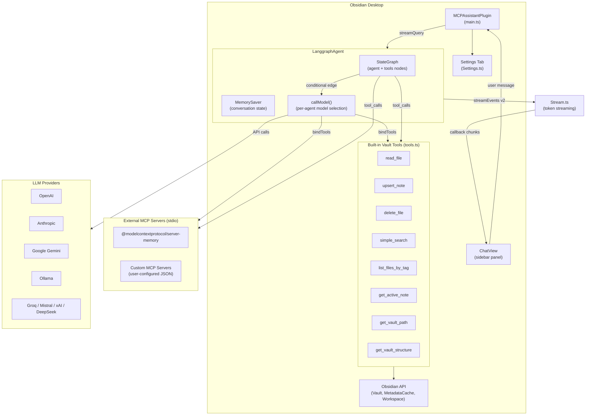

# Competitor Analysis: obsidian-mcp-assistants

## Overview

| Field | Value |
|-------|-------|
| **Repository** | [github.com/ndendic/obsidian-mcp-assistants](https://github.com/ndendic/obsidian-mcp-assistants) |
| **Author** | Nikola Dendic |
| **Language** | TypeScript |
| **Version** | 0.1.0 (initial beta, released 2025-05-19) |
| **License** | MIT |
| **Stars** | ~2 |
| **Last activity** | 2025-05-23 |
| **Status** | Abandoned |
| **Min Obsidian** | 1.4.0 |
| **Desktop only** | Yes (`isDesktopOnly: true`) |
| **Codebase size** | ~3,350 lines across 7 source files |

### Maturity Assessment

**Abandoned.** No commits since 2025-05-23 — over fourteen months of silence as of this
review. Version 0.1.0 was the only release and the plugin never entered the Obsidian
Community Plugins directory. Code contains commented-out debug logs, hardcoded dev paths in
npm scripts, and several providers commented out in the settings (Groq, Mistral, xAI,
DeepSeek). It never reached production quality and no longer will.

> **Retained for one reason:** it is the clearest worked example of the *plugin-as-MCP-client*
> inversion — the vault hosts the agent and calls out to MCP servers, rather than exposing
> the vault as a server. That architecture is a consumer of something like Tarn, not a
> competitor to it. See [Comparison with Tarn](#comparison-with-tarn).

## Technology Stack

| Layer | Technology |
|-------|-----------|
| **Runtime** | Obsidian desktop (Electron / Node.js) |
| **Language** | TypeScript 4.7 |
| **Build** | esbuild 0.17.3 |
| **LLM orchestration** | LangChain 0.3.24 + LangGraph 0.2.68 |
| **MCP client** | `@langchain/mcp-adapters` 0.4.2 (MultiServerMCPClient) |
| **LLM providers** | `@langchain/openai`, `@langchain/anthropic`, `@langchain/google-genai`, `@langchain/groq`, `@langchain/mistralai`, `@langchain/ollama`, `@langchain/xai`, `@langchain/deepseek` |
| **Schema validation** | Zod (via LangChain DynamicStructuredTool) |
| **Dev tooling** | chokidar-cli, cpy-cli, npm-run-all, nodemon |

Key architectural choice: This is an **MCP client** (not server). It connects *to* external MCP servers while also providing built-in Obsidian vault tools locally. LangGraph orchestrates the agent loop.

## Architecture

This is an **Obsidian plugin** that embeds a full LangGraph agent inside the Obsidian process. It acts as an MCP client that can connect to external MCP servers via stdio, while simultaneously providing built-in vault tools through Obsidian's API.



### Data Flow

1. User types in `ChatView` sidebar panel, optionally using `@agent` handles or `[[note]]` links.
2. `MCPAssistantPlugin.streamQuery()` passes messages to `LanggraphAgent`.
3. LangGraph's `StateGraph` runs a two-node graph: `agent` (calls LLM) and `tools` (executes tool calls).
4. The `callModel` node selects the correct LLM provider and system prompt based on the agent ID, binds all tools (local + MCP), and streams the response.
5. `Stream.ts` processes `streamEvents v2` from LangGraph, emitting token, tool_start, tool_end, and final_response events back to the UI via callback.
6. Conversation state is persisted via `MemorySaver` (in-memory, per-session) keyed by `thread_id`.

### Plugin Integration Pattern

- Registers a custom `ItemView` (`ChatView`) in Obsidian's right sidebar.
- Opens via a ribbon icon (`message-square-heart`).
- Reinitializes the full MCP agent on every settings save (`saveSettings` triggers `initializeMCP`).
- Conversation history is stored in Obsidian's plugin data (`this.saveData`), limited by `maxConversations` (default 5).

## Tools & Capabilities

### Built-in Vault Tools (tools.ts)

These use Obsidian's API directly, not MCP protocol.

| Tool | Category | Description |
|------|----------|-------------|
| `read_file` | Read | Reads full markdown content of a vault-relative file via `Vault.read()` |
| `upsert_note` | Write | Creates/overwrites notes, or patches specific heading sections (append/prepend/replace). Opens file in new tab after write. |
| `delete_file` | Write | Permanently deletes a file (bypasses trash). No confirmation. |
| `simple_search` | Search | Plain-text search across all markdown files using `prepareSimpleSearch()`. Returns top-N results with score and snippet. |
| `list_files_by_tag` | Query | Finds files by tag using `MetadataCache.getFileCache()` |
| `get_active_note` | Context | Returns path and content of the currently open note |
| `get_vault_path` | Context | Returns absolute filesystem path of vault root (desktop only) |
| `get_vault_structure` | Context | Returns tree-outline of vault files/folders with configurable depth and item limits |

Each tool can be individually toggled on/off in settings.

### External MCP Server Support

| Feature | Details |
|---------|---------|
| **Memory Server** | Built-in toggle for `@modelcontextprotocol/server-memory` (stores knowledge graph in `memory.json` inside plugin folder) |
| **Custom Servers** | JSON configuration for arbitrary MCP servers via stdio transport. Custom config overrides predefined servers. |
| **MCP Client** | Uses `@langchain/mcp-adapters` `MultiServerMCPClient` to connect to multiple servers simultaneously |

### Multi-Model and Agent System

| Feature | Details |
|---------|---------|
| **Multi-provider** | OpenAI, Anthropic, Google Gemini, Ollama (Groq, Mistral, xAI, DeepSeek in code but commented out in UI) |
| **Named agents** | User-defined agents with custom name, handle, model assignment, and system prompt |
| **Agent invocation** | `@handle` syntax in chat input with autocomplete suggester |
| **Per-agent models** | Each agent can use a different LLM provider/model |
| **Note linking** | `[[note_name]]` syntax in chat input injects note content |

### Chat Features

- Streaming token delivery via LangGraph `streamEvents v2`
- Conversation history with configurable max conversations (default 5)
- Conversation rename, delete, switch
- Markdown rendering of responses
- Tool call visualization in chat

## Search Implementation

### Algorithm: Obsidian `prepareSimpleSearch()`

The search uses Obsidian's built-in `prepareSimpleSearch()` function, which is a **plain-text fuzzy matcher** provided by the Obsidian API.

```typescript
const search = prepareSimpleSearch(query);
for (const file of app.vault.getMarkdownFiles()) {
    const text = await app.vault.cachedRead(file);
    const res = search(text);
    if (!res) continue;
    // collect first match with context
    results.push({ path, score: res.score, snippet });
}
results.sort((a, b) => a.score - b.score); // lower score = better match
return results.slice(0, max_results);
```

**Key characteristics:**
- **Scope:** All markdown files in vault (full scan every query)
- **Algorithm:** Obsidian's internal `prepareSimpleSearch` -- returns a callback that tests text and produces `{ score, matches: [start, end][] }`
- **Ranking:** Score-based (lower is better), sorted ascending
- **Result format:** Returns file path, score, and a snippet of +/- `context_length` characters (default 100) around the first match
- **Default limit:** 10 results
- **File reading:** Uses `cachedRead` (reads from Obsidian's cache, not disk)
- **No indexing:** No persistent search index. Every search scans all files.

### Tag Search

`list_files_by_tag` uses `MetadataCache.getFileCache()` to check inline tags. It iterates all markdown files and checks `cache.tags` for exact `#tag` matches. This only finds inline tags, not frontmatter tags (Obsidian's `getFileCache().tags` only returns inline tags; frontmatter tags are in `getFileCache().frontmatter`).

## Token & Cost Optimization

### Assessment: Minimal optimization

| Aspect | Approach |
|--------|----------|
| **File reads** | Returns full file content (no truncation, no section extraction) |
| **Search results** | Returns snippets (+/- 100 chars) with a cap of 10 results -- this is the only optimization |
| **Vault structure** | Capped at 100 items and 4 levels depth by default |
| **Conversation history** | Full conversation sent to LLM each turn (no summarization, no window) |
| **System prompt** | Lengthy default prompt (~30 lines) included on every turn |
| **Streaming** | Uses LangGraph `streamEvents v2` for incremental delivery |

There is no section-level retrieval, no content truncation for large files, and no conversation summarization. The system prompt is re-injected on every `callModel` invocation (by design in LangGraph, but with no attempt to minimize it).

## Security Model

### Authentication

- API keys stored in Obsidian's plugin data (`this.saveData`) -- local file on disk, not encrypted
- Per-provider global keys with optional per-model key overrides
- Settings UI has a "Reveal" toggle for key visibility
- Basic input cleaning mentioned in comments but no implementation visible

### Input Validation

| Area | Validation |
|------|-----------|
| **Tool schemas** | Zod schemas via `DynamicStructuredTool` (type-checked parameters) |
| **Path traversal** | **None.** `getFile()` is a thin wrapper: `app.vault.getAbstractFileByPath(path)`. No validation that paths stay within vault. Relies entirely on Obsidian's `Vault` API to constrain access. |
| **File deletion** | No confirmation, no trash -- calls `adapter.remove()` directly with "no recycle bin" warning only in the tool description |
| **Upsert heading match** | Simple string comparison (`line.replace(/^#+\s*/, "") === headingParts.at(-1)`). Only matches the last heading part, ignoring hierarchy. |
| **MCP server config** | Raw JSON parsed with `JSON.parse` -- no schema validation of custom server configurations |
| **Google schema sanitization** | Sanitizes tool schemas for Google Generative AI compatibility (removes unsupported keywords) |

### Risks

- **No path traversal protection.** The `read_file`, `upsert_note`, and `delete_file` tools accept vault-relative paths but perform no validation. While Obsidian's `Vault.getAbstractFileByPath` should confine to the vault, `adapter.remove()` in `delete_file` and `adapter.write()` in `upsert_note` use the raw adapter, which could potentially access outside the vault.
- **Destructive operations without confirmation.** `delete_file` permanently removes files. `upsert_note` can overwrite entire files. The LLM decides when to call these.
- **API keys in plaintext.** Stored in Obsidian's `data.json` for the plugin, readable by any process with filesystem access.

## Strengths & Weaknesses

### Strengths

1. **Deep Obsidian integration.** Running inside the plugin process gives direct access to `Vault`, `MetadataCache`, `Workspace`, and `cachedRead`. No need for a separate server process or HTTP/stdio bridge.

2. **Multi-provider agent system.** Supports 8 LLM providers with per-agent model assignment. Users can have a "research agent" on Claude and a "coding agent" on GPT-4o. The LangGraph StateGraph handles tool routing automatically.

3. **Extensible MCP client.** Can connect to arbitrary external MCP servers via stdio, enabling integration with memory servers, custom tools, or any MCP-compliant service.

4. **Built-in memory server.** One-click toggle for `@modelcontextprotocol/server-memory` with automatic path configuration to store a knowledge graph alongside the plugin.

5. **Section-level upsert.** The `upsert_note` tool can target specific headings with append/prepend/replace operations, enabling granular note editing without overwriting entire files.

6. **Streaming UX.** Token-by-token streaming via LangGraph `streamEvents v2` provides responsive chat experience.

### Weaknesses

1. **No search indexing.** Every search scans all vault files sequentially. No BM25, no TF-IDF, no persistent index. Unusable for large vaults (1000+ notes).

2. **No token optimization.** `read_file` returns entire file content. No section-level retrieval, no truncation, no content windowing. Large files will consume the full context window.

3. **No path validation.** Tools accept arbitrary paths with no traversal protection beyond what Obsidian's `Vault` API provides. The `delete_file` and `upsert_note` tools use `adapter.remove()` and `adapter.write()` which operate at the filesystem adapter level.

4. **Destructive writes without safeguards.** No revision tokens, no conflict detection, no undo, no confirmation dialogs. The LLM can delete files or overwrite notes at will.

5. **Heavy dependency chain.** The full LangChain/LangGraph stack plus 8 provider SDKs results in a large bundle. The plugin bundles an entire agent framework into Obsidian's process.

6. **Tag search misses frontmatter tags.** `list_files_by_tag` only checks `cache.tags` (inline tags), missing `cache.frontmatter` tags which are common in Obsidian vaults.

7. **Heading match is fragile.** `upsert_note` matches headings by stripping `#` prefixes and comparing the last component only. Two sections with the same leaf heading name at different nesting levels will collide.

8. **Full conversation replay on every turn.** The system prompt is prepended and the full message history is sent on each `callModel` invocation. No summarization or sliding window for long conversations.

9. **Maturity gaps.** Version 0.1.0, not in community plugins, dev paths hardcoded in scripts, several providers commented out in the UI, no tests beyond a single `test.js` file.

---

## Comparison with Tarn

| Dimension | obsidian-mcp-assistants | Tarn |
|---|---|---|
| Role in the MCP graph | **Client** — hosts an agent that calls out to MCP servers | **Server** — exposes a corpus to any client |
| Vault access | Obsidian Plugin API (requires Obsidian running) | Direct filesystem, headless |
| Index | None — delegates to Obsidian's built-in search | Persistent section-level BM25 |
| Retrieval unit | Whole note | Section (heading-delimited) |
| Write targeting | Heading-based `upsert_note`, leaf-name match only | Section-addressed, planned |
| Concurrency control | None | `RevisionToken` optimistic locking |
| Tag coverage | Inline tags only — misses frontmatter tags | Frontmatter and inline |
| Runtime footprint | Full LangChain/LangGraph stack + 8 provider SDKs in Obsidian's process | Single binary, no LLM dependencies |
| Status | Abandoned (2025-05) | Active |

**The useful takeaway is directional, not competitive.** This project inverts the usual
arrangement: instead of exposing the vault as an MCP server, it embeds an agent *inside*
Obsidian and lets that agent consume external MCP servers. A plugin shaped like this is a
**potential Tarn client**, not a rival — it would gain a real index and headless operation
for free by pointing at Tarn instead of Obsidian's built-in search.

Its failure mode is also instructive: bundling an entire agent framework and eight provider
SDKs into the editor process is exactly the coupling Tarn avoids by staying
provider-agnostic. Keep LLM calls in the agent layer, not the retrieval layer.
