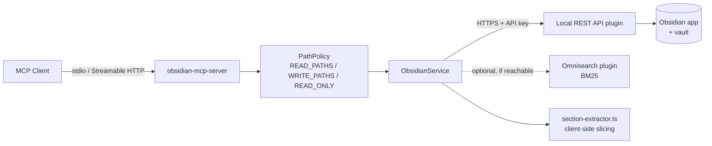

# Competitor Analysis: obsidian-mcp-server (cyanheads)

> **Rewritten 2026-08-09.** The previous review covered v2.0.7 (8 tools, no section reads,
> unbounded in-memory vault cache). v3 is a different server: 14 tools, section-addressed
> reads, surgical patching, folder-scoped path ACLs, and the vault cache is gone. Two
> conclusions from the 2026-03 analysis are **retracted** below.

## Overview

| Field | Value |
|---|---|
| **Repository** | <https://github.com/cyanheads/obsidian-mcp-server> |
| **Author** | Casey Hand (@cyanheads) |
| **Language** | TypeScript 7 (Bun 1.3 toolchain) |
| **Version** | 3.2.12 (2026-08-02) |
| **License** | Apache-2.0 |
| **Stars** | ~652 |
| **Last activity** | 2026-08-02 |
| **Status** | Active — high release cadence |
| **Surface** | 14 tools, 3 resources |
| **Transport** | stdio, Streamable HTTP |
| **Vault access** | Obsidian Local REST API plugin (Obsidian must be running) |
| **Codebase size** | ~5,800 lines TypeScript |

### Maturity Assessment

The most professionally packaged project in the Obsidian/PKM category. It is built on the
author's own extracted framework (`@cyanheads/mcp-ts-core`), ships a Docker image on GHCR, a
`.mcpb` bundle for one-click Claude Desktop install, and deep-link install buttons for
Cursor and VS Code. Runtime dependencies are notably lean for a Node project — six direct
deps, with `zod` v4 for schemas and `undici` for HTTP.

The jump from 2.0.7 to 3.2.12 in roughly five months represents a full architectural
rewrite, not incremental growth.

---

## Technology Stack

| Layer | Technology |
|---|---|
| **Runtime** | Node.js / Bun 1.3 |
| **Language** | TypeScript ^7.0.2 |
| **MCP SDK** | ^1.30.0 via `@cyanheads/mcp-ts-core` ^0.11.1 |
| **Schema** | Zod ^4.4.3 (discriminated unions per tool projection) |
| **HTTP client** | undici ^8.9.0 |
| **YAML** | `yaml` ^2.9.0 + `js-yaml` (frontmatter round-trip) |
| **Logging** | pino / pino-pretty |
| **Distribution** | npm (`obsidian-mcp-server`), GHCR Docker image, `.mcpb` bundle |

The `mcp-ts-core` extraction is worth noting: tool definitions are declarative objects with
schema, error catalogue, handler, and a `format()` renderer that produces the human-readable
text block. Adding a tool is one file in `tools/definitions/`.

---

## Architecture

Still a **bridge**, not an indexer. Every operation is an HTTP call to the Obsidian Local
REST API plugin running inside a live Obsidian instance. There is no persistent index, no
embeddings, and — new in v3 — no local cache of vault contents.

Two structural details matter:

**Client-side section extraction.** The upstream REST API supports section *targeting* for
`PATCH` but has no section-extracted `GET`. So `section-extractor.ts` fetches the note and
slices the markdown locally. Its heading matcher is fence-aware — it precomputes a mask of
lines inside fenced code blocks so a `#` comment in a Python sample cannot be mistaken for a
heading. It walks a `Parent::Child` hierarchy and slices from the matched heading to the
next heading at the same or shallower level, so a section read returns the whole subtree.

**Path policy as a single chokepoint.** `PathPolicy` is constructed once from config and
consulted by the service before every upstream call, rather than being scattered across
tools.

---

## Tools & Capabilities

Fourteen tools. Two (`obsidian_list_commands`, `obsidian_execute_command`) are opt-in behind
`OBSIDIAN_ENABLE_COMMANDS=true` because command-palette dispatch is an arbitrary-code
escape hatch.

| Tool | Shape | Notes |
|---|---|---|
| `obsidian_get_note` | Read | Four projections — see below |
| `obsidian_list_notes` | Read | Recursive walk, default depth 2, max 20, 1000-entry cap, `extension` + `nameRegex` filters |
| `obsidian_list_tags` | Read | Vault-wide tags with usage counts, including hierarchical parents |
| `obsidian_search_notes` | Read | Three modes — see Search Implementation |
| `obsidian_write_note` | Write | Create, replace a single section in place, or `overwrite: true` to clobber. **Refuses whole-file writes to an existing path by default.** |
| `obsidian_append_to_note` | Write | Appends to file, or to a specific heading/block/frontmatter field |
| `obsidian_patch_note` | Write | Surgical `append`/`prepend`/`replace` against heading, block ref, or frontmatter field |
| `obsidian_replace_in_note` | Write | Body-wide search/replace; literal or regex, whole-word, whitespace-flexible, capture-group replacement |
| `obsidian_manage_frontmatter` | Write | Atomic `get`/`set`/`delete` on one key |
| `obsidian_manage_tags` | Write | Add/remove/list; frontmatter array by default, `location: 'inline' \| 'both'` opts into body mutation |
| `obsidian_delete_note` | Write | Permanent; **elicits human confirmation** when the client supports MCP elicitation |
| `obsidian_open_in_ui` | UI | Open a file in the app |
| `obsidian_list_commands` | Escape hatch | Opt-in |
| `obsidian_execute_command` | Escape hatch | Opt-in |

### The discovery → patch flow (the important part)

`obsidian_get_note` takes a `format` discriminator with four projections:

- `content` — raw markdown body
- `full` — content + frontmatter + tags + file stat; `includeLinks: true` additionally parses
  outgoing wiki and markdown links (vault-internal only, external URLs filtered)
- `document-map` — a catalog of headings, block IDs, and frontmatter field names
- `section` — one heading/block/frontmatter value, requires a `section` locator; heading
  sections return the full subtree, addressed with `Parent::Child` syntax

The intended agent loop is **`document-map` → pick a target → `section` read or
`patch_note`**. The `section_not_found` error is authored to close that loop explicitly, with
a recovery hint that names the next call: *"Call obsidian_get_note with format
'document-map' to list available headings, blocks, and frontmatter fields, then retry."*

Targets can be addressed by vault path, the currently active file, or a **periodic note**
(`daily`, `weekly`, `monthly`, `quarterly`, `yearly`) — resolved by type, not by path.

---

## Search Implementation

Three modes on one tool, with MCP-spec opaque-cursor pagination on all of them:

| Mode | Mechanism | Notes |
|---|---|---|
| `text` | Case-insensitive substring across filenames and bodies | Returns context windows; `maxMatchesPerHit` clips per file, and clipped hits carry `truncated: true` + `totalMatches` |
| `jsonlogic` | JSONLogic predicate tree evaluated per note | `var` paths into `path`, `content`, `frontmatter.<key>`, `tags`, `stat.{ctime,mtime,size}`, plus `glob` and `regexp` operators |
| `omnisearch` | **BM25** via the Omnisearch plugin's HTTP server | Quoted phrases, `-exclusion`, `path:`/`ext:` filters, typo tolerance, and **PDF/OCR coverage** via the Text Extractor plugin |

**Conditional tool registration.** The `omnisearch` mode is added to the input and output
schemas *only if* the Omnisearch plugin's HTTP server is reachable at startup. If it is not,
the enum, the description text, and the result branch all omit it — the agent never sees a
mode it cannot use. This is a genuinely good pattern: capability negotiation expressed in
the schema rather than in a runtime error.

**Ceiling:** Omnisearch hard-caps at 50 raw hits upstream, and the tool surfaces that
honestly with a flag telling the agent to narrow the query rather than paginate into
nothing. So the BM25 ranking is real, but it is the *plugin's* index, not this server's —
which means it requires Obsidian running, and the server itself still has no index of its
own.

---

## Token & Cost Optimization

Better than v2, though not a headline feature:

- **Projection choice** — `document-map` returns structure only, so an agent can locate an
  edit target without pulling note bodies.
- **Section reads** — retrieve one subtree instead of a whole note.
- **`maxMatchesPerHit`** with explicit truncation flags, and a `contextWindow` parameter the
  description warns "multiplies the response across every match on the page."
- **Cursor pagination** with server-determined page size and an explicit instruction not to
  assume a fixed value.
- **`nameRegex`/`extension` filters** on listing, plus a 1000-entry cap.

What is absent: no response-density knob (no minified field names or `concise` mode), and no
cross-call deduplication of content the agent has already seen.

---

## Security Model

The strongest security posture in this category, and materially better than v2.

- **Folder-scoped path ACL** — `OBSIDIAN_READ_PATHS` and `OBSIDIAN_WRITE_PATHS` restrict
  operations to path prefixes; `OBSIDIAN_READ_ONLY` denies all writes. Enforced at a single
  chokepoint in `PathPolicy`, consulted by the service before every upstream call, not
  re-implemented per tool.
- **Self-describing denials** — a `path_forbidden` error carries `activeScope`, `op`, `path`,
  a `subreason` (`outside_read_paths` / `outside_write_paths` / `read_only_mode`) and a
  `recovery.hint`, so the model can correct itself without an operator reading logs. The
  server also warns at startup when `READ_ONLY` shadows a non-empty `WRITE_PATHS`.
- **Write guardrails** — whole-file writes to an existing path are refused unless
  `overwrite: true`; deletes elicit human confirmation where the client supports it.
- **Command execution gated** — the two command-palette tools require an explicit env opt-in.
- **Transport** — API key to the Local REST API, `OBSIDIAN_VERIFY_SSL`, request timeouts.

Residual risk is inherited: the Local REST API plugin listens on localhost and its key is the
only boundary; anything that can reach it can reach the vault.

---

## Strengths & Weaknesses

### Strengths

1. **Section-addressed reads and writes.** `document-map` → `section` → `patch_note` is a
   coherent, discoverable loop, and the heading matcher is fence-aware.
2. **Errors engineered for agent self-correction.** Every failure carries a `recovery.hint`
   naming the next call. This is the single most transferable idea in the project.
3. **Capability negotiation in the schema.** Omnisearch mode appears only when reachable.
4. **Real path ACLs** enforced at one chokepoint, with scope echoed back on denial.
5. **Distribution.** npm, Docker/GHCR, `.mcpb` bundle, Cursor/VS Code deep links.
6. **Lean dependency tree** and a declarative tool-definition pattern that makes the surface
   easy to audit.

### Weaknesses

1. **Still requires Obsidian running.** The entire value proposition depends on a desktop
   app plus a community plugin. No headless, CI, or server deployment.
2. **No index of its own.** Ranked retrieval is borrowed from Omnisearch, so BM25 is
   available only if the user installs a second plugin — and it caps at 50 hits.
3. **Section extraction is per-request slicing, not indexing.** Every section read fetches
   the whole note over HTTP and slices it client-side. Correct, but O(note) per call and
   invisible to ranking.
4. **`text` mode is a full scan** across the vault via the REST API.
5. **Tool surface is drifting upward** — 14 tools with overlapping write semantics
   (`write_note` section replace vs `patch_note` replace vs `replace_in_note`). An agent
   must choose among three ways to modify a section.
6. **Two arbitrary-execution tools** exist at all, even gated.

---

## Comparison with Tarn

| Dimension | obsidian-mcp-server v3 | Tarn |
|---|---|---|
| Obsidian required | **Yes** — app running + Local REST API plugin | No — direct filesystem |
| Index | **None of its own**; borrows Omnisearch BM25 if installed | Persistent section-level BM25 |
| Section retrieval | Yes — client-side slicing per request | Yes — sections are the *indexed unit* |
| Section ranking | No — sections are not ranked, only extracted | Yes — sections are ranked with `heading_path` |
| Heading addressing | `Parent::Child` string | `heading_path` array |
| Search modes | text / JSONLogic / Omnisearch BM25 (≤50 hits) | BM25, hybrid planned |
| Path ACL | **Yes** — read/write prefix scopes + read-only | Not yet |
| Concurrency control | None | `RevisionToken` optimistic locking |
| Write operations | 7 tools incl. surgical patching | Planned |
| Error ergonomics | **Recovery hints on every failure** | Not yet |
| Pagination | MCP-spec opaque cursors | Not yet |
| Runtime | Node/Bun + Obsidian + plugins | Single Rust binary |
| Transport | stdio, Streamable HTTP | stdio |

### Two retractions from the 2026-03 analysis

1. **"No competitor indexes at the section/heading level."** This overstated Tarn's edge and
   is now clearly wrong as written. v3 reads, addresses, and patches at the section level.
   The accurate claim is narrower and still true: cyanheads *extracts* sections on demand by
   slicing a fetched note, while Tarn *indexes* sections as the retrieval unit and ranks
   them. Extraction gives you addressing; indexing gives you ranking and token-efficient
   retrieval across a whole corpus. Keep the distinction; drop the absolute.

2. **"Unbounded caching — caches the entire vault in memory with no eviction."** True of
   v2.0.7, false of v3. The vault cache is gone; the service is a thin stateless HTTP client.
   This should no longer appear under patterns to avoid.

### What Tarn should take

- **`recovery.hint` on every error.** Cheap, protocol-agnostic, and it converts a dead-end
  failure into the agent's next correct call. Tarn's `section_not_found` equivalent should
  name the `document-map` analogue.
- **A structure-only projection.** A cheap "what headings exist in this note" response, so an
  agent can locate a target without paying for content.
- **Conditional capability registration.** If Tarn ever gains optional lanes (semantic,
  rerank), advertise them in the schema only when actually available.
- **Path ACLs.** cyanheads' read/write prefix model with the scope echoed back on denial is
  simpler than obsidian-vault-mcp's three-tier glob ACL and covers the same need.

### Where Tarn still wins

No Obsidian, no plugins, no Node runtime; an index that persists and ranks rather than
scanning; sections as first-class ranked units carrying `heading_path`; and revision tokens
for safe concurrent writes. The gap that matters is no longer *section awareness* — it is
that cyanheads has writes, ACLs, pagination, and error ergonomics that Tarn has not built
yet.
