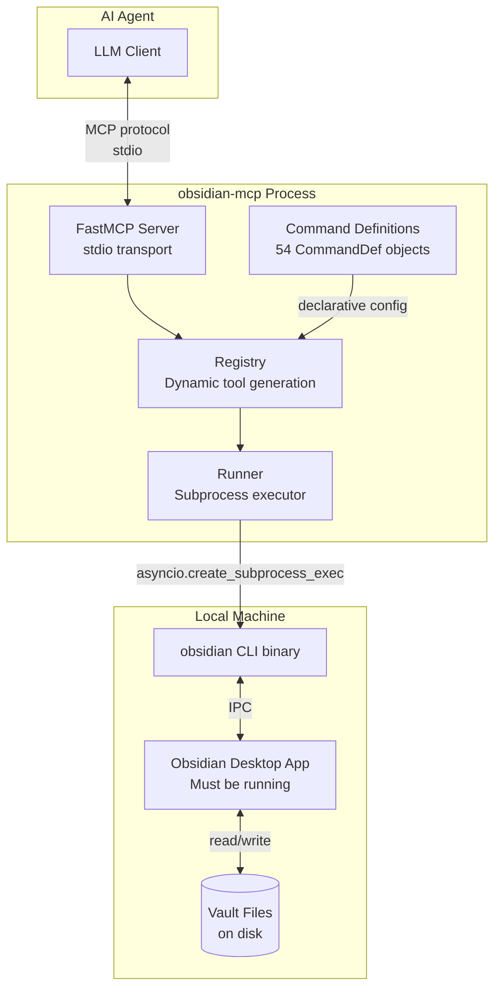

# Competitor Analysis: obsidian-mcp (Storks)

> **Repo:** https://github.com/Storks/obsidian-mcp
> **Originally analyzed:** 2026-03-21 · **Re-verified:** 2026-08-09

## Overview

| Field | Value |
|---|---|
| Language | Python 3.11+ |
| Version | 0.1.0 (unchanged since the original review) |
| License | **None declared** — no LICENSE file; the README's MIT claim is unbacked |
| Stars | ~15 |
| Last activity | 2026-02-28 |
| Status | Dormant |
| Transport | stdio |
| MCP SDK | `mcp[cli]` (FastMCP) |
| Build system | Hatchling + uv |

### Maturity Assessment

Early-stage project (v0.1.0), and it has stayed there. Clean, well-structured codebase with a declarative command model and good test coverage for its scope. The design is intentionally thin — it is a **CLI wrapper**, not a standalone vault parser. The entire value proposition depends on Obsidian 1.12+ running locally with its CLI feature enabled. This is a fundamental architectural constraint that limits deployment scenarios (no headless servers, no CI, no containers).

> **Two corrections since the 2026-03 review.** First, the repository has **no LICENSE
> file** — the GitHub API reports no detected license, so the project is technically
> all-rights-reserved regardless of README wording. Treat any code reuse as blocked.
> Second, it has been dormant since 2026-02-28 with no version change.

## Technology Stack

### Runtime & Frameworks

- **Python 3.11+** with asyncio for subprocess management
- **FastMCP** from `mcp[cli]` — the official Python MCP SDK's high-level server builder
- **Pydantic v2** — models for command definitions (`CommandDef`, `CommandParam`, `CommandFlag`)
- **Hatchling** — build backend
- **uv** — dependency management and runner

### Key Dependencies (from pyproject.toml)

| Dependency | Purpose |
|---|---|
| `mcp[cli]` | MCP server framework (FastMCP) + CLI entry point |
| `pydantic>=2.0` | Data validation for command definitions |

### Dev Dependencies

| Dependency | Purpose |
|---|---|
| `pytest>=9.0.2` | Test runner |
| `pytest-asyncio>=1.3.0` | Async test support |

The dependency footprint is minimal. No search libraries, no indexing engines, no markdown parsers — all of that is delegated to the Obsidian app via its CLI.

## Architecture

### Connection Model

This server does **not** read vault files directly. It shells out to the `obsidian` CLI binary, which communicates with the running Obsidian desktop app via IPC. Every tool call becomes a subprocess invocation:

```
Agent → MCP (stdio) → obsidian-mcp (Python) → obsidian CLI (subprocess) → Obsidian App (IPC)
```

### Component Diagram



### Core Components

**`server.py`** — Entry point. Creates a `FastMCP("Obsidian MCP")` instance, registers all commands, runs stdio transport. 16 lines of code.

**`models.py`** — Pydantic models: `CommandDef` (cli_command, tool_name, description, params, flags, category), `CommandParam` (name, description, required, param_type), `CommandFlag` (name, description). Pure data, no logic.

**`registry.py`** — The interesting part. `create_tool_handler()` dynamically generates async handler functions with proper type signatures using `inspect.Parameter` and `inspect.Signature`. This lets FastMCP auto-generate JSON Schema for each tool from the Python function signature. `register_commands()` loops over all `CommandDef` objects and registers them with FastMCP.

**`runner.py`** — `build_cli_args()` translates tool parameters into CLI arguments (`obsidian [vault=X] <command> [key=value...] [flags...]`). `run_command()` executes the subprocess with timeout handling and error capture.

**`commands/`** — 16 modules, each exporting a `COMMANDS` list of `CommandDef` objects. Pure declarative definitions — no logic. All 54 tools are defined this way.

### Design Pattern

The architecture follows a **declarative command mapping** pattern:

1. Each tool is declared as a `CommandDef` data object
2. The registry dynamically creates Python functions with typed signatures
3. FastMCP introspects those signatures to generate MCP tool schemas
4. At runtime, the handler maps parameters back to CLI arguments and spawns a subprocess

This is elegant in its simplicity — adding a new tool requires only adding a `CommandDef` to the appropriate module. No handler code to write.

## Tools & Capabilities

### Files (12 tools)

| Tool | Parameters | Flags | Description |
|---|---|---|---|
| `obsidian_file_info` | `file`, `path` | — | Show file info (default: active file) |
| `obsidian_files` | `folder`, `ext` | `total` | List files in vault |
| `obsidian_folder_info` | `path` (required), `info` | — | Show folder info |
| `obsidian_folders` | `folder` | `total` | List folders in vault |
| `obsidian_open` | `file`, `path` | `newtab` | Open a file in Obsidian |
| `obsidian_create` | `name`, `path`, `content`, `template` | `overwrite`, `open`, `newtab` | Create or overwrite a file |
| `obsidian_read` | `file`, `path` | — | Read file contents |
| `obsidian_append` | `file`, `path`, `content` (required) | `inline` | Append content to a file |
| `obsidian_prepend` | `file`, `path`, `content` (required) | `inline` | Prepend content after frontmatter |
| `obsidian_move` | `file`, `path`, `to` (required) | — | Move or rename a file |
| `obsidian_rename` | `file`, `path`, `name` (required) | — | Rename a file |
| `obsidian_delete` | `file`, `path` | `permanent` | Delete a file (trash by default) |

### Search (2 tools)

| Tool | Parameters | Flags | Description |
|---|---|---|---|
| `obsidian_search` | `query` (required), `path`, `limit` (int), `format` | `total`, `case` | Search vault for text; returns matching file paths |
| `obsidian_search_context` | `query` (required), `path`, `limit` (int), `format` | `case` | Search with grep-style `path:line: text` context |

### Daily Notes (5 tools)

| Tool | Parameters | Flags | Description |
|---|---|---|---|
| `obsidian_daily` | `paneType` | — | Open today's daily note |
| `obsidian_daily_path` | — | — | Get daily note file path |
| `obsidian_daily_read` | — | — | Read daily note contents |
| `obsidian_daily_append` | `content` (required), `paneType` | `inline`, `open` | Append content to daily note |
| `obsidian_daily_prepend` | `content` (required), `paneType` | `inline`, `open` | Prepend content to daily note |

### Tasks (2 tools)

| Tool | Parameters | Flags | Description |
|---|---|---|---|
| `obsidian_tasks` | `file`, `path`, `status` | `total`, `done`, `todo`, `verbose`, `active`, `daily` | List tasks in vault |
| `obsidian_task` | `ref`, `file`, `path`, `line` (int), `status` | `toggle`, `daily`, `done`, `todo` | Show or update a task |

### Tags (2 tools)

| Tool | Parameters | Flags | Description |
|---|---|---|---|
| `obsidian_tags` | `file`, `path`, `sort` | `total`, `counts`, `active` | List tags in vault |
| `obsidian_tag` | `name` (required) | `total`, `verbose` | Get tag info |

### Properties (4 tools)

| Tool | Parameters | Flags | Description |
|---|---|---|---|
| `obsidian_properties` | `file`, `path`, `name`, `sort`, `format` | `total`, `counts`, `active` | List properties in vault |
| `obsidian_property_set` | `name` (required), `value` (required), `type`, `file`, `path` | — | Set a property on a file |
| `obsidian_property_remove` | `name` (required), `file`, `path` | — | Remove a property from a file |
| `obsidian_property_read` | `name` (required), `file`, `path` | — | Read a property value |

### Links (5 tools)

| Tool | Parameters | Flags | Description |
|---|---|---|---|
| `obsidian_backlinks` | `file`, `path` | `counts`, `total` | List backlinks to a file |
| `obsidian_links` | `file`, `path` | `total` | List outgoing links from a file |
| `obsidian_unresolved` | — | `total`, `counts`, `verbose` | List unresolved links in vault |
| `obsidian_orphans` | — | `total` | List files with no incoming links |
| `obsidian_deadends` | — | `total` | List files with no outgoing links |

### Outline (1 tool)

| Tool | Parameters | Flags | Description |
|---|---|---|---|
| `obsidian_outline` | `file`, `path`, `format` | `total` | Show headings for a file |

### Templates (1 tool)

| Tool | Parameters | Flags | Description |
|---|---|---|---|
| `obsidian_templates` | — | `total` | List available templates |

### Bookmarks (2 tools)

| Tool | Parameters | Flags | Description |
|---|---|---|---|
| `obsidian_bookmarks` | — | `total`, `verbose` | List bookmarks |
| `obsidian_bookmark` | `file`, `subpath`, `folder`, `search`, `url`, `title` | — | Add a bookmark |

### Vault (1 tool)

| Tool | Parameters | Flags | Description |
|---|---|---|---|
| `obsidian_vault` | `info` | — | Show vault info |

### Word Count (1 tool)

| Tool | Parameters | Flags | Description |
|---|---|---|---|
| `obsidian_wordcount` | `file`, `path` | `words`, `characters` | Count words and characters |

### Plugins (7 tools)

| Tool | Parameters | Flags | Description |
|---|---|---|---|
| `obsidian_plugins` | `filter` | `versions` | List installed plugins |
| `obsidian_plugins_enabled` | `filter` | `versions` | List enabled plugins |
| `obsidian_plugin_info` | `id` (required) | — | Get plugin info |
| `obsidian_plugin_enable` | `id` (required), `filter` | — | Enable a plugin |
| `obsidian_plugin_disable` | `id` (required), `filter` | — | Disable a plugin |
| `obsidian_plugin_install` | `id` (required) | `enable` | Install a community plugin |
| `obsidian_plugin_reload` | `id` (required) | — | Reload a plugin |

### Workspace (4 tools)

| Tool | Parameters | Flags | Description |
|---|---|---|---|
| `obsidian_workspace` | — | `ids` | Show workspace tree |
| `obsidian_workspaces` | — | `total` | List saved workspaces |
| `obsidian_workspace_save` | `name` | — | Save current layout |
| `obsidian_workspace_load` | `name` (required) | — | Load a saved workspace |

### Bases (3 tools)

| Tool | Parameters | Flags | Description |
|---|---|---|---|
| `obsidian_bases` | — | — | List .base files in vault |
| `obsidian_base_create` | `file`, `path`, `view`, `name`, `content` | `open`, `newtab` | Create a new item in a base |
| `obsidian_base_query` | `file`, `path`, `view`, `format` | — | Query a base and return results |

### History (2 tools)

| Tool | Parameters | Flags | Description |
|---|---|---|---|
| `obsidian_diff` | `file`, `path`, `from` (int), `to` (int), `filter` | — | Compare file versions (recovery + Sync) |
| `obsidian_history` | `file`, `path` | — | List versions from file recovery |

## Search Implementation

**There is no search implementation in this codebase.** Search is entirely delegated to the Obsidian CLI, which delegates to the running Obsidian app's built-in search engine.

The MCP server provides two search tools:

1. **`obsidian_search`** — maps to `obsidian search query=<text>` — returns file paths
2. **`obsidian_search_context`** — maps to `obsidian search:context query=<text>` — returns grep-style `path:line: text` output

The server itself has:
- No indexing
- No ranking algorithm
- No full-text search engine
- No caching

All search quality, performance, and ranking depend entirely on what the Obsidian app provides through its CLI interface. The server is a pure pass-through.

### Implications

- Search capabilities are limited to what the Obsidian CLI exposes (text matching only based on observable behavior)
- No semantic search or BM25 or any ranking visible to the MCP layer
- No ability to search sections or return targeted context
- The `limit` parameter controls maximum files returned, but there is no token-aware truncation

## Token & Cost Optimization

**There is essentially no token optimization in this server.** The server returns raw CLI output as plain strings.

- `run_command()` returns `stdout.decode().strip()` — the raw output of the Obsidian CLI
- No response truncation, summarization, or compression
- No section-level retrieval — `obsidian_read` returns entire file contents
- No token counting or context budget management
- The `format` parameter on some tools (json, text, tsv) is passed through to the CLI — formatting is done by Obsidian, not the server
- The `total` flag on many tools can return just a count instead of full results, which is a rudimentary form of response size control

### Impact for LLM Agents

Large vault files are returned in full. A note with 10,000 words would be sent entirely to the agent context. There is no mechanism to:
- Return only specific sections of a note
- Limit response size based on token budget
- Provide summaries instead of full content
- Stream partial results

## Security Model

### Authentication

None. The server runs as a local stdio process. Access control is based on OS-level process permissions.

### Path Restrictions

**None implemented in the MCP server itself.** The server passes file paths directly to the Obsidian CLI without validation:

```python
# runner.py — params are passed directly as CLI arguments
for name, value in params.items():
    if value is None:
        continue
    args.append(f"{name}={value}")
```

Path traversal protection, if any, is handled by the Obsidian app/CLI, not by this server. There is no `VaultPath` or path validation type.

### Input Validation

- **Pydantic models** validate command definition structure at import time (not user input at runtime)
- **Python keyword safety**: `_safe_name()` appends underscore to Python reserved words used as parameter names (e.g., `from` becomes `from_`)
- **Type coercion**: FastMCP handles JSON Schema validation based on the dynamically generated function signatures
- **No sanitization** of parameter values before passing to subprocess — values are passed as separate `exec` arguments (not shell-interpolated), which prevents shell injection but does not prevent CLI argument injection

### Timeout

Configurable via `OBSIDIAN_TIMEOUT` env var (default: 30 seconds). `asyncio.wait_for()` is used to enforce the timeout.

### Error Handling

- `FileNotFoundError` if CLI binary not found — returns user-friendly error message
- `TimeoutError` — returns timeout message
- Non-zero exit codes — returns stderr content
- No error logging or tracing

## Strengths & Weaknesses

### Strengths

1. **Breadth of capabilities (54 tools)** — Covers the full Obsidian feature set including plugins, workspaces, bases, history, bookmarks, and daily notes. This is the widest tool surface of any Obsidian MCP server.

2. **Leverages Obsidian's internal API** — By going through the official CLI, the server gets access to features that filesystem-only approaches cannot replicate: plugin management, workspace layouts, Obsidian Sync history, base queries, bookmark management. These are app-level features, not file-level features.

3. **Elegant declarative design** — Adding a new tool requires only a `CommandDef` data object. The registry dynamically generates typed handlers. Zero boilerplate per tool.

4. **Clean, minimal codebase** — ~500 lines of actual code (excluding command definitions). Easy to understand, maintain, and extend.

5. **Good test coverage** — Tests for models, runner (with subprocess mocking), registry (signature generation, tool registration), server (all tools registered), and command definitions (uniqueness, completeness).

6. **Write operations** — Full create/append/prepend/delete/move/rename support, plus property mutations and task toggling.

### Weaknesses

1. **Hard dependency on running Obsidian desktop app** — The server is useless without Obsidian 1.12+ running on the same machine. Cannot work in headless environments, containers, CI/CD, or on servers. This is the most significant architectural limitation.

2. **No search intelligence** — Zero indexing, ranking, or semantic search. Pure pass-through to whatever the Obsidian CLI provides. No section-level retrieval.

3. **No token optimization** — Returns full file contents with no truncation, summarization, or context budgeting. Large vaults will produce large responses that consume agent context windows.

4. **No path validation** — File paths are passed through to the CLI without any server-side validation. Security depends entirely on the Obsidian CLI's own protections.

5. **Subprocess overhead** — Every tool call spawns a new subprocess (`obsidian` CLI), which communicates via IPC with the Obsidian app. This adds latency compared to direct file access. For batch operations (e.g., reading 20 files), this means 20 sequential subprocess spawns.

6. **No concurrency control** — No optimistic concurrency (revision tokens) or conflict detection for write operations. Two agents could overwrite each other's changes.

7. **No observability** — No logging, tracing, or metrics. Errors are returned as strings but not logged.

8. **Platform limitations** — Windows requires a special `Obsidian.com` terminal redirector only available to Catalyst (paid) members. The CLI feature itself is relatively new (Obsidian 1.12+).

9. **No caching** — Every read operation triggers a full subprocess round-trip. Repeated reads of the same file incur the same cost.

10. **54 tools may overwhelm agents** — The large tool count means the tool schema itself consumes significant context. The README acknowledges this and suggests filtering tools via client permissions, but this shifts the burden to users.

## Comparison with Tarn

| Dimension | obsidian-mcp (Storks) | Tarn |
|---|---|---|
| Vault access | Via Obsidian CLI (requires running app) | Direct filesystem access |
| Search | Delegated to Obsidian app | BM25 with section-level index |
| Token optimization | None | Section-based retrieval |
| Tool count | 54 | Focused set |
| Write operations | Full CRUD | In development |
| Concurrency control | None | Revision tokens |
| Obsidian-specific features | Plugins, workspaces, bases, sync history | Vault structure (notes, tags, links) |
| Deployment flexibility | Desktop only (needs Obsidian running) | Anywhere (headless, CI, server) |
| Indexing | None (Obsidian handles it) | In-memory BM25 with persistence |
| Dependencies | Obsidian 1.12+ CLI | None (standalone binary) |
