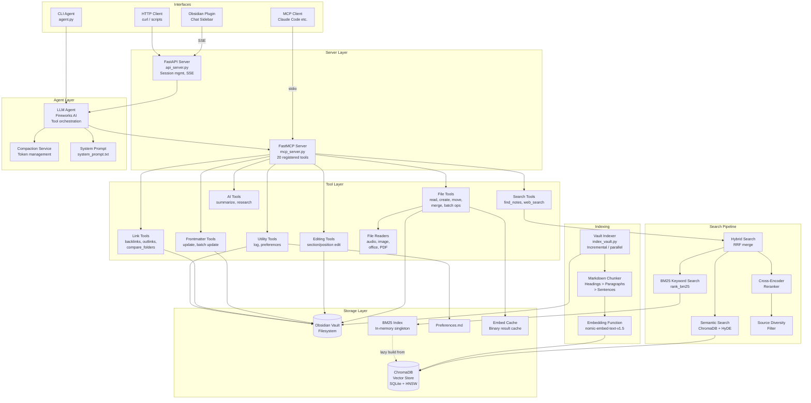

# Competitor Analysis: obsidian-tools (glibalien)

## Overview

| Field | Value |
|---|---|
| **Repository** | https://github.com/glibalien/obsidian-tools |
| **Language** | Python (3.11–3.13) |
| **Version** | None — no tags, no releases, no versioning scheme |
| **License** | **None declared** — the GitHub API detects no license file |
| **Stars** | ~2 |
| **Last activity** | 2026-03-27 |
| **Status** | Dormant |
| **Transport** | stdio, HTTP/SSE |

### Maturity Assessment

Single-developer project with a comprehensive feature set and a full test suite. Architecture is monolithic but well-organized with clear module boundaries. Production-ready for personal use; no versioning or release automation ever appeared.

> **Re-verified 2026-08-09.** Unchanged since the original review apart from going quiet —
> last commit 2026-03-27, still no releases. Two corrections: the repository has **no
> LICENSE file** (the original review recorded MIT; the GitHub API detects none), and its
> ~2GB PyTorch/ChromaDB dependency footprint means it never became practically deployable.
>
> Despite near-zero adoption, this remains the **most retrieval-sophisticated project in the
> Obsidian/PKM category** — HyDE, structure-aware chunking with heading prefixes, and
> cross-encoder reranking with source diversity. It is worth reading precisely because
> nobody adopted it: sophisticated retrieval alone does not win this market.

---

## Technology Stack

### Runtime & Frameworks

| Component | Technology |
|-----------|-----------|
| Runtime | Python 3.11 / 3.12 / 3.13 (not 3.14 due to onnxruntime) |
| MCP framework | FastMCP (official `mcp[cli]` SDK, >= 1.26.0) |
| HTTP API | FastAPI + Uvicorn |
| LLM provider | Fireworks AI (OpenAI-compatible API) |
| Vector database | ChromaDB >= 1.4.0 (PersistentClient, local storage) |
| Embeddings | sentence-transformers (nomic-embed-text-v1.5) |
| Reranking | CrossEncoder (BAAI/bge-reranker-v2-m3) |
| BM25 | rank_bm25 (BM25Okapi) |
| Web search | ddgs (DuckDuckGo) |
| Audio | Whisper v3 via Fireworks API |
| Vision | Qwen3-VL-30B via Fireworks API |
| PDF | PyMuPDF |
| Office docs | python-docx, openpyxl, python-pptx |
| HTML parsing | html2text |

### Key Dependencies (`requirements.txt`)

```
chromadb>=1.4.0
mcp[cli]>=1.26.0
openai>=2.0.0
PyYAML>=6.0
ddgs>=9.0.0
fastapi>=0.128.0
uvicorn>=0.40.0
python-docx>=1.1.0
openpyxl>=3.1.0
python-pptx>=1.0.0
pymupdf>=1.25.0
html2text>=2024.2.26
sentence-transformers>=3.0.0
einops>=0.8.0
rank_bm25>=0.2.2
```

Notable: Heavy dependency footprint. sentence-transformers pulls in PyTorch, which means ~2GB+ disk for the venv. ChromaDB adds SQLite-backed persistent storage. No lock file for reproducible installs.

### Build Tooling

No build system (pyproject.toml, setup.py, etc.). Plain `requirements.txt` with `pip install`. Install scripts (`install.sh`, `install.ps1`) handle venv creation and service registration. No packaging or distribution mechanism.

---

## Architecture

### Deployment Model

The project operates in **four modes**:

1. **MCP Server** (stdio) -- standalone `mcp_server.py` for Claude Code / MCP clients
2. **HTTP API** (FastAPI) -- `api_server.py` on localhost:8000 with session management
3. **CLI Agent** -- `agent.py` connects Fireworks LLM to MCP tools via in-process client
4. **Obsidian Plugin** -- chat sidebar in `plugin/` that talks to the HTTP API via SSE

### Component Diagram



### Data Flow

1. **Indexing**: `index_vault.py` scans the vault filesystem, chunks markdown files using structure-aware splitting (headings, paragraphs, sentences), computes embeddings with nomic-embed-text-v1.5, and upserts into ChromaDB. Incremental by default (mtime-based), with manifest tracking for fast pruning. Parallel file reading via ThreadPoolExecutor; ChromaDB mutations on main thread.

2. **Search**: `find_notes` dispatches to the hybrid search pipeline. Semantic retrieval queries ChromaDB with pre-computed embeddings. BM25 keyword search runs against an in-memory index lazily built from ChromaDB documents. Results are merged via Reciprocal Rank Fusion, reranked by cross-encoder, and filtered for source diversity.

3. **Tool execution**: The MCP server registers 20 tools. Each tool function returns JSON via `ok()`/`err()` envelope helpers. The agent loop calls tools, receives results, and feeds them back to the LLM. Between turns, tool results are compacted to lightweight stubs to manage token budget.

---

## Tools & Capabilities

### Search & Discovery

| Tool | Parameters | Description |
|------|-----------|-------------|
| `find_notes` | `query`, `mode` (hybrid/semantic/keyword), `folder`, `recursive`, `frontmatter` (FilterCondition[]), `date_start`/`date_end` (YYYY-MM-DD), `date_type` (modified/created), `sort` (relevance/name/modified/created), `include_fields`, `n_results` (default 20), `offset` | Unified discovery tool. Combines semantic/keyword search with vault-scan filtering. Search mode returns `{source, content, heading}` chunks. Scan mode returns paths or `{path, field1, ...}` dicts. Supports pagination, date ranges, and frontmatter AND-logic filters with 6 match types (contains, equals, missing, exists, not_contains, not_equals). |
| `web_search` | `query` | DuckDuckGo web search, returns top 5 results with title/url/snippet. |

### File Operations

| Tool | Parameters | Description |
|------|-----------|-------------|
| `read_file` | `path`, `offset` (default 0), `length` (default 30000) | Reads any vault file. Auto-dispatches by extension: markdown (with `![[embed]]` expansion, 1-level deep), audio (Whisper transcription), images (vision model description), .docx/.xlsx/.pptx (text extraction), .pdf (PyMuPDF page-delimited). Binary results cached by mtime. Supports pagination via offset/length for large files. |
| `create_file` | `path`, `content`, `frontmatter` (JSON string) | Creates a new note with optional YAML frontmatter. |
| `batch_create_files` | (list of path/content/frontmatter) | Create multiple files in one call. |
| `move_file` | `source`, `destination` | Move a file within the vault. Creates destination directories. |
| `batch_move_files` | `moves` (list) OR `target_field`/`target_value`/`target_filters` + `destination_folder` OR `folder` + `destination_folder`, `confirm` | Move multiple files. Supports explicit list, query-based targeting, or folder-based targeting. Confirmation gate for >5 files. |
| `merge_files` | `source`, `destination`, `strategy` (smart/concat), `delete_source` | Merge source into destination. "smart" mode does content-aware dedup; "concat" appends. |
| `batch_merge_files` | `source_folder`, `destination_folder`, `recursive`, `strategy`, `delete_source`, `confirm` | Batch merge duplicates across folders by filename stem match. |
| `get_note_info` | `path` | Lightweight metadata: frontmatter, headings, size, timestamps, link counts. No content returned. |
| `transcribe_to_file` | `path`, `output_path` | Transcribe audio to a new vault note with diarized speaker segments via Whisper. |

### Editing

| Tool | Parameters | Description |
|------|-----------|-------------|
| `edit_file` | `path`, `content`, `position` (prepend/append/section), `heading` (for section), `mode` (replace/append for section) | Edit file content. "prepend" inserts after frontmatter. "section" targets a heading by exact match (case-insensitive), replacing or appending to that section. Code-fence-aware section boundary detection. |

### Frontmatter Management

| Tool | Parameters | Description |
|------|-----------|-------------|
| `update_frontmatter` | `path`, `field`, `value` (str\|list), `operation` (set/remove/append/rename) | Single-file frontmatter update. Supports set, remove, append (to list, dedup), rename. Typed `str|list` to accept native JSON arrays from LLMs. |
| `batch_update_frontmatter` | `field`, `value`, `operation`, `paths` OR `target_field`/`target_value`/`target_match_type`/`target_filters` OR `folder`, `recursive`, `confirm` | Bulk frontmatter update with three targeting modes: explicit paths, query-based (frontmatter match), or folder scope. Two-step confirmation gate via `store_preview`/`consume_preview` when >5 files affected. |

### Link Analysis

| Tool | Parameters | Description |
|------|-----------|-------------|
| `find_links` | `path`, `direction` (backlinks/outlinks/both), `limit`, `offset` | Backlinks: O(n) vault scan matching wikilink patterns (respects Obsidian's shortest-path resolution for bare stems). Outlinks: regex extraction + resolution via stem/path/file maps. |
| `compare_folders` | `source`, `target`, `recursive` | Compare two folders by filename stem (case-insensitive). Returns only_in_source, only_in_target, in_both with counts. |

### AI-Powered Analysis

| Tool | Parameters | Description |
|------|-----------|-------------|
| `summarize_file` | `path`, `focus` | LLM-powered summarization. Reads file (with embed expansion), sends to Fireworks LLM, appends `## Summary` section. 200K char safety cap. |
| `research` | `path` OR `topic` (mutually exclusive), `depth` (shallow/deep), `focus` | Three-stage agentic pipeline: (1) extract topics from note/string via LLM, (2) gather research concurrently (web search + vault search per topic, with optional page fetching in deep mode), (3) LLM synthesis into `## Research` section. SSRF-protected page fetching with DNS pinning. |

### Utility

| Tool | Parameters | Description |
|------|-----------|-------------|
| `log_interaction` | `task_description`, `query`, `summary`, `files`, `full_response` | Logs interactions to Obsidian daily notes (`Daily Notes/YYYY-MM-DD.md`). Wikilink auto-insertion for known note names. |
| `manage_preferences` | `operation` (list/add/remove), `preference`, `line_number` | CRUD for user preferences stored as bullet points in `Preferences.md`. Preferences appended to system prompt at runtime. |

---

## Search Implementation

### Architecture

The search pipeline is a multi-stage retrieval system combining four distinct techniques:

#### 1. Semantic Search (ChromaDB + nomic-embed-text-v1.5)

- **Embedding model**: `nomic-ai/nomic-embed-text-v1.5` via sentence-transformers. Nomic-specific prefixes applied: `search_document:` for indexing, `search_query:` for queries. Prefixes are applied at embedding time only; stored documents remain unprefixed.
- **Vector index**: ChromaDB's HNSW index with PersistentClient (SQLite-backed).
- **GPU support**: Auto-detects CUDA; falls back to CPU.

#### 2. BM25 Keyword Search

- **Implementation**: `rank_bm25.BM25Okapi` built lazily as a singleton from ChromaDB documents.
- **Tokenization**: Whitespace split, lowercase, punctuation stripping, stopword removal (27-word list), minimum 3 characters.
- **Inverted index**: Supplementary `token_to_docs` dict to handle BM25 IDF edge cases (score 0 when term appears in exactly half the corpus).
- **Cross-process invalidation**: Stamp file (`.bm25_stamp`) written by indexer; checked by MCP server process via mtime comparison.
- **Thread safety**: `threading.RLock()` protecting lazy initialization.

#### 3. Reciprocal Rank Fusion (RRF)

- **Merge formula**: `score(d) = sum(weight / (rank + k))` per result list.
- **k constant**: 60 (standard RRF constant, configurable via `RRF_K`).
- **Weights**: Equal 0.5/0.5 for semantic/keyword by default.
- **Dedup key**: `(source, content[:100])` tuple.

#### 4. HyDE (Hypothetical Document Embeddings)

- **Trigger**: Question-type queries detected by `_is_question()` -- checks for `?` suffix or question-word prefix (who, what, where, when, why, how, which, is, are, does, do, can, could, would, should).
- **Generation**: Fireworks LLM generates a short hypothetical answer paragraph (150 max tokens, temperature 0.5).
- **Dual search**: Both original query and hypothetical answer are embedded and searched; results merged via RRF.
- **Fallback**: Graceful degradation to standard search on generation failure.
- **Toggle**: `HYDE_ENABLED` env var (default true).

### Post-Retrieval Pipeline

1. **Over-fetch**: 4x `n_results` candidates retrieved from each source (semantic + keyword).
2. **Cross-encoder reranking**: `BAAI/bge-reranker-v2-m3` scores `(query, content)` pairs. Lazy singleton with graceful fallback on load failure (`_reranker_failed` flag).
3. **Source diversity**: `_diversify()` limits `MAX_CHUNKS_PER_SOURCE` (default 3) chunks per file. Iterates in rank order, skipping over-represented sources.
4. **Final truncation**: Top `n_results` returned.

### Indexing Strategy

- **Chunking hierarchy**: Headings > Paragraphs > Sentences, with fixed-character fallback for text with no natural boundaries.
- **Heading chains**: Each section tracks its heading hierarchy as `[Note > Section > Subsection]`. This chain is prepended to document text before embedding for richer context.
- **Cross-section overlap**: Last `OVERLAP_SENTENCES` (2) sentences from previous section prepended to next section's first body chunk.
- **Frontmatter**: Indexed as dedicated chunk (type: "frontmatter"). Display-only fields (cssclass, aliases, publish, permalink) excluded. Wikilink brackets stripped.
- **Chunk types**: frontmatter, section, paragraph, sentence, fragment.
- **Max chunk size**: 1500 characters (default).
- **Incremental indexing**: Mtime-based -- only files modified since last run are re-indexed. Manifest file tracks indexed sources for fast pruning of deleted files.
- **Parallel processing**: `ThreadPoolExecutor` with `INDEX_WORKERS` (default 4) threads for file reading/chunking. ChromaDB operations on main thread (not thread-safe).
- **Batched upserts**: `UPSERT_BATCH_SIZE` (500) chunks per ChromaDB upsert batch.
- **Dirty sentinel**: `.indexing_in_progress` flag file prevents stale manifest reads after incomplete runs.

### Performance Characteristics

- **Startup cost**: Heavy -- sentence-transformers model loading (nomic-embed-text-v1.5 + cross-encoder) on first query. CUDA detection. BM25 index built lazily from full ChromaDB contents.
- **Query latency**: Multi-step pipeline (embed query + ChromaDB HNSW search + BM25 scoring + cross-encoder reranking). Expect seconds, not milliseconds. HyDE adds an LLM call for question-type queries.
- **Index size**: Full ChromaDB persistent storage (SQLite + HNSW files). BM25 index is in-memory (rebuilt from ChromaDB on startup/invalidation).
- **Memory**: Significant -- PyTorch + two neural models (embedding + cross-encoder) + full BM25 index in memory.

---

## Token & Cost Optimization

### Tool Result Compaction

The `compaction.py` service replaces tool results with lightweight stubs between agent turns. Tool-specific stub builders strip heavy content while preserving structural metadata:

| Tool | Compaction Strategy |
|------|-------------------|
| `find_notes` (semantic) | Keeps source, heading, 80-char snippet per result |
| `find_notes` (vault scan) | Preserves results as-is (already compact paths/field projections) |
| `read_file` | Content length + 100-char preview + truncation marker |
| `web_search` | Title + URL only, snippets dropped |
| `get_note_info` | Path + size + dates + link counts; frontmatter/headings dropped |
| `summarize_file` | Path + summary_length only |
| `research` | Path + topics_researched count |
| Generic fallback | Status + path + result_count + content_length + file list |

### Response Pagination

- `read_file` has `offset`/`length` parameters (default 30000 chars) to avoid returning entire large files.
- List tools support `limit`/`offset` pagination with `total` field (default limit 500, max 2000).
- Search results default to 20, with pagination support.

### Agent-Level Controls

- **Tool result truncation**: 100,000 character hard cap with `get_continuation` continuation marker.
- **Session message trimming**: Max 50 messages per API session (configurable).
- **Max agent iterations**: 20 per conversation turn (prevents runaway loops).
- **LLM content safety cap**: 200,000 chars for summarize/research inputs.
- **System prompt efficiency**: Includes guidance to batch independent calls and trust successful results to reduce LLM round-trips.
- **force_text_only enforcement**: Code-level stripping of tool calls when model ignores `tool_choice="none"` (retries up to 3 times).

---

## Security Model

### Path Restrictions

- **Vault containment**: `resolve_vault_path()` resolves paths and validates they stay within the vault root using `Path.relative_to()`. Absolute paths allowed but must resolve within vault. Rejects path traversal.
- **Excluded directories**: `.venv`, `.chroma_db`, `.trash`, `.obsidian`, `.git`, `embed_cache` are blocked at the vault scanning and path resolution levels.
- **File/directory validation**: `resolve_file()` and `resolve_dir()` check existence and type after path resolution.

### SSRF Protection (Research Tool)

The research tool's page fetching has a thorough SSRF defense:

- **DNS validation**: `_resolve_public_host()` resolves hostnames and validates ALL returned IPs are `is_global` and not `is_multicast`. Rejects private, loopback, link-local, reserved, carrier-grade NAT, documentation, and multicast ranges. If ANY IP is non-public, the entire host is rejected.
- **DNS pinning**: `_PinnedHTTPSConnection` connects TCP to the validated IP but uses the original hostname for TLS SNI, preventing DNS rebinding attacks.
- **Redirect validation**: Each redirect target is independently resolved and validated.
- **Read cap**: Page content capped at `MAX_PAGE_CHARS * 5` (250KB raw HTML).

### Authentication

- **None**. The HTTP API binds to `127.0.0.1` only (localhost), relying on network-level isolation. No API keys, tokens, or session authentication.
- **CORS enabled** on the API server (required for Obsidian plugin).

### Input Validation

- Tool parameters validated with type checks and enum constraints.
- Frontmatter filter conditions validated via `_validate_filters()` with explicit match type whitelisting.
- Pagination validated with range checks (offset >= 0, 1 <= limit <= 2000).
- `FilterCondition` uses Pydantic `BaseModel` for structural validation.
- Batch operations have a confirmation gate (`BATCH_CONFIRM_THRESHOLD = 5`) with server-side `store_preview`/`consume_preview` preventing direct execution without preview.

### No Concurrency Control

- No revision tokens or optimistic locking on file writes. Concurrent modifications can silently overwrite each other.
- The batch confirmation gate uses an in-memory set (`_pending_previews`) -- not durable across restarts.

---

## Strengths & Weaknesses

### Strengths

1. **Sophisticated search pipeline**: The combination of semantic search, BM25, RRF, HyDE, cross-encoder reranking, and source diversity is a production-quality retrieval system. Few MCP servers invest this deeply in search quality.

2. **Rich file type support**: Auto-dispatch to Whisper (audio), vision model (images), Office document extractors, and PDF extraction -- all through a single `read_file` tool. Binary result caching (in-memory + disk) is well-implemented with mtime invalidation.

3. **Comprehensive write operations**: Full CRUD plus batch operations with confirmation gates, section-targeted editing, frontmatter manipulation with 6 match types, merge strategies, and folder-based targeting. The batch confirmation flow is a thoughtful UX pattern for destructive operations.

4. **Agentic research pipeline**: The three-stage research tool (extract topics, gather web + vault results, synthesize) with SSRF-protected page fetching is a unique differentiator. Deep mode adds LLM-powered page content extraction.

5. **Token management**: The compaction service is well-designed with tool-specific stub builders that preserve just enough context for LLM continuity. The differentiation between semantic and vault-scan result shapes shows attention to detail.

6. **Structure-aware chunking**: The heading hierarchy tracking (`heading_chain`), cross-section overlap, and multi-level fallback (heading > paragraph > sentence > fixed) produces high-quality chunks for embedding.

7. **Multiple interfaces**: MCP server, HTTP API, CLI agent, and Obsidian plugin offer flexibility. The SSE streaming for the plugin with confirmation flow is polished.

8. **Wikilink handling**: Obsidian-native features like wikilink resolution (shortest-path stem matching), backlink scanning, embed expansion, and wikilink bracket stripping in frontmatter are thorough.

---

### Weaknesses

1. **No concurrency control on writes**: No revision tokens, file locking, or optimistic concurrency. The `edit_file` tool reads, modifies, and writes without any atomicity guarantee. Concurrent modifications from Obsidian or other agents can cause data loss.

2. **Heavy runtime footprint**: PyTorch + sentence-transformers + ChromaDB means ~2GB+ memory baseline before any indexing. Startup is slow (model loading). Not suitable for lightweight or embedded use cases.

3. **Fireworks AI lock-in**: The agent, research, summarization, audio transcription, and image description all require Fireworks AI. No provider abstraction or local model support for the LLM-dependent tools.

4. **No packaging or distribution**: Raw git clone with `requirements.txt`. No pyproject.toml, no versioned releases, no PyPI package. The install scripts are thorough but non-standard.

5. **Backlink scanning is O(n)**: `_scan_backlinks()` reads every markdown file in the vault for each backlink query. No precomputed link graph or index. This will be slow for large vaults (1000+ notes).

6. **BM25 index built from full ChromaDB dump**: `_build_index()` calls `collection.get(include=["documents", "metadatas"])` to load ALL documents into memory. For large vaults this is both slow and memory-intensive.

7. **No structured error handling for MCP**: All tools return JSON strings via `ok()`/`err()`. These are always `str` -- the MCP server never returns structured error types. MCP clients cannot distinguish tool errors from successful results at the protocol level.

8. **Single-process indexer**: ChromaDB operations must run on the main thread. Parallelism is limited to file reading/chunking. For large vaults, the embedding + upsert phase is the bottleneck and runs sequentially in batches.

9. **No real-time index updates**: The index runs on a timer (default 60 minutes) or manually. There is no filesystem watcher. Notes modified between index runs will have stale or missing search results.

10. **Monolithic search function**: `find_notes` is a single uber-tool that handles semantic search, vault scanning, frontmatter filtering, date ranges, and folder browsing. This pushes complexity onto the LLM to select the right parameter combination. Separate tools for distinct use cases (search vs. list vs. filter) could improve tool selection accuracy.

11. **No tag extraction or graph queries**: Despite indexing heading chains and wikilinks, there is no dedicated tag index or graph traversal tool. The `find_links` tool does basic backlink/outlink scanning but cannot traverse the link graph (e.g., "find all notes 2 hops from X").

12. **localhost-only security**: The API server has no authentication. Anyone with local access can read and modify the entire vault. The CORS policy is permissive.

---

## Comparison with Tarn

| Aspect | obsidian-tools | Tarn |
|--------|---------------|------|
| Language | Python | Rust |
| Search | Hybrid (semantic + BM25 + RRF + HyDE + reranking) | BM25 with section-based index |
| Vector DB | ChromaDB (external) | None (BM25 only) |
| Write ops | Full CRUD + batch + section editing | In progress |
| Concurrency control | None | Revision tokens (optimistic) |
| Index unit | Chunks (headings/paragraphs/sentences) | Sections (heading-delimited) |
| File types | md + audio + image + office + PDF | md only |
| LLM dependency | Required (Fireworks AI) | None (pure MCP server) |
| Memory footprint | Heavy (PyTorch + models) | Lightweight |
| Startup time | Slow (model loading) | Fast |
| Distribution | Git clone | Cargo crate |
