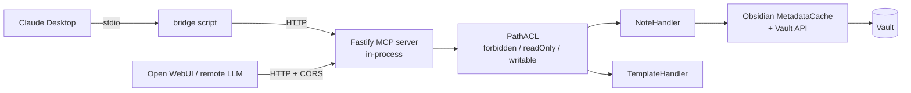

# Competitor Analysis: Vault as MCP (ebullient)

> **Rewritten 2026-08-09.** The plugin was renamed from **obsidian-vault-mcp** to **Vault as
> MCP** (plugin id `vault-as-mcp`) and moved 0.7.4 → 0.10.0. The tool surface was
> *reduced* from 15 to 12 by folding capabilities into richer parameters — most importantly,
> `read_note_with_embeds` was replaced by a `read_note` that filters by heading and returns
> an outline. It is now the most section-aware server in the Obsidian/PKM category.
> This file replaces the earlier `obsidian-vault-mcp.md`.

## Overview

| Field | Value |
|---|---|
| **Repository** | <https://github.com/ebullient/obsidian-vault-mcp> |
| **Plugin id / name** | `vault-as-mcp` / "Vault as MCP" |
| **Author** | Erin Schnabel (ebullient) |
| **Language** | TypeScript |
| **Version** | 0.10.0 (2026-07-30) |
| **License** | MIT |
| **Stars** | ~34 |
| **Last activity** | 2026-08-03 |
| **Status** | Active |
| **Surface** | 12 tools |
| **Transport** | HTTP (Fastify) natively; stdio via an optional bridge script |
| **Min Obsidian** | 1.13.0, desktop only |

### Maturity Assessment

Small but carefully engineered, and unusually explicit about its trust posture: the README
states up front that the plugin runs a local HTTP server, connects to no external services,
collects no telemetry, and is desktop-only. Distribution is via BRAT or manual install — not
in the Community Plugins directory.

The 0.7.4 → 0.10.0 arc is notable for going *down* in tool count while going up in
capability. That is the opposite of the drift seen in most competitors.

---

## Technology Stack

| Layer | Technology |
|---|---|
| **Runtime** | Obsidian desktop (Electron), in-process |
| **HTTP server** | Fastify |
| **Vault access** | Obsidian Plugin API + `MetadataCache` |
| **Transport** | HTTP/MCP natively; `bridge` script for stdio clients (Claude Desktop) |
| **Extras** | CORS support for remote access over Tailscale/LAN; status-bar indicator with click-to-toggle |

Source is a flat, prefixed module set — `vaultasmcp-Server.ts`, `-MCPHandler.ts`,
`-NoteHandler.ts`, `-Tools.ts`, `-PathACL.ts`, `-TemplateHandler.ts`,
`-PathACLTestModal.ts`.

---

## Architecture

The server lives **inside** Obsidian, so it gets the `MetadataCache` for free — resolved
links, embeds, tags, and headings without parsing anything itself.

Being HTTP-native rather than stdio-native is the deliberate inversion here: one long-lived
server serves many clients, and stdio clients are the special case handled by a bridge. Most
competitors do the reverse.

---

## Tools & Capabilities

Twelve tools, each carrying MCP **behavior annotations** (`readOnlyHint` and friends) so
clients can reason about safety without calling them:

| Tool | Notes |
|---|---|
| `read_note` | Four-in-one — see below |
| `read_multiple_notes` | Batch read |
| `search_notes` | Multi-dimensional filter — see Search Implementation |
| `list_notes` | Directory browsing (explicitly *not* what `search_notes` does) |
| `create_note` | Create |
| `append_to_note` | Additive edit without overwrite risk |
| `update_note` | Full-content update |
| `patch_note` | Targeted modification |
| `delete_note` | Delete |
| `rename_note` | Rename/move |
| `read_periodic_note` | Daily/weekly/etc. by type |
| `list_templates` | Template discovery |

### `read_note` — the section-addressing story

This single tool is where 0.10.0 earns its rewrite. Parameters:

- **`headings: string[]`** — return only the sections under these headings, matched by
  heading *text*, case-insensitive, **including subheadings**. Throws if a name matches more
  than one heading in the note rather than silently picking one.
- **`headingIndexes: {[text]: number | number[]}`** — disambiguates duplicates by 0-based
  occurrence index. `{"Notes": 1}` selects the second `Notes` heading; `{"Notes": [0,1]}`
  returns both.
- **`metadataOnly: true`** — skip content entirely, return only `embeds`, `links`, `outline`,
  and `frontmatter`. The description states the intent plainly: *"useful for triaging
  candidate notes before a full read."*
- **`excludePatterns: string[]`** — regex filters applied to the returned `embeds`/`links`
  arrays, matched against each entry's rendered markdown-link form (display text plus target).

The returned `outline` carries the occurrence `index` for each heading, so the
disambiguation loop closes: read metadata → see the outline with indices → request exactly
the section you want. That is a complete, edit-stable section-addressing protocol built on
heading identity rather than line offsets.

**What was lost:** the recursive `![[]]` embed expansion (`read_note_with_embeds`, BFS with
depth limiting and cycle detection) is gone. `read_note` now returns **depth-1** embed and
link targets, leaving multi-hop traversal to the agent. That is arguably the right call —
the agent can decide how far to walk — but the old recursive expansion was a genuinely
distinctive feature and it is worth recording that it existed.

---

## Search Implementation

No index and no ranking. `search_notes` is a **multi-dimensional filter** over Obsidian's
`MetadataCache`:

| Parameter | Semantics |
|---|---|
| `folder` | Restrict to a subtree (recursive) |
| `tag` | Single tag, ANDed with other dimensions |
| `tags[]` | **OR** within the tag dimension |
| `text` | Text content match |
| `frontmatter` | Key/value map match |
| `mtime` | `{before, after}` modification-time window |
| `sort` | `alpha` or `recent` |
| `limit` | Result cap |

All parameters are optional and combine with **AND** logic, except `tags[]` which is OR
*within* its dimension. The description is careful about scope: it returns note paths only,
not folder structure, and points at `list_notes` for browsing.

This is precise but unranked — you get the set of notes matching a predicate, in alphabetical
or recency order. There is no relevance signal at all, so an agent must either narrow hard or
triage the result set itself (which is what `metadataOnly` exists for).

---

## Token & Cost Optimization

Strong, and structurally rather than cosmetically:

- **`metadataOnly` triage** — inspect outline/links/frontmatter before committing to content.
- **Heading-filtered reads** — retrieve one section subtree instead of a note.
- **`excludePatterns`** — prune noisy link/embed arrays out of the response.
- **`read_multiple_notes`** — batch round-trips.
- **`limit` + `sort`** on search.
- **Dropping recursive embed expansion** removes an unbounded-response footgun; depth-1
  targets are a fixed cost.

There is no minified-field or density-knob equivalent to MCPVault's `{p,t,ex}`.

---

## Security Model

Still the most explicit access-control model in this category.

**Three-tier glob ACL**, evaluated in order:

1. **`forbidden`** — matched paths throw `Access forbidden` for both reads and writes.
2. **`writable`** — if non-empty, it acts as an **allowlist**: a write to a path not matching
   any pattern is denied (`not in writable list`).
3. **`readOnly`** — matched paths permit reads and deny writes.

Enforcement is centralized in `PathACL` with separate read and write entry points, and
denials are logged through a dedicated `warnAcl` channel rather than generic logging. The
settings tab ships a **`PathACLTestModal`** — a live "what would happen to this path"
checker, which is the only interactive ACL debugging UI found in any project surveyed.

Other posture:

- **Desktop-only, localhost HTTP**, no external services, no telemetry — stated explicitly.
- **CORS** is opt-in for LAN/Tailscale access, which is also the main exposure: the HTTP
  server's protection is network placement, and there is no auth layer in front of it.
- **Per-tool MCP annotations** (`readOnlyHint`) let a client apply its own policy.

---

## Strengths & Weaknesses

### Strengths

1. **Complete heading-addressed read protocol** — `metadataOnly` → `outline` with occurrence
   indices → `headings` + `headingIndexes`. Edit-stable and unambiguous by construction.
2. **Fails loudly on ambiguity.** A duplicate heading name throws instead of guessing.
3. **Three-tier ACL with an interactive test modal.** Nobody else ships ACL debugging UI.
4. **Tool count went down while capability went up** — 15 → 12 by enriching parameters.
5. **Per-tool behavior annotations** so clients can reason about safety.
6. **HTTP-first with a stdio bridge** — one server, many clients, remote-capable.
7. **Honest, prominent trust statement** in the README.

### Weaknesses

1. **Requires Obsidian running**, desktop only. Same ceiling as every plugin here.
2. **No ranking whatsoever.** `search_notes` is a filter; results are ordered alphabetically
   or by recency, never by relevance.
3. **No index of its own** — it borrows `MetadataCache`, which is why it needs the app.
4. **HTTP server with no authentication.** Security rests on binding and network placement;
   enabling CORS for Tailscale widens that meaningfully.
5. **Recursive embed expansion was removed** — a real capability regression for agents that
   relied on it.
6. **Small adoption** (~34★) and BRAT-only distribution.
7. **No concurrency control** on writes.

---

## Comparison with Tarn

| Dimension | Vault as MCP | Tarn |
|---|---|---|
| Obsidian required | **Yes** (in-process plugin, desktop only) | No |
| Index | None — Obsidian `MetadataCache` | Persistent section-level BM25 |
| Search | Multi-dimensional filter, **unranked** | Ranked BM25 |
| Section reads | **Yes** — by heading text + occurrence index, incl. subtree | Yes — sections are the indexed unit |
| Section ambiguity | Throws; disambiguate via `headingIndexes` | `heading_path` is unique by construction |
| Structure triage | `metadataOnly` (outline + links + embeds + frontmatter) | Index already holds structure |
| Path ACL | **Three-tier globs + test modal** | Not yet |
| Tool annotations | **Yes** (`readOnlyHint`) | Not yet |
| Concurrency control | None | `RevisionToken` |
| Transport | HTTP native + stdio bridge | stdio |
| Link/embed graph | Depth-1 resolved refs | Parsed and indexed for graph queries |

### What Tarn should take

- **`headingIndexes`-style disambiguation.** Tarn's `heading_path` is unique by construction,
  so it sidesteps the problem — but the *lesson* transfers: when an addressing scheme can be
  ambiguous, throw and hand back the disambiguator rather than guessing.
- **`metadataOnly` as a first-class projection.** Cheap structural triage before content
  retrieval; complements the ranked-hit flow rather than duplicating it.
- **Three-tier ACL semantics** — `forbidden` / `writable` (allowlist when non-empty) /
  `readOnly` is a clean, well-specified model, and the interactive test modal is the reason
  users can actually trust it. Cheap to add as a config-time `tarn acl test <path>` command.
- **Per-tool MCP behavior annotations.** Nearly free and improves client-side safety.
- **Shrinking the tool surface by enriching parameters** — the 15 → 12 move is the counter to
  tool sprawl, and it worked.

### Where Tarn wins

Ranking is the whole gap. Vault as MCP can address a section precisely but cannot tell you
*which* section is relevant — it has no relevance model at all. Tarn ranks sections directly,
so a query returns the right subtree rather than a filtered candidate set the agent must
triage. Add no-Obsidian operation, a persistent index, and revision tokens, and the remaining
deficits on Tarn's side are ACLs, tool annotations, and writes — all of which this project
shows are inexpensive to build.
