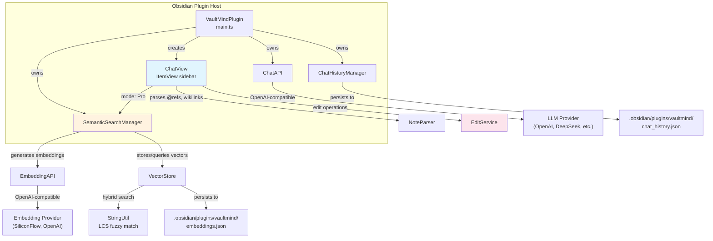

# VaultMind Plugin

## Overview

| Field | Value |
|-------|-------|
| **Repository** | <https://github.com/crazyjgg7/vaultmind-plugin> |
| **Language** | TypeScript |
| **Version** | 3.1.9 (manifest); latest GitHub release tag is 3.1.6 |
| **License** | MIT (Copyright 2024 LLenger) |
| **Stars** | ~1 |
| **Last activity** | 2026-01-26 |
| **Status** | Dormant |
| **Obsidian Min Version** | 1.0.0 |
| **Platform** | Desktop + iOS (mobile-first design) |

**Maturity**: Early-to-mid stage, now stalled. The codebase is compact (~12 source files, ~1,500 LOC) with straightforward architecture. Chinese-language comments throughout suggest a primarily Chinese developer audience. The plugin never entered the Obsidian Community Plugin directory (manual install only). Version numbering at 3.x suggests rapid iteration but the feature surface remains narrow. No test suite exists.

> **Re-verified 2026-08-09.** Version unchanged at 3.1.9; dormant since 2026-01-26. Note the
> manifest/release mismatch — `manifest.json` declares 3.1.9 while the newest release tag is
> 3.1.6, so installs via BRAT and manual installs can diverge.

**Positioning**: VaultMind is an Obsidian-native AI chat sidebar with RAG capabilities and a note editing mode. It targets users who want a ChatGPT-like experience embedded directly in Obsidian, with vault-aware context injection. Strong emphasis on iOS compatibility and CJK (Chinese) language support.

---

## Technology Stack

| Component | Technology |
|-----------|-----------|
| **Runtime** | Obsidian Plugin API (Electron/Capacitor) |
| **Language** | TypeScript 5.8 |
| **Build** | esbuild via custom `esbuild.config.mjs` |
| **UI** | Obsidian DOM API (imperative `createDiv`/`createEl`), custom CSS |
| **HTTP** | Obsidian `requestUrl` (bypasses CORS, works in iOS sandbox) |
| **Markdown** | Obsidian `MarkdownRenderer.render` |
| **Dependencies** | `obsidian` (only runtime dep); no external vector DB, no ML runtime |

Notable: zero external dependencies beyond Obsidian itself. The embedding vectors, cosine similarity, and LCS algorithm are all hand-rolled in TypeScript. No bundled ML models -- all inference is delegated to remote APIs.

---

## Architecture

VaultMind is a standard Obsidian sidebar plugin. The main plugin class initializes services on load, registers a custom `ItemView` for the chat panel, and wires everything through direct references (no DI, no event bus).



### Data Flow (Pro Mode / RAG)

1. User types query in chat sidebar
2. `NoteParser` resolves any `[[wikilink]]` or `@note` references in the message
3. If `autoIncludeCurrentFile` is enabled, current note content is appended as context
4. `SemanticSearchManager.searchNotes()` executes the 3-tier search pipeline (see below)
5. Retrieved chunks are formatted with `[[WikiLink]]` citation headers and prepended to the user message
6. Full conversation history (trimmed to `contextLength` turns) is sent to the LLM via `ChatAPI`
7. Response is rendered as Obsidian-flavored markdown in the chat view

### Persistence

All state lives in the vault's `.obsidian/plugins/vaultmind/` directory:
- `embeddings.json` -- serialized vector index (all chunk embeddings as JSON arrays)
- `chat_history.json` -- up to 50 saved chat sessions
- Plugin settings via standard Obsidian `loadData()`/`saveData()`

---

## Tools & Capabilities

VaultMind operates in 3 modes, selectable via UI tabs in the chat sidebar:

### Standard Mode

Basic AI chat with optional vault context.

| Feature | Description |
|---------|-------------|
| **OpenAI-compatible chat** | Sends conversation to any OpenAI-format API (OpenAI, DeepSeek, OpenRouter, etc.) |
| **Note reference resolution** | `[[Note Name]]` and `@NoteName` in messages are resolved to file content and injected as context |
| **Current file auto-include** | Optionally appends the active editor's content (truncated to 2,000 chars) |
| **Conversation history** | Retains configurable number of turns (default 10) in context window |
| **Chat history management** | Save/load/delete past sessions (max 50, persisted to JSON) |
| **Copy/Delete messages** | Per-message actions in the chat UI |
| **Stop generation** | Abort in-flight requests |
| **Markdown rendering** | Full Obsidian markdown rendering including code blocks, callouts |

### Pro Mode (RAG)

Everything in Standard, plus automatic semantic search.

| Feature | Description |
|---------|-------------|
| **Semantic vault search** | Automatically queries the vector index before sending to LLM |
| **3-tier hybrid search** | LCS fuzzy filename match + vector cosine similarity + keyword fallback (see Search section) |
| **WikiLink citation** | System prompt instructs LLM to cite sources as `[[Note Name]]` |
| **Vault indexing** | Command to build/rebuild embedding index for all markdown files |
| **Index clearing** | Command to wipe all stored embeddings |
| **Incremental updates** | Skips files whose content hash hasn't changed since last index |
| **Chunk-level retrieval** | Returns specific text chunks (400-char windows with 50-char overlap), not whole notes |

### Edit Mode

AI-assisted note editing with apply/reject workflow.

| Feature | Description |
|---------|-------------|
| **Intent detection** | Keyword-based classification: rewrite vs. append |
| **Rewrite mode** | Triggers on keywords: "rewrite", "modify", "optimize", "refactor", "fix", and Chinese equivalents ("修改", "改写", "优化", "润色") |
| **Append mode** | Default for all other edit instructions -- adds content to end of file |
| **XML-tagged output** | LLM returns modified content wrapped in `<FILE_CONTENT>` tags for reliable parsing |
| **Diff preview card** | Shows truncated preview (300 chars) of proposed changes |
| **Apply/Reject UI** | One-click apply writes to file; reject discards the suggestion |
| **Fallback parsing** | If XML tags fail, falls back to markdown code block extraction |

---

## Search Implementation

The search pipeline in Pro mode is a 3-tier system designed to handle CJK text where word-boundary tokenization fails.

### Tier 1: LCS Fuzzy Filename Match (Live Lookup)

**Source**: `SemanticSearchManager.searchNotes()` + `StringUtil.isFuzzyMatch()`

Before any vector search, all vault markdown files are scanned in real-time. Each filename is compared against the query using Longest Common Substring (LCS):

- **Algorithm**: Dynamic programming LCS matrix (`O(n*m)` time and space where n,m are string lengths)
- **CJK threshold**: Match requires >= 2 CJK characters in common
- **Latin threshold**: Match requires >= 4 Latin characters in common
- **Stop word filter**: Ignores matches on common query words ("查找", "查询", "关于", "search", "find", etc.)
- **Scoring**: Matches get similarity score of `1.1` (above maximum cosine similarity of 1.0), guaranteeing they rank first
- **Limit**: Top 3 filename matches, each returns up to 1,500 chars of content

**Rationale**: Chinese queries like "查找上海卓祺相关的笔记" contain the entity "上海卓祺" as a substring. Traditional tokenization would split this incorrectly. LCS finds the 4-character overlap with filename "上海卓祺实施项目" without needing a tokenizer.

### Tier 2: Vector Cosine Similarity with Keyword Boost

**Source**: `VectorStore.searchSimilar()`

The main vector search with a hybrid scoring formula:

```
finalScore = cosineSimilarity(queryEmbedding, chunkEmbedding) + keywordBoost
```

Keyword boost is determined by:
1. **LCS filename match** (same `isFuzzyMatch`): boost = `1.0`
2. **English keyword in file path**: boost = `0.5` (splits query on whitespace, checks `includes()`)
3. **No match**: boost = `0.0`

This means a file whose name LCS-matches the query will have all its chunks boosted by 1.0, effectively doubling their ranking weight.

### Tier 3: Keyword Content Search (Fallback in Standard Mode)

**Source**: `VaultSearch.searchNotes()`

Used when semantic search is disabled. Two-phase approach:
1. **Obsidian fuzzy search** (`prepareFuzzySearch`) on filenames -- uses Obsidian's built-in fuzzy matcher
2. **Substring search** on content (`indexOf`) for files whose names don't match -- score = `1/(position+1)`

### Chunking Strategy

**Source**: `SemanticSearchManager.chunkContent()`

- **Chunk size**: 400 characters with 50-character overlap
- **Boundary detection**: Prefers splitting at Chinese period (`。`), newline (`\n`), or space (` `)
- **Minimum chunk**: Ignores chunks shorter than 5 characters
- **Context injection**: Each chunk is prefixed with `File: {filename}\nContent:` before embedding generation
- **Batch processing**: 5 chunks per batch, 200ms delay between batches to avoid rate limits

### Embedding Configuration

Default embedding provider is SiliconFlow (`https://api.siliconflow.cn/v1`) with model `BAAI/bge-large-zh-v1.5` -- a Chinese-optimized BGE model. Any OpenAI-compatible embedding endpoint is supported.

---

## Token & Cost Optimization

### Context Size Management

- **Hard character limit**: `maxTotalContextChars` setting (default 15,000 chars) -- though this is exposed in settings but not actually enforced in the sending code path (it exists only as a setting field)
- **Per-note truncation**: Referenced notes truncated to 2,000 chars each
- **Current file truncation**: Active file context capped at 2,000 chars
- **Chunk retrieval limit**: `maxRetrievedNotes` (default 5) chunks from vector search, returns `topK + 2` results
- **Conversation windowing**: Only last `contextLength * 2` messages sent (default 10 turns = 20 messages)

### Response Format

- Edit mode uses XML tags (`<FILE_CONTENT>`) to demarcate generated content, reducing parsing ambiguity
- System prompt instructs WikiLink citation format for traceability
- No streaming -- full response returned at once

### Cost Concerns

- Embedding generation is sequential (not batched at the API level despite code structure), with 100-200ms artificial delays
- No local embedding option -- every index build and search query requires API calls
- No token counting -- relies on character-based heuristics
- Rate limit handling: exponential backoff retry (up to 3 attempts) on 429 responses

---

## Security Model

### Authentication

- API keys stored in Obsidian plugin settings (plaintext in `.obsidian/plugins/vaultmind/data.json`)
- Separate API keys for chat LLM and embedding service
- Keys sent as `Bearer` tokens in `Authorization` header
- No encryption at rest for API keys or stored embeddings

### Network

- All HTTP via Obsidian's `requestUrl` API (respects platform proxy settings, works in iOS sandbox)
- No hardcoded external endpoints beyond defaults (user-configurable base URLs)
- No telemetry, no analytics, no phone-home

### Input Validation

- **Minimal**: No sanitization of user input before sending to LLM
- **No path traversal protection**: `NoteParser.getNoteContent()` does basic filename matching but no vault boundary enforcement (relies on Obsidian's vault API which is inherently sandboxed)
- **Edit mode**: Applies LLM output directly to files with `vault.modify()` -- no diff review beyond the truncated 300-char preview
- **XSS surface**: Raw LLM output is rendered via `MarkdownRenderer.render` -- Obsidian's renderer handles sanitization, but custom HTML in responses could be a concern
- **No rate limiting** on the plugin side (only server-side 429 handling)

### Data Privacy

- Note content sent to external LLM/embedding providers on every chat and index operation
- Embeddings stored locally in vault directory
- Chat history stored locally (up to 50 sessions)
- No data minimization strategy -- full chunk text stored alongside vectors

---

## Strengths & Weaknesses

### Strengths

1. **Zero external dependencies**: The entire plugin is self-contained with only the Obsidian API as a dependency. No node_modules bloat, no native binaries, no WASM. This makes it extremely portable and easy to audit.

2. **CJK-aware search via LCS**: The Longest Common Substring approach to fuzzy filename matching is a clever solution to the Chinese tokenization problem. It avoids the need for a segmentation library (like jieba) while still extracting meaningful entity matches from natural language queries.

3. **iOS-first design**: Explicit mobile support with touch-friendly UI, mode cycling via tools button, and use of `requestUrl` (which is the only HTTP method that works in Obsidian's iOS sandbox). Most competitors ignore mobile entirely.

4. **Edit mode with intent detection**: The append-vs-rewrite classification and apply/reject workflow is a practical UX pattern for AI-assisted writing. The XML tag protocol for parsing LLM output is more robust than regex-based extraction.

5. **Provider-agnostic**: Works with any OpenAI-compatible API (OpenAI, DeepSeek, OpenRouter, local endpoints). Separate configuration for chat and embedding providers allows mixing (e.g., DeepSeek for chat, SiliconFlow for embeddings).

6. **Lightweight persistence**: JSON-based storage for both embeddings and chat history, using Obsidian's vault adapter. No database dependency, syncs naturally with vault sync solutions.

### Weaknesses

1. **No streaming**: All LLM responses are received as a single block. For long responses this creates poor UX -- the user sees only a "Thinking..." timer with no progressive output. This is a significant gap compared to competitors that support SSE streaming.

2. **Naive vector storage**: Embeddings are serialized as raw JSON arrays in a single file (`embeddings.json`). For vaults with thousands of notes, this file becomes enormous and cosine similarity search is brute-force `O(n)` over all chunks. No approximate nearest neighbor (ANN) index, no dimensionality reduction.

3. **No incremental search index updates**: The index is only built via explicit command. There is no file watcher to re-index modified notes automatically. The `needsUpdate` check only runs during a full re-index pass, not on individual file changes.

4. **Character-based limits, not token-based**: The `maxTotalContextChars` setting is exposed but never enforced in the actual API call path. Context management relies on per-field truncation (2,000 chars per note) rather than a global token budget. This can lead to exceeding model context windows with many referenced notes.

5. **Weak edit mode safety**: The diff preview shows only 300 characters of potentially large file rewrites. Users must "Apply" changes with limited visibility into what will change. No undo mechanism beyond Obsidian's built-in file history. The `applyModification` method does a full file replacement with no backup.

6. **No structured tool use**: Unlike MCP-based approaches, VaultMind hardcodes all vault interactions into the plugin code. There is no tool-calling protocol -- the LLM cannot request additional context, search the vault, or perform multi-step operations autonomously. All context must be pre-assembled before the API call.

7. **Sequential embedding generation**: Despite having a `generateEmbeddings` batch method, it calls `generateEmbedding` in a loop with artificial delays. For a vault of 1,000 notes with 5 chunks each, indexing requires 5,000 sequential API calls with 100ms+ delays -- roughly 10+ minutes minimum.

8. **No test coverage**: No test files exist in the repository. The build script runs `tsc -noEmit` for type checking but there are no unit or integration tests.

9. **Hardcoded system prompt**: The system prompt in `ChatAPI.formatMessages()` contains project-specific instructions (references to "Shanghai" project) that appear to be development artifacts left in production code.

---

## Comparison with Tarn

| Dimension | VaultMind | Tarn |
|---|---|---|
| Form factor | Obsidian plugin (desktop + iOS) | Standalone MCP server |
| Protocol | None — hardcoded vault access, HTTP REST to LLM providers | MCP (stdio) |
| Tool calling | **None** — context is pre-assembled before the API call | Agent-driven tool calls |
| Index | Vector embeddings generated via provider API, sequentially | Local BM25, no API calls |
| Retrieval unit | Fixed chunks (5 per note typical) | Section (heading-delimited) |
| Search | Hybrid: vector + LCS substring + keyword | BM25, hybrid planned |
| CJK handling | **LCS-based matching** — no segmentation library needed | Tokenizer-dependent |
| Context budget | Per-field char truncation; `maxTotalContextChars` declared but unenforced | Section-level budgeting |
| Indexing cost | ~5,000 sequential provider API calls for a 1,000-note vault | Local, no network |
| Status | Dormant (2026-01) | Active |

**One idea worth keeping: LCS-based CJK search.** VaultMind solves Chinese/Japanese/Korean
word segmentation without any NLP dependency by matching on Longest Common Substring. If
Tarn's tokenizer ever needs CJK coverage, this is the cheapest viable fallback — no
dictionary, no model, no added binary weight.

**Everything else is a counter-example.** Hardcoding vault access instead of speaking a
protocol means the LLM cannot search, cannot request more context, and cannot perform
multi-step work — all context must be assembled up front by plugin code. That is precisely
the ceiling MCP exists to remove, and it is the strongest argument in this category for
Tarn's server-not-plugin shape. The sequential embedding pipeline (10+ minutes to index a
modest vault) is a second warning: retrieval quality is worthless if indexing never
completes.
