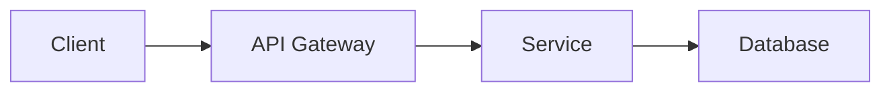

---
aliases:
  - Web Application Project
  - MyApp
tags:
  - project
  - active
status: in-progress
priority: high
created: 2024-01-05
due: 2024-03-01
---
# WebApp

Building a web application using [[wiki/Rust]].

## Overview

> [!note]
> This project uses [[wiki/Rust#Ownership|ownership principles]] for memory safety.

## Architecture

## Tasks

- [x] Setup project structure
- [x] Configure CI/CD #devops
- [ ] Implement auth module
- [ ] Write unit tests #testing
- [ ] Deploy to staging [due:: 2024-02-15]

## Decisions

### ADR-001: Use Axum Framework

We chose Axum for the web framework. See [[wiki/Rust#Borrowing]] for why ownership matters here.

![[attachments/architecture.png]]

## Links

- [[Home]]
- [[wiki/Rust]]
- [[wiki/REST API]]
- [Project Board](https://github.com/example/webapp)

#project/webapp
